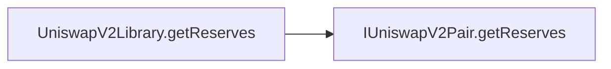
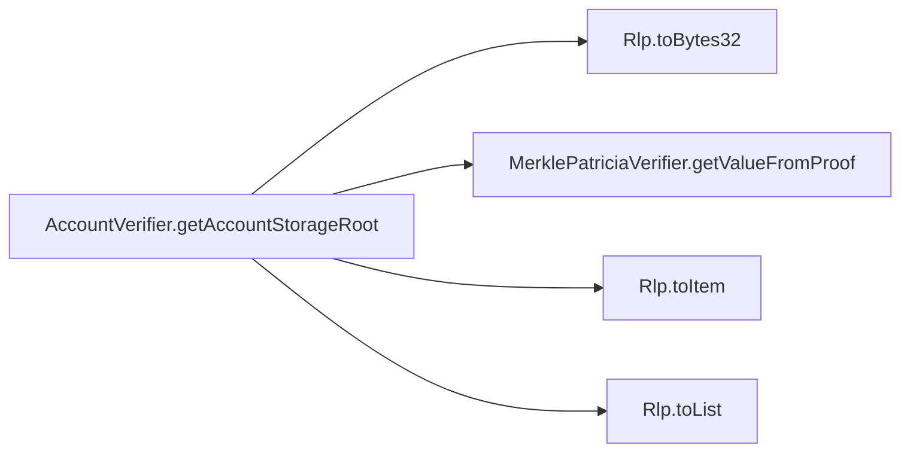
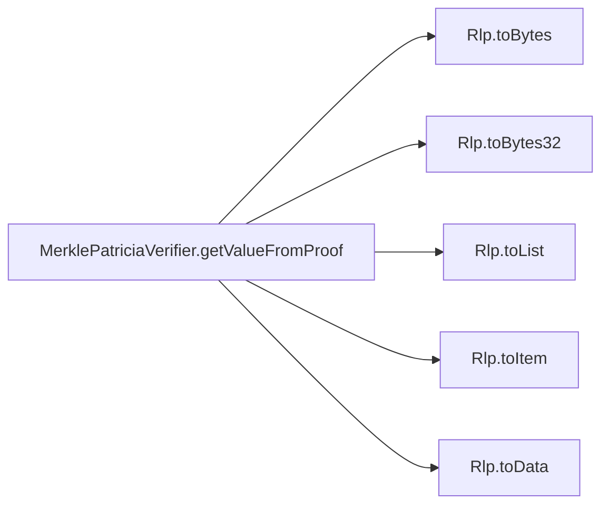
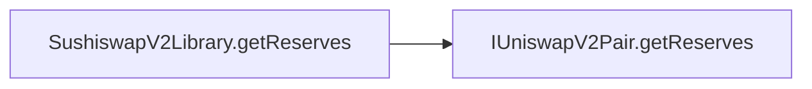
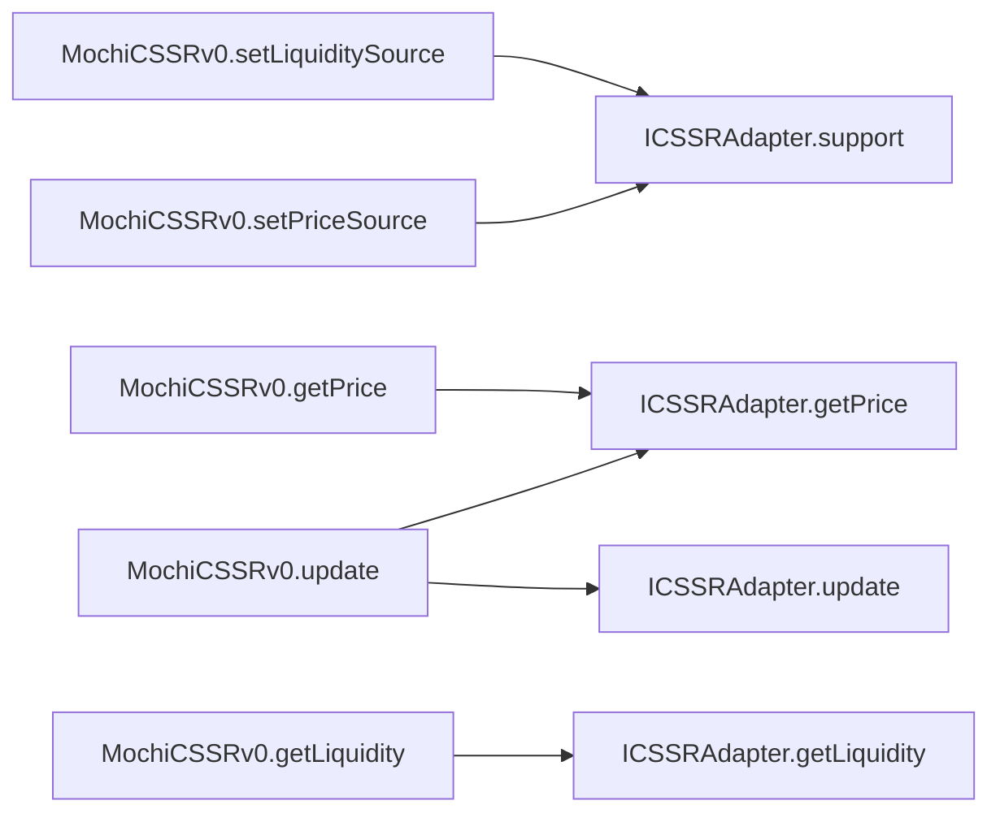

## Package: mochi-library

# 🧬 Flow Graphs, Constructor Sequences & SSA Representations

## Contract: CheapERC20
### Linearised Constructor Execution sequence
- No constructors configured in hierarchy.

### Inter-Contract & Function Call Graph (Mermaid)
```mermaid
flowchart LR
```

### Functions Intermediate Code Operations (SlithIR & SSA)

---

## Contract: IERC20
### Linearised Constructor Execution sequence
- No constructors configured in hierarchy.

### Inter-Contract & Function Call Graph (Mermaid)
```mermaid
flowchart LR
```

### Functions Intermediate Code Operations (SlithIR & SSA)
#### Function: `totalSupply`
<details><summary>View SlithIR Operations</summary>

```
No SlithIR operations.
```
</details>
<details><summary>View SSA Operations</summary>

```
No SSA operations.
```
</details>

#### Function: `balanceOf`
<details><summary>View SlithIR Operations</summary>

```
No SlithIR operations.
```
</details>
<details><summary>View SSA Operations</summary>

```
No SSA operations.
```
</details>

#### Function: `transfer`
<details><summary>View SlithIR Operations</summary>

```
No SlithIR operations.
```
</details>
<details><summary>View SSA Operations</summary>

```
No SSA operations.
```
</details>

#### Function: `allowance`
<details><summary>View SlithIR Operations</summary>

```
No SlithIR operations.
```
</details>
<details><summary>View SSA Operations</summary>

```
No SSA operations.
```
</details>

#### Function: `approve`
<details><summary>View SlithIR Operations</summary>

```
No SlithIR operations.
```
</details>
<details><summary>View SSA Operations</summary>

```
No SSA operations.
```
</details>

#### Function: `transferFrom`
<details><summary>View SlithIR Operations</summary>

```
No SlithIR operations.
```
</details>
<details><summary>View SSA Operations</summary>

```
No SSA operations.
```
</details>


---

## Contract: Float
### Linearised Constructor Execution sequence
- No constructors configured in hierarchy.

### Inter-Contract & Function Call Graph (Mermaid)
```mermaid
flowchart LR
```

### Functions Intermediate Code Operations (SlithIR & SSA)

---

## Contract: BlockVerifier
### Linearised Constructor Execution sequence
- No constructors configured in hierarchy.

### Inter-Contract & Function Call Graph (Mermaid)
```mermaid
flowchart LR
```

### Functions Intermediate Code Operations (SlithIR & SSA)

---

## Contract: BeaconProxyDeployer
### Linearised Constructor Execution sequence
- No constructors configured in hierarchy.

### Inter-Contract & Function Call Graph (Mermaid)
```mermaid
flowchart LR
```

### Functions Intermediate Code Operations (SlithIR & SSA)

---

## Contract: Create2BeaconMaker
### Linearised Constructor Execution sequence
- No constructors configured in hierarchy.

### Inter-Contract & Function Call Graph (Mermaid)
```mermaid
flowchart LR
```

### Functions Intermediate Code Operations (SlithIR & SSA)

---

## Contract: Beacon
### Linearised Constructor Execution sequence
- No constructors configured in hierarchy.

### Inter-Contract & Function Call Graph (Mermaid)
```mermaid
flowchart LR
```

### Functions Intermediate Code Operations (SlithIR & SSA)
#### Function: `fallback`
<details><summary>View SlithIR Operations</summary>

```
TMP_0(bool) = msg.sender != _CONTROLLER
CONDITION TMP_0
TMP_1(uint256) = SOLIDITY_CALL sload(uint256)(0)
TMP_2(None) = SOLIDITY_CALL mstore(uint256,uint256)(0,TMP_1)
TMP_3(None) = SOLIDITY_CALL return(uint256,uint256)(0,32)
TMP_4(uint256) = SOLIDITY_CALL calldataload(uint256)(0)
TMP_5(None) = SOLIDITY_CALL sstore(uint256,uint256)(0,TMP_4)
```
</details>
<details><summary>View SSA Operations</summary>

```
No SSA operations.
```
</details>


---

## Contract: UniswapV2Library
### Linearised Constructor Execution sequence
- No constructors configured in hierarchy.

### Inter-Contract & Function Call Graph (Mermaid)


### Functions Intermediate Code Operations (SlithIR & SSA)

---

## Contract: IUniswapV2Pair
### Linearised Constructor Execution sequence
- No constructors configured in hierarchy.

### Inter-Contract & Function Call Graph (Mermaid)
```mermaid
flowchart LR
```

### Functions Intermediate Code Operations (SlithIR & SSA)
#### Function: `name`
<details><summary>View SlithIR Operations</summary>

```
No SlithIR operations.
```
</details>
<details><summary>View SSA Operations</summary>

```
No SSA operations.
```
</details>

#### Function: `symbol`
<details><summary>View SlithIR Operations</summary>

```
No SlithIR operations.
```
</details>
<details><summary>View SSA Operations</summary>

```
No SSA operations.
```
</details>

#### Function: `decimals`
<details><summary>View SlithIR Operations</summary>

```
No SlithIR operations.
```
</details>
<details><summary>View SSA Operations</summary>

```
No SSA operations.
```
</details>

#### Function: `totalSupply`
<details><summary>View SlithIR Operations</summary>

```
No SlithIR operations.
```
</details>
<details><summary>View SSA Operations</summary>

```
No SSA operations.
```
</details>

#### Function: `balanceOf`
<details><summary>View SlithIR Operations</summary>

```
No SlithIR operations.
```
</details>
<details><summary>View SSA Operations</summary>

```
No SSA operations.
```
</details>

#### Function: `allowance`
<details><summary>View SlithIR Operations</summary>

```
No SlithIR operations.
```
</details>
<details><summary>View SSA Operations</summary>

```
No SSA operations.
```
</details>

#### Function: `approve`
<details><summary>View SlithIR Operations</summary>

```
No SlithIR operations.
```
</details>
<details><summary>View SSA Operations</summary>

```
No SSA operations.
```
</details>

#### Function: `transfer`
<details><summary>View SlithIR Operations</summary>

```
No SlithIR operations.
```
</details>
<details><summary>View SSA Operations</summary>

```
No SSA operations.
```
</details>

#### Function: `transferFrom`
<details><summary>View SlithIR Operations</summary>

```
No SlithIR operations.
```
</details>
<details><summary>View SSA Operations</summary>

```
No SSA operations.
```
</details>

#### Function: `DOMAIN_SEPARATOR`
<details><summary>View SlithIR Operations</summary>

```
No SlithIR operations.
```
</details>
<details><summary>View SSA Operations</summary>

```
No SSA operations.
```
</details>

#### Function: `PERMIT_TYPEHASH`
<details><summary>View SlithIR Operations</summary>

```
No SlithIR operations.
```
</details>
<details><summary>View SSA Operations</summary>

```
No SSA operations.
```
</details>

#### Function: `nonces`
<details><summary>View SlithIR Operations</summary>

```
No SlithIR operations.
```
</details>
<details><summary>View SSA Operations</summary>

```
No SSA operations.
```
</details>

#### Function: `permit`
<details><summary>View SlithIR Operations</summary>

```
No SlithIR operations.
```
</details>
<details><summary>View SSA Operations</summary>

```
No SSA operations.
```
</details>

#### Function: `MINIMUM_LIQUIDITY`
<details><summary>View SlithIR Operations</summary>

```
No SlithIR operations.
```
</details>
<details><summary>View SSA Operations</summary>

```
No SSA operations.
```
</details>

#### Function: `factory`
<details><summary>View SlithIR Operations</summary>

```
No SlithIR operations.
```
</details>
<details><summary>View SSA Operations</summary>

```
No SSA operations.
```
</details>

#### Function: `token0`
<details><summary>View SlithIR Operations</summary>

```
No SlithIR operations.
```
</details>
<details><summary>View SSA Operations</summary>

```
No SSA operations.
```
</details>

#### Function: `token1`
<details><summary>View SlithIR Operations</summary>

```
No SlithIR operations.
```
</details>
<details><summary>View SSA Operations</summary>

```
No SSA operations.
```
</details>

#### Function: `getReserves`
<details><summary>View SlithIR Operations</summary>

```
No SlithIR operations.
```
</details>
<details><summary>View SSA Operations</summary>

```
No SSA operations.
```
</details>

#### Function: `price0CumulativeLast`
<details><summary>View SlithIR Operations</summary>

```
No SlithIR operations.
```
</details>
<details><summary>View SSA Operations</summary>

```
No SSA operations.
```
</details>

#### Function: `price1CumulativeLast`
<details><summary>View SlithIR Operations</summary>

```
No SlithIR operations.
```
</details>
<details><summary>View SSA Operations</summary>

```
No SSA operations.
```
</details>

#### Function: `kLast`
<details><summary>View SlithIR Operations</summary>

```
No SlithIR operations.
```
</details>
<details><summary>View SSA Operations</summary>

```
No SSA operations.
```
</details>

#### Function: `mint`
<details><summary>View SlithIR Operations</summary>

```
No SlithIR operations.
```
</details>
<details><summary>View SSA Operations</summary>

```
No SSA operations.
```
</details>

#### Function: `burn`
<details><summary>View SlithIR Operations</summary>

```
No SlithIR operations.
```
</details>
<details><summary>View SSA Operations</summary>

```
No SSA operations.
```
</details>

#### Function: `swap`
<details><summary>View SlithIR Operations</summary>

```
No SlithIR operations.
```
</details>
<details><summary>View SSA Operations</summary>

```
No SSA operations.
```
</details>

#### Function: `skim`
<details><summary>View SlithIR Operations</summary>

```
No SlithIR operations.
```
</details>
<details><summary>View SSA Operations</summary>

```
No SSA operations.
```
</details>

#### Function: `sync`
<details><summary>View SlithIR Operations</summary>

```
No SlithIR operations.
```
</details>
<details><summary>View SSA Operations</summary>

```
No SSA operations.
```
</details>

#### Function: `initialize`
<details><summary>View SlithIR Operations</summary>

```
No SlithIR operations.
```
</details>
<details><summary>View SSA Operations</summary>

```
No SSA operations.
```
</details>


---

## Contract: Rlp
### Linearised Constructor Execution sequence
- No constructors configured in hierarchy.

### Inter-Contract & Function Call Graph (Mermaid)
```mermaid
flowchart LR
```

### Functions Intermediate Code Operations (SlithIR & SSA)

---

## Contract: AccountVerifier
### Linearised Constructor Execution sequence
- No constructors configured in hierarchy.

### Inter-Contract & Function Call Graph (Mermaid)


### Functions Intermediate Code Operations (SlithIR & SSA)

---

## Contract: MerklePatriciaVerifier
### Linearised Constructor Execution sequence
- No constructors configured in hierarchy.

### Inter-Contract & Function Call Graph (Mermaid)


### Functions Intermediate Code Operations (SlithIR & SSA)

---

## Contract: SushiswapV2Library
### Linearised Constructor Execution sequence
- No constructors configured in hierarchy.

### Inter-Contract & Function Call Graph (Mermaid)


### Functions Intermediate Code Operations (SlithIR & SSA)

---

## Contract: UQ112x112
### Linearised Constructor Execution sequence
- No constructors configured in hierarchy.

### Inter-Contract & Function Call Graph (Mermaid)
```mermaid
flowchart LR
```

### Functions Intermediate Code Operations (SlithIR & SSA)

---

---

## Package: mochi-cssr

# 🧬 Flow Graphs, Constructor Sequences & SSA Representations

## Contract: MochiCSSRv0
### Linearised Constructor Execution sequence
- No constructors configured in hierarchy.

### Inter-Contract & Function Call Graph (Mermaid)


### Functions Intermediate Code Operations (SlithIR & SSA)
#### Function: `update`
<details><summary>View SlithIR Operations</summary>

```
No SlithIR operations.
```
</details>
<details><summary>View SSA Operations</summary>

```
No SSA operations.
```
</details>

#### Function: `getPrice`
<details><summary>View SlithIR Operations</summary>

```
No SlithIR operations.
```
</details>
<details><summary>View SSA Operations</summary>

```
No SSA operations.
```
</details>

#### Function: `getLiquidity`
<details><summary>View SlithIR Operations</summary>

```
No SlithIR operations.
```
</details>
<details><summary>View SSA Operations</summary>

```
No SSA operations.
```
</details>

#### Function: `setBluechip`
<details><summary>View SlithIR Operations</summary>

```
i(uint256) := 0(uint256)
REF_0 -> LENGTH _assets
TMP_1(bool) = i < REF_0
CONDITION TMP_1
REF_1(address) -> _assets[i]
REF_2(bool) -> blueChip[REF_1]
REF_2(bool) (->blueChip) := True(bool)
TMP_2(uint256) := i(uint256)
i(uint256) = i (c)+ 1
MODIFIER_CALL, MochiCSSRv0.onlyGov()()
```
</details>
<details><summary>View SSA Operations</summary>

```
No SSA operations.
```
</details>

#### Function: `removeBluechip`
<details><summary>View SlithIR Operations</summary>

```
i(uint256) := 0(uint256)
REF_3 -> LENGTH _assets
TMP_4(bool) = i < REF_3
CONDITION TMP_4
REF_4(address) -> _assets[i]
REF_5(bool) -> blueChip[REF_4]
REF_5(bool) (->blueChip) := False(bool)
TMP_5(uint256) := i(uint256)
i(uint256) = i (c)+ 1
MODIFIER_CALL, MochiCSSRv0.onlyGov()()
```
</details>
<details><summary>View SSA Operations</summary>

```
No SSA operations.
```
</details>

#### Function: `listAdapter`
<details><summary>View SlithIR Operations</summary>

```
REF_6(bool) -> adapter[_adapter]
REF_6(bool) (->adapter) := True(bool)
MODIFIER_CALL, MochiCSSRv0.onlyGov()()
```
</details>
<details><summary>View SSA Operations</summary>

```
No SSA operations.
```
</details>

#### Function: `delistAdapter`
<details><summary>View SlithIR Operations</summary>

```
REF_7(bool) -> adapter[_adapter]
REF_7(bool) (->adapter) := False(bool)
MODIFIER_CALL, MochiCSSRv0.onlyGov()()
```
</details>
<details><summary>View SSA Operations</summary>

```
No SSA operations.
```
</details>

#### Function: `setFiatPriceAdapter`
<details><summary>View SlithIR Operations</summary>

```
TMP_9 = CONVERT _adapter to ICSSRAdapter
fiatPriceAdapter(ICSSRAdapter) := TMP_9(ICSSRAdapter)
MODIFIER_CALL, MochiCSSRv0.onlyGov()()
```
</details>
<details><summary>View SSA Operations</summary>

```
No SSA operations.
```
</details>

#### Function: `setPriceSource`
<details><summary>View SlithIR Operations</summary>

```
REF_8(bool) -> adapter[_adapter]
TMP_11(None) = SOLIDITY_CALL require(bool,string)(REF_8,!listed)
i(uint256) := 0(uint256)
REF_9 -> LENGTH _assets
TMP_12(bool) = i < REF_9
CONDITION TMP_12
TMP_13 = CONVERT _adapter to ICSSRAdapter
REF_11(address) -> _assets[i]
TMP_14(bool) = HIGH_LEVEL_CALL, dest:TMP_13(ICSSRAdapter), function:support, arguments:['REF_11']  
TMP_15(None) = SOLIDITY_CALL require(bool,string)(TMP_14,!supported)
REF_12(address) -> _assets[i]
REF_13(address) -> priceSource[REF_12]
REF_13(address) (->priceSource) := _adapter(address)
TMP_16(uint256) := i(uint256)
i(uint256) = i (c)+ 1
MODIFIER_CALL, MochiCSSRv0.onlyGov()()
```
</details>
<details><summary>View SSA Operations</summary>

```
No SSA operations.
```
</details>

#### Function: `setLiquiditySource`
<details><summary>View SlithIR Operations</summary>

```
REF_14(bool) -> adapter[_adapter]
TMP_18(None) = SOLIDITY_CALL require(bool,string)(REF_14,!listed)
i(uint256) := 0(uint256)
REF_15 -> LENGTH _assets
TMP_19(bool) = i < REF_15
CONDITION TMP_19
TMP_20 = CONVERT _adapter to ICSSRAdapter
REF_17(address) -> _assets[i]
TMP_21(bool) = HIGH_LEVEL_CALL, dest:TMP_20(ICSSRAdapter), function:support, arguments:['REF_17']  
TMP_22(None) = SOLIDITY_CALL require(bool,string)(TMP_21,!supported)
REF_18(address) -> _assets[i]
REF_19(address) -> liquiditySource[REF_18]
REF_19(address) (->liquiditySource) := _adapter(address)
TMP_23(uint256) := i(uint256)
i(uint256) = i (c)+ 1
MODIFIER_CALL, MochiCSSRv0.onlyGov()()
```
</details>
<details><summary>View SSA Operations</summary>

```
No SSA operations.
```
</details>

#### Function: `setDefaultPriceSource`
<details><summary>View SlithIR Operations</summary>

```
REF_20(bool) -> adapter[_adapter]
TMP_25(None) = SOLIDITY_CALL require(bool,string)(REF_20,!listed)
defaultPriceSource(address) := _adapter(address)
MODIFIER_CALL, MochiCSSRv0.onlyGov()()
```
</details>
<details><summary>View SSA Operations</summary>

```
No SSA operations.
```
</details>

#### Function: `setDefaultLiquiditySource`
<details><summary>View SlithIR Operations</summary>

```
REF_21(bool) -> adapter[_adapter]
TMP_27(None) = SOLIDITY_CALL require(bool,string)(REF_21,!listed)
defaultLiquiditySource(address) := _adapter(address)
MODIFIER_CALL, MochiCSSRv0.onlyGov()()
```
</details>
<details><summary>View SSA Operations</summary>

```
No SSA operations.
```
</details>

#### Function: `update`
<details><summary>View SlithIR Operations</summary>

```
REF_22(bool) -> blueChip[_asset]
CONDITION REF_22
TMP_29(float) = HIGH_LEVEL_CALL, dest:fiatPriceAdapter(ICSSRAdapter), function:getPrice, arguments:['_asset']  
RETURN TMP_29
REF_24(address) -> priceSource[_asset]
TMP_30 = CONVERT REF_24 to ICSSRAdapter
priceAdapter(ICSSRAdapter) := TMP_30(ICSSRAdapter)
TMP_31 = CONVERT priceAdapter to address
TMP_32 = CONVERT 0 to address
TMP_33(bool) = TMP_31 == TMP_32
CONDITION TMP_33
TMP_34 = CONVERT defaultPriceSource to ICSSRAdapter
priceAdapter(ICSSRAdapter) := TMP_34(ICSSRAdapter)
TMP_35(float) = HIGH_LEVEL_CALL, dest:priceAdapter(ICSSRAdapter), function:update, arguments:['_asset', '_data']  
price(float) := TMP_35(float)
REF_26(float) -> lastPrice[_asset]
REF_26(float) (->lastPrice) := price(float)
RETURN price
```
</details>
<details><summary>View SSA Operations</summary>

```
No SSA operations.
```
</details>

#### Function: `getPrice`
<details><summary>View SlithIR Operations</summary>

```
REF_27(bool) -> blueChip[_asset]
CONDITION REF_27
TMP_36(float) = HIGH_LEVEL_CALL, dest:fiatPriceAdapter(ICSSRAdapter), function:getPrice, arguments:['_asset']  
RETURN TMP_36
REF_29(address) -> priceSource[_asset]
TMP_37 = CONVERT REF_29 to ICSSRAdapter
priceAdapter(ICSSRAdapter) := TMP_37(ICSSRAdapter)
TMP_38 = CONVERT priceAdapter to address
TMP_39 = CONVERT 0 to address
TMP_40(bool) = TMP_38 == TMP_39
CONDITION TMP_40
TMP_41 = CONVERT defaultPriceSource to ICSSRAdapter
priceAdapter(ICSSRAdapter) := TMP_41(ICSSRAdapter)
TMP_42(float) = HIGH_LEVEL_CALL, dest:priceAdapter(ICSSRAdapter), function:getPrice, arguments:['_asset']  
RETURN TMP_42
```
</details>
<details><summary>View SSA Operations</summary>

```
No SSA operations.
```
</details>

#### Function: `getLiquidity`
<details><summary>View SlithIR Operations</summary>

```
REF_31(address) -> liquiditySource[_asset]
TMP_43 = CONVERT REF_31 to ICSSRAdapter
liquidityAdapter(ICSSRAdapter) := TMP_43(ICSSRAdapter)
TMP_44 = CONVERT liquidityAdapter to address
TMP_45 = CONVERT 0 to address
TMP_46(bool) = TMP_44 == TMP_45
CONDITION TMP_46
TMP_47 = CONVERT defaultLiquiditySource to ICSSRAdapter
liquidityAdapter(ICSSRAdapter) := TMP_47(ICSSRAdapter)
TMP_48(uint256) = HIGH_LEVEL_CALL, dest:liquidityAdapter(ICSSRAdapter), function:getLiquidity, arguments:['_asset']  
RETURN TMP_48
```
</details>
<details><summary>View SSA Operations</summary>

```
No SSA operations.
```
</details>


---

## Contract: ICSSRAdapter
### Linearised Constructor Execution sequence
- No constructors configured in hierarchy.

### Inter-Contract & Function Call Graph (Mermaid)
```mermaid
flowchart LR
```

### Functions Intermediate Code Operations (SlithIR & SSA)
#### Function: `update`
<details><summary>View SlithIR Operations</summary>

```
No SlithIR operations.
```
</details>
<details><summary>View SSA Operations</summary>

```
No SSA operations.
```
</details>

#### Function: `support`
<details><summary>View SlithIR Operations</summary>

```
No SlithIR operations.
```
</details>
<details><summary>View SSA Operations</summary>

```
No SSA operations.
```
</details>

#### Function: `getPrice`
<details><summary>View SlithIR Operations</summary>

```
No SlithIR operations.
```
</details>
<details><summary>View SSA Operations</summary>

```
No SSA operations.
```
</details>

#### Function: `getLiquidity`
<details><summary>View SlithIR Operations</summary>

```
No SlithIR operations.
```
</details>
<details><summary>View SSA Operations</summary>

```
No SSA operations.
```
</details>


---

## Contract: IGovernanceOwned
### Linearised Constructor Execution sequence
- No constructors configured in hierarchy.

### Inter-Contract & Function Call Graph (Mermaid)
```mermaid
flowchart LR
```

### Functions Intermediate Code Operations (SlithIR & SSA)
#### Function: `governance`
<details><summary>View SlithIR Operations</summary>

```
No SlithIR operations.
```
</details>
<details><summary>View SSA Operations</summary>

```
No SSA operations.
```
</details>


---

## Contract: Float
### Linearised Constructor Execution sequence
- No constructors configured in hierarchy.

### Inter-Contract & Function Call Graph (Mermaid)
```mermaid
flowchart LR
```

### Functions Intermediate Code Operations (SlithIR & SSA)

---

## Contract: ICSSRRouter
### Linearised Constructor Execution sequence
- No constructors configured in hierarchy.

### Inter-Contract & Function Call Graph (Mermaid)
```mermaid
flowchart LR
```

### Functions Intermediate Code Operations (SlithIR & SSA)
#### Function: `update`
<details><summary>View SlithIR Operations</summary>

```
No SlithIR operations.
```
</details>
<details><summary>View SSA Operations</summary>

```
No SSA operations.
```
</details>

#### Function: `getPrice`
<details><summary>View SlithIR Operations</summary>

```
No SlithIR operations.
```
</details>
<details><summary>View SSA Operations</summary>

```
No SSA operations.
```
</details>

#### Function: `getLiquidity`
<details><summary>View SlithIR Operations</summary>

```
No SlithIR operations.
```
</details>
<details><summary>View SSA Operations</summary>

```
No SSA operations.
```
</details>


---

## Contract: IUniswapV2CSSR
### Linearised Constructor Execution sequence
- No constructors configured in hierarchy.

### Inter-Contract & Function Call Graph (Mermaid)
```mermaid
flowchart LR
```

### Functions Intermediate Code Operations (SlithIR & SSA)
#### Function: `uniswapFactory`
<details><summary>View SlithIR Operations</summary>

```
No SlithIR operations.
```
</details>
<details><summary>View SSA Operations</summary>

```
No SSA operations.
```
</details>

#### Function: `getExchangeRatio`
<details><summary>View SlithIR Operations</summary>

```
No SlithIR operations.
```
</details>
<details><summary>View SSA Operations</summary>

```
No SSA operations.
```
</details>

#### Function: `getLiquidity`
<details><summary>View SlithIR Operations</summary>

```
No SlithIR operations.
```
</details>
<details><summary>View SSA Operations</summary>

```
No SSA operations.
```
</details>

#### Function: `saveState`
<details><summary>View SlithIR Operations</summary>

```
No SlithIR operations.
```
</details>
<details><summary>View SSA Operations</summary>

```
No SSA operations.
```
</details>

#### Function: `saveReserve`
<details><summary>View SlithIR Operations</summary>

```
No SlithIR operations.
```
</details>
<details><summary>View SSA Operations</summary>

```
No SSA operations.
```
</details>


---

## Contract: ICurveAddressProvider
### Linearised Constructor Execution sequence
- No constructors configured in hierarchy.

### Inter-Contract & Function Call Graph (Mermaid)
```mermaid
flowchart LR
```

### Functions Intermediate Code Operations (SlithIR & SSA)
#### Function: `get_registry`
<details><summary>View SlithIR Operations</summary>

```
No SlithIR operations.
```
</details>
<details><summary>View SSA Operations</summary>

```
No SSA operations.
```
</details>


---

## Contract: ICurveRegistry
### Linearised Constructor Execution sequence
- No constructors configured in hierarchy.

### Inter-Contract & Function Call Graph (Mermaid)
```mermaid
flowchart LR
```

### Functions Intermediate Code Operations (SlithIR & SSA)
#### Function: `get_n_coins`
<details><summary>View SlithIR Operations</summary>

```
No SlithIR operations.
```
</details>
<details><summary>View SSA Operations</summary>

```
No SSA operations.
```
</details>

#### Function: `get_pool_from_lp_token`
<details><summary>View SlithIR Operations</summary>

```
No SlithIR operations.
```
</details>
<details><summary>View SSA Operations</summary>

```
No SSA operations.
```
</details>


---

## Contract: ICurvePool
### Linearised Constructor Execution sequence
- No constructors configured in hierarchy.

### Inter-Contract & Function Call Graph (Mermaid)
```mermaid
flowchart LR
```

### Functions Intermediate Code Operations (SlithIR & SSA)
#### Function: `coins`
<details><summary>View SlithIR Operations</summary>

```
No SlithIR operations.
```
</details>
<details><summary>View SSA Operations</summary>

```
No SSA operations.
```
</details>

#### Function: `get_virtual_price`
<details><summary>View SlithIR Operations</summary>

```
No SlithIR operations.
```
</details>
<details><summary>View SSA Operations</summary>

```
No SSA operations.
```
</details>


---

## Contract: SushiswapV2LPAdapter
### Linearised Constructor Execution sequence
- No constructors configured in hierarchy.

### Inter-Contract & Function Call Graph (Mermaid)
```mermaid
flowchart LR
    SushiswapV2LPAdapter.support --> SushiswapV2Library.pairFor
    SushiswapV2LPAdapter.update --> ICSSRRouter.update
    SushiswapV2LPAdapter.getUnderlyingAsset --> IUniswapV2Pair.token1
    SushiswapV2LPAdapter.getUnderlyingAsset --> IUniswapV2Pair.token0
    SushiswapV2LPAdapter._getPrice --> ICSSRRouter.getPrice
    SushiswapV2LPAdapter._getPrice --> IUniswapV2Pair.totalSupply
    SushiswapV2LPAdapter._getPrice --> IUniswapV2CSSR.getExchangeRatio
    SushiswapV2LPAdapter._getPrice --> IUniswapV2Pair.getReserves
    SushiswapV2LPAdapter._getPrice --> Float.mul
    SushiswapV2LPAdapter._getPrice --> IUniswapV2Pair.token0
    SushiswapV2LPAdapter.getLiquidity --> ICSSRRouter.getLiquidity
```

### Functions Intermediate Code Operations (SlithIR & SSA)
#### Function: `update`
<details><summary>View SlithIR Operations</summary>

```
No SlithIR operations.
```
</details>
<details><summary>View SSA Operations</summary>

```
No SSA operations.
```
</details>

#### Function: `support`
<details><summary>View SlithIR Operations</summary>

```
No SlithIR operations.
```
</details>
<details><summary>View SSA Operations</summary>

```
No SSA operations.
```
</details>

#### Function: `getPrice`
<details><summary>View SlithIR Operations</summary>

```
No SlithIR operations.
```
</details>
<details><summary>View SSA Operations</summary>

```
No SSA operations.
```
</details>

#### Function: `getLiquidity`
<details><summary>View SlithIR Operations</summary>

```
No SlithIR operations.
```
</details>
<details><summary>View SSA Operations</summary>

```
No SSA operations.
```
</details>

#### Function: `support`
<details><summary>View SlithIR Operations</summary>

```
TMP_2 = CONVERT _asset to IUniswapV2Pair
TMP_3(address) = INTERNAL_CALL, SushiswapV2LPAdapter.getUnderlyingAsset(IUniswapV2Pair)(TMP_2)
underlying(address) := TMP_3(address)
TMP_4(address) = LIBRARY_CALL, dest:SushiswapV2Library, function:SushiswapV2Library.pairFor(address,address,address), arguments:['factory', 'underlying', 'weth'] 
calculatedAddress(address) := TMP_4(address)
TMP_5(bool) = _asset == calculatedAddress
RETURN TMP_5
```
</details>
<details><summary>View SSA Operations</summary>

```
No SSA operations.
```
</details>

#### Function: `update`
<details><summary>View SlithIR Operations</summary>

```
TMP_6 = CONVERT _asset to IUniswapV2Pair
TMP_7(address) = INTERNAL_CALL, SushiswapV2LPAdapter.getUnderlyingAsset(IUniswapV2Pair)(TMP_6)
underlying(address) := TMP_7(address)
TMP_8(float) = HIGH_LEVEL_CALL, dest:router(ICSSRRouter), function:update, arguments:['_asset', '_proof']  
TMP_9 = CONVERT _asset to IUniswapV2Pair
TMP_10(float) = INTERNAL_CALL, SushiswapV2LPAdapter._getPrice(IUniswapV2Pair,address)(TMP_9,underlying)
RETURN TMP_10
RETURN price
```
</details>
<details><summary>View SSA Operations</summary>

```
No SSA operations.
```
</details>

#### Function: `getUnderlyingAsset`
<details><summary>View SlithIR Operations</summary>

```
TMP_11(address) = HIGH_LEVEL_CALL, dest:_pair(IUniswapV2Pair), function:token0, arguments:[]  
TMP_12(bool) = TMP_11 == weth
CONDITION TMP_12
TMP_13(address) = HIGH_LEVEL_CALL, dest:_pair(IUniswapV2Pair), function:token1, arguments:[]  
underlyingAsset(address) := TMP_13(address)
TMP_14(address) = HIGH_LEVEL_CALL, dest:_pair(IUniswapV2Pair), function:token1, arguments:[]  
TMP_15(bool) = TMP_14 == weth
CONDITION TMP_15
TMP_16(address) = HIGH_LEVEL_CALL, dest:_pair(IUniswapV2Pair), function:token0, arguments:[]  
underlyingAsset(address) := TMP_16(address)
TMP_17(None) = SOLIDITY_CALL revert(string)(!eth paired)
RETURN underlyingAsset
```
</details>
<details><summary>View SSA Operations</summary>

```
No SSA operations.
```
</details>

#### Function: `getPrice`
<details><summary>View SlithIR Operations</summary>

```
TMP_18 = CONVERT _asset to IUniswapV2Pair
pair(IUniswapV2Pair) := TMP_18(IUniswapV2Pair)
TMP_19(address) = INTERNAL_CALL, SushiswapV2LPAdapter.getUnderlyingAsset(IUniswapV2Pair)(pair)
underlying(address) := TMP_19(address)
TMP_20(float) = INTERNAL_CALL, SushiswapV2LPAdapter._getPrice(IUniswapV2Pair,address)(pair,underlying)
RETURN TMP_20
RETURN price
```
</details>
<details><summary>View SSA Operations</summary>

```
No SSA operations.
```
</details>

#### Function: `getLiquidity`
<details><summary>View SlithIR Operations</summary>

```
TMP_67 = CONVERT _asset to IUniswapV2Pair
TMP_68(address) = INTERNAL_CALL, SushiswapV2LPAdapter.getUnderlyingAsset(IUniswapV2Pair)(TMP_67)
underlying(address) := TMP_68(address)
TMP_69(uint256) = HIGH_LEVEL_CALL, dest:router(ICSSRRouter), function:getLiquidity, arguments:['underlying']  
RETURN TMP_69
```
</details>
<details><summary>View SSA Operations</summary>

```
No SSA operations.
```
</details>


---

## Contract: SushiswapV2Library
### Linearised Constructor Execution sequence
- No constructors configured in hierarchy.

### Inter-Contract & Function Call Graph (Mermaid)
```mermaid
flowchart LR
    SushiswapV2Library.getReserves --> IUniswapV2Pair.getReserves
```

### Functions Intermediate Code Operations (SlithIR & SSA)

---

## Contract: IUniswapV2Pair
### Linearised Constructor Execution sequence
- No constructors configured in hierarchy.

### Inter-Contract & Function Call Graph (Mermaid)
```mermaid
flowchart LR
```

### Functions Intermediate Code Operations (SlithIR & SSA)
#### Function: `name`
<details><summary>View SlithIR Operations</summary>

```
No SlithIR operations.
```
</details>
<details><summary>View SSA Operations</summary>

```
No SSA operations.
```
</details>

#### Function: `symbol`
<details><summary>View SlithIR Operations</summary>

```
No SlithIR operations.
```
</details>
<details><summary>View SSA Operations</summary>

```
No SSA operations.
```
</details>

#### Function: `decimals`
<details><summary>View SlithIR Operations</summary>

```
No SlithIR operations.
```
</details>
<details><summary>View SSA Operations</summary>

```
No SSA operations.
```
</details>

#### Function: `totalSupply`
<details><summary>View SlithIR Operations</summary>

```
No SlithIR operations.
```
</details>
<details><summary>View SSA Operations</summary>

```
No SSA operations.
```
</details>

#### Function: `balanceOf`
<details><summary>View SlithIR Operations</summary>

```
No SlithIR operations.
```
</details>
<details><summary>View SSA Operations</summary>

```
No SSA operations.
```
</details>

#### Function: `allowance`
<details><summary>View SlithIR Operations</summary>

```
No SlithIR operations.
```
</details>
<details><summary>View SSA Operations</summary>

```
No SSA operations.
```
</details>

#### Function: `approve`
<details><summary>View SlithIR Operations</summary>

```
No SlithIR operations.
```
</details>
<details><summary>View SSA Operations</summary>

```
No SSA operations.
```
</details>

#### Function: `transfer`
<details><summary>View SlithIR Operations</summary>

```
No SlithIR operations.
```
</details>
<details><summary>View SSA Operations</summary>

```
No SSA operations.
```
</details>

#### Function: `transferFrom`
<details><summary>View SlithIR Operations</summary>

```
No SlithIR operations.
```
</details>
<details><summary>View SSA Operations</summary>

```
No SSA operations.
```
</details>

#### Function: `DOMAIN_SEPARATOR`
<details><summary>View SlithIR Operations</summary>

```
No SlithIR operations.
```
</details>
<details><summary>View SSA Operations</summary>

```
No SSA operations.
```
</details>

#### Function: `PERMIT_TYPEHASH`
<details><summary>View SlithIR Operations</summary>

```
No SlithIR operations.
```
</details>
<details><summary>View SSA Operations</summary>

```
No SSA operations.
```
</details>

#### Function: `nonces`
<details><summary>View SlithIR Operations</summary>

```
No SlithIR operations.
```
</details>
<details><summary>View SSA Operations</summary>

```
No SSA operations.
```
</details>

#### Function: `permit`
<details><summary>View SlithIR Operations</summary>

```
No SlithIR operations.
```
</details>
<details><summary>View SSA Operations</summary>

```
No SSA operations.
```
</details>

#### Function: `MINIMUM_LIQUIDITY`
<details><summary>View SlithIR Operations</summary>

```
No SlithIR operations.
```
</details>
<details><summary>View SSA Operations</summary>

```
No SSA operations.
```
</details>

#### Function: `factory`
<details><summary>View SlithIR Operations</summary>

```
No SlithIR operations.
```
</details>
<details><summary>View SSA Operations</summary>

```
No SSA operations.
```
</details>

#### Function: `token0`
<details><summary>View SlithIR Operations</summary>

```
No SlithIR operations.
```
</details>
<details><summary>View SSA Operations</summary>

```
No SSA operations.
```
</details>

#### Function: `token1`
<details><summary>View SlithIR Operations</summary>

```
No SlithIR operations.
```
</details>
<details><summary>View SSA Operations</summary>

```
No SSA operations.
```
</details>

#### Function: `getReserves`
<details><summary>View SlithIR Operations</summary>

```
No SlithIR operations.
```
</details>
<details><summary>View SSA Operations</summary>

```
No SSA operations.
```
</details>

#### Function: `price0CumulativeLast`
<details><summary>View SlithIR Operations</summary>

```
No SlithIR operations.
```
</details>
<details><summary>View SSA Operations</summary>

```
No SSA operations.
```
</details>

#### Function: `price1CumulativeLast`
<details><summary>View SlithIR Operations</summary>

```
No SlithIR operations.
```
</details>
<details><summary>View SSA Operations</summary>

```
No SSA operations.
```
</details>

#### Function: `kLast`
<details><summary>View SlithIR Operations</summary>

```
No SlithIR operations.
```
</details>
<details><summary>View SSA Operations</summary>

```
No SSA operations.
```
</details>

#### Function: `mint`
<details><summary>View SlithIR Operations</summary>

```
No SlithIR operations.
```
</details>
<details><summary>View SSA Operations</summary>

```
No SSA operations.
```
</details>

#### Function: `burn`
<details><summary>View SlithIR Operations</summary>

```
No SlithIR operations.
```
</details>
<details><summary>View SSA Operations</summary>

```
No SSA operations.
```
</details>

#### Function: `swap`
<details><summary>View SlithIR Operations</summary>

```
No SlithIR operations.
```
</details>
<details><summary>View SSA Operations</summary>

```
No SSA operations.
```
</details>

#### Function: `skim`
<details><summary>View SlithIR Operations</summary>

```
No SlithIR operations.
```
</details>
<details><summary>View SSA Operations</summary>

```
No SSA operations.
```
</details>

#### Function: `sync`
<details><summary>View SlithIR Operations</summary>

```
No SlithIR operations.
```
</details>
<details><summary>View SSA Operations</summary>

```
No SSA operations.
```
</details>

#### Function: `initialize`
<details><summary>View SlithIR Operations</summary>

```
No SlithIR operations.
```
</details>
<details><summary>View SSA Operations</summary>

```
No SSA operations.
```
</details>


---

## Contract: UniswapV2LPAdapter
### Linearised Constructor Execution sequence
- No constructors configured in hierarchy.

### Inter-Contract & Function Call Graph (Mermaid)
```mermaid
flowchart LR
    UniswapV2LPAdapter.support --> UniswapV2Library.pairFor
    UniswapV2LPAdapter.update --> ICSSRRouter.update
    UniswapV2LPAdapter.getUnderlyingAsset --> IUniswapV2Pair.token1
    UniswapV2LPAdapter.getUnderlyingAsset --> IUniswapV2Pair.token0
    UniswapV2LPAdapter._getPrice --> IUniswapV2Pair.getReserves
    UniswapV2LPAdapter._getPrice --> IUniswapV2Pair.token0
    UniswapV2LPAdapter._getPrice --> Float.mul
    UniswapV2LPAdapter._getPrice --> IUniswapV2CSSR.getExchangeRatio
    UniswapV2LPAdapter._getPrice --> IUniswapV2Pair.totalSupply
    UniswapV2LPAdapter._getPrice --> ICSSRRouter.getPrice
    UniswapV2LPAdapter.getLiquidity --> ICSSRRouter.getLiquidity
```

### Functions Intermediate Code Operations (SlithIR & SSA)
#### Function: `update`
<details><summary>View SlithIR Operations</summary>

```
No SlithIR operations.
```
</details>
<details><summary>View SSA Operations</summary>

```
No SSA operations.
```
</details>

#### Function: `support`
<details><summary>View SlithIR Operations</summary>

```
No SlithIR operations.
```
</details>
<details><summary>View SSA Operations</summary>

```
No SSA operations.
```
</details>

#### Function: `getPrice`
<details><summary>View SlithIR Operations</summary>

```
No SlithIR operations.
```
</details>
<details><summary>View SSA Operations</summary>

```
No SSA operations.
```
</details>

#### Function: `getLiquidity`
<details><summary>View SlithIR Operations</summary>

```
No SlithIR operations.
```
</details>
<details><summary>View SSA Operations</summary>

```
No SSA operations.
```
</details>

#### Function: `support`
<details><summary>View SlithIR Operations</summary>

```
TMP_2 = CONVERT _asset to IUniswapV2Pair
TMP_3(address) = INTERNAL_CALL, UniswapV2LPAdapter.getUnderlyingAsset(IUniswapV2Pair)(TMP_2)
underlying(address) := TMP_3(address)
TMP_4(address) = LIBRARY_CALL, dest:UniswapV2Library, function:UniswapV2Library.pairFor(address,address,address), arguments:['factory', 'underlying', 'weth'] 
calculatedAddress(address) := TMP_4(address)
TMP_5(bool) = _asset == calculatedAddress
RETURN TMP_5
```
</details>
<details><summary>View SSA Operations</summary>

```
No SSA operations.
```
</details>

#### Function: `update`
<details><summary>View SlithIR Operations</summary>

```
TMP_6 = CONVERT _asset to IUniswapV2Pair
TMP_7(address) = INTERNAL_CALL, UniswapV2LPAdapter.getUnderlyingAsset(IUniswapV2Pair)(TMP_6)
underlying(address) := TMP_7(address)
TMP_8(float) = HIGH_LEVEL_CALL, dest:router(ICSSRRouter), function:update, arguments:['_asset', '_proof']  
TMP_9 = CONVERT _asset to IUniswapV2Pair
TMP_10(float) = INTERNAL_CALL, UniswapV2LPAdapter._getPrice(IUniswapV2Pair,address)(TMP_9,underlying)
RETURN TMP_10
RETURN price
```
</details>
<details><summary>View SSA Operations</summary>

```
No SSA operations.
```
</details>

#### Function: `getUnderlyingAsset`
<details><summary>View SlithIR Operations</summary>

```
TMP_11(address) = HIGH_LEVEL_CALL, dest:_pair(IUniswapV2Pair), function:token0, arguments:[]  
TMP_12(bool) = TMP_11 == weth
CONDITION TMP_12
TMP_13(address) = HIGH_LEVEL_CALL, dest:_pair(IUniswapV2Pair), function:token1, arguments:[]  
underlyingAsset(address) := TMP_13(address)
TMP_14(address) = HIGH_LEVEL_CALL, dest:_pair(IUniswapV2Pair), function:token1, arguments:[]  
TMP_15(bool) = TMP_14 == weth
CONDITION TMP_15
TMP_16(address) = HIGH_LEVEL_CALL, dest:_pair(IUniswapV2Pair), function:token0, arguments:[]  
underlyingAsset(address) := TMP_16(address)
TMP_17(None) = SOLIDITY_CALL revert(string)(!eth paired)
RETURN underlyingAsset
```
</details>
<details><summary>View SSA Operations</summary>

```
No SSA operations.
```
</details>

#### Function: `getPrice`
<details><summary>View SlithIR Operations</summary>

```
TMP_18 = CONVERT _asset to IUniswapV2Pair
pair(IUniswapV2Pair) := TMP_18(IUniswapV2Pair)
TMP_19(address) = INTERNAL_CALL, UniswapV2LPAdapter.getUnderlyingAsset(IUniswapV2Pair)(pair)
underlying(address) := TMP_19(address)
TMP_20(float) = INTERNAL_CALL, UniswapV2LPAdapter._getPrice(IUniswapV2Pair,address)(pair,underlying)
RETURN TMP_20
RETURN price
```
</details>
<details><summary>View SSA Operations</summary>

```
No SSA operations.
```
</details>

#### Function: `getLiquidity`
<details><summary>View SlithIR Operations</summary>

```
TMP_67 = CONVERT _asset to IUniswapV2Pair
TMP_68(address) = INTERNAL_CALL, UniswapV2LPAdapter.getUnderlyingAsset(IUniswapV2Pair)(TMP_67)
underlying(address) := TMP_68(address)
TMP_69(uint256) = HIGH_LEVEL_CALL, dest:router(ICSSRRouter), function:getLiquidity, arguments:['underlying']  
RETURN TMP_69
```
</details>
<details><summary>View SSA Operations</summary>

```
No SSA operations.
```
</details>


---

## Contract: UniswapV2Library
### Linearised Constructor Execution sequence
- No constructors configured in hierarchy.

### Inter-Contract & Function Call Graph (Mermaid)
```mermaid
flowchart LR
    UniswapV2Library.getReserves --> IUniswapV2Pair.getReserves
```

### Functions Intermediate Code Operations (SlithIR & SSA)

---

## Contract: UniswapV2TokenAdapter
### Linearised Constructor Execution sequence
- No constructors configured in hierarchy.

### Inter-Contract & Function Call Graph (Mermaid)
```mermaid
flowchart LR
    UniswapV2TokenAdapter.update --> IUniswapV2CSSR.uniswapFactory
    UniswapV2TokenAdapter.update --> IUniswapV2CSSR.saveReserve
    UniswapV2TokenAdapter.update --> SushiswapV2Library.pairFor
    UniswapV2TokenAdapter.update --> IUniswapV2CSSR.saveState
    UniswapV2TokenAdapter.update --> UniswapV2Library.pairFor
    UniswapV2TokenAdapter.getPriceRaw --> IUniswapV2CSSR.getLiquidity
    UniswapV2TokenAdapter.getPriceRaw --> ICSSRRouter.getPrice
    UniswapV2TokenAdapter.getPriceRaw --> IUniswapV2CSSR.getExchangeRatio
    UniswapV2TokenAdapter.getLiquidity --> ICSSRRouter.getPrice
    UniswapV2TokenAdapter.getLiquidity --> IUniswapV2CSSR.getLiquidity
    UniswapV2TokenAdapter.aboveLiquidity --> ICSSRRouter.getPrice
    UniswapV2TokenAdapter.aboveLiquidity --> IUniswapV2CSSR.getLiquidity
```

### Functions Intermediate Code Operations (SlithIR & SSA)
#### Function: `update`
<details><summary>View SlithIR Operations</summary>

```
No SlithIR operations.
```
</details>
<details><summary>View SSA Operations</summary>

```
No SSA operations.
```
</details>

#### Function: `support`
<details><summary>View SlithIR Operations</summary>

```
No SlithIR operations.
```
</details>
<details><summary>View SSA Operations</summary>

```
No SSA operations.
```
</details>

#### Function: `getPrice`
<details><summary>View SlithIR Operations</summary>

```
No SlithIR operations.
```
</details>
<details><summary>View SSA Operations</summary>

```
No SSA operations.
```
</details>

#### Function: `getLiquidity`
<details><summary>View SlithIR Operations</summary>

```
No SlithIR operations.
```
</details>
<details><summary>View SSA Operations</summary>

```
No SSA operations.
```
</details>

#### Function: `addKeyCurrency`
<details><summary>View SlithIR Operations</summary>

```
REF_1 -> LENGTH keyCurrency
TMP_5(uint256) := REF_1(uint256)
TMP_6(uint256) = TMP_5 (c)+ 1
REF_1(uint256) (->keyCurrency) := TMP_6(uint256)
REF_2(address) -> keyCurrency[TMP_5]
REF_2(address) (->keyCurrency) := _currency(address)
REF_3(bool) -> isKeyCurrency[_currency]
REF_3(bool) (->isKeyCurrency) := True(bool)
MODIFIER_CALL, UniswapV2TokenAdapter.onlyGov()()
```
</details>
<details><summary>View SSA Operations</summary>

```
No SSA operations.
```
</details>

#### Function: `removeKeyCurrency`
<details><summary>View SlithIR Operations</summary>

```
REF_4(address) -> keyCurrency[_idx]
TMP_8(bool) = REF_4 == _currency
TMP_9(None) = SOLIDITY_CALL require(bool,string)(TMP_8,!match)
REF_5(address) -> keyCurrency[_idx]
REF_6 -> LENGTH keyCurrency
TMP_10(uint256) = REF_6 (c)- 1
REF_7(address) -> keyCurrency[TMP_10]
REF_5(address) (->keyCurrency) := REF_7(address)
REF_9 -> LENGTH keyCurrency
TMP_12(uint256) = REF_9 (c)- 1
REF_10(address) -> keyCurrency[TMP_12]
keyCurrency = delete REF_10 
REF_11 -> LENGTH keyCurrency
REF_11(uint256) (->keyCurrency) := TMP_12(uint256)
REF_12(bool) -> isKeyCurrency[_currency]
REF_12(bool) (->isKeyCurrency) := False(bool)
MODIFIER_CALL, UniswapV2TokenAdapter.onlyGov()()
```
</details>
<details><summary>View SSA Operations</summary>

```
No SSA operations.
```
</details>

#### Function: `setMinimumLiquidity`
<details><summary>View SlithIR Operations</summary>

```
minimumLiquidity(uint256) := _liquidity(uint256)
MODIFIER_CALL, UniswapV2TokenAdapter.onlyGov()()
```
</details>
<details><summary>View SSA Operations</summary>

```
No SSA operations.
```
</details>

#### Function: `support`
<details><summary>View SlithIR Operations</summary>

```
i(uint256) := 0(uint256)
REF_13 -> LENGTH keyCurrency
TMP_15(bool) = i < REF_13
CONDITION TMP_15
REF_14(address) -> keyCurrency[i]
TMP_16(bool) = INTERNAL_CALL, UniswapV2TokenAdapter.aboveLiquidity(address,address)(_asset,REF_14)
CONDITION TMP_16
RETURN True
TMP_17(uint256) := i(uint256)
i(uint256) = i (c)+ 1
RETURN False
```
</details>
<details><summary>View SSA Operations</summary>

```
No SSA operations.
```
</details>

#### Function: `update`
<details><summary>View SlithIR Operations</summary>

```
TUPLE_0(uint256,bytes) = SOLIDITY_CALL abi.decode()(_data(uint256,bytes))
cssrType(uint256)= UNPACK TUPLE_0 index: 0 
data(bytes)= UNPACK TUPLE_0 index: 1 
TMP_18(bool) = cssrType == 0
CONDITION TMP_18
TUPLE_1(address,bytes,bytes,bytes,bytes,bytes) = SOLIDITY_CALL abi.decode()(data(address,bytes,bytes,bytes,bytes,bytes))
p(address)= UNPACK TUPLE_1 index: 0 
bd(bytes)= UNPACK TUPLE_1 index: 1 
ap(bytes)= UNPACK TUPLE_1 index: 2 
rp(bytes)= UNPACK TUPLE_1 index: 3 
pp0(bytes)= UNPACK TUPLE_1 index: 4 
pp1(bytes)= UNPACK TUPLE_1 index: 5 
REF_17(bool) -> isKeyCurrency[p]
TMP_19(None) = SOLIDITY_CALL require(bool,string)(REF_17,!keyCurrency)
TUPLE_2(bytes32,uint256,uint256) = HIGH_LEVEL_CALL, dest:uniswapCSSR(IUniswapV2CSSR), function:saveState, arguments:['bd']  
bn(uint256)= UNPACK TUPLE_2 index: 1 
TMP_20(address) = HIGH_LEVEL_CALL, dest:uniswapCSSR(IUniswapV2CSSR), function:uniswapFactory, arguments:[]  
TMP_21(address) = LIBRARY_CALL, dest:UniswapV2Library, function:UniswapV2Library.pairFor(address,address,address), arguments:['TMP_20', '_asset', 'p'] 
pair(address) := TMP_21(address)
TMP_22(ObservedData) = HIGH_LEVEL_CALL, dest:uniswapCSSR(IUniswapV2CSSR), function:saveReserve, arguments:['bn', 'pair', 'ap', 'rp', 'pp0', 'pp1']  
TMP_23(bool) = cssrType == 1
CONDITION TMP_23
TUPLE_3(address,bytes,bytes,bytes,bytes,bytes) = SOLIDITY_CALL abi.decode()(data(address,bytes,bytes,bytes,bytes,bytes))
p_scope_0(address)= UNPACK TUPLE_3 index: 0 
bd_scope_1(bytes)= UNPACK TUPLE_3 index: 1 
ap_scope_2(bytes)= UNPACK TUPLE_3 index: 2 
rp_scope_3(bytes)= UNPACK TUPLE_3 index: 3 
pp0_scope_4(bytes)= UNPACK TUPLE_3 index: 4 
pp1_scope_5(bytes)= UNPACK TUPLE_3 index: 5 
REF_23(bool) -> isKeyCurrency[p_scope_0]
TMP_24(None) = SOLIDITY_CALL require(bool,string)(REF_23,!keyCurrency)
TUPLE_4(bytes32,uint256,uint256) = HIGH_LEVEL_CALL, dest:sushiCSSR(IUniswapV2CSSR), function:saveState, arguments:['bd_scope_1']  
bn_scope_6(uint256)= UNPACK TUPLE_4 index: 1 
TMP_25(address) = HIGH_LEVEL_CALL, dest:sushiCSSR(IUniswapV2CSSR), function:uniswapFactory, arguments:[]  
TMP_26(address) = LIBRARY_CALL, dest:SushiswapV2Library, function:SushiswapV2Library.pairFor(address,address,address), arguments:['TMP_25', '_asset', 'p_scope_0'] 
pair_scope_7(address) := TMP_26(address)
TMP_27(ObservedData) = HIGH_LEVEL_CALL, dest:sushiCSSR(IUniswapV2CSSR), function:saveReserve, arguments:['bn_scope_6', 'pair_scope_7', 'ap_scope_2', 'rp_scope_3', 'pp0_scope_4', 'pp1_scope_5']  
TMP_28(None) = SOLIDITY_CALL revert(string)(!supported type)
TMP_29(float) = INTERNAL_CALL, UniswapV2TokenAdapter.getPrice(address)(_asset)
RETURN TMP_29
```
</details>
<details><summary>View SSA Operations</summary>

```
No SSA operations.
```
</details>

#### Function: `getPriceRaw`
<details><summary>View SlithIR Operations</summary>

```
i(uint256) := 0(uint256)
REF_28 -> LENGTH keyCurrency
TMP_30(bool) = i < REF_28
CONDITION TMP_30
REF_29(address) -> keyCurrency[i]
key(address) := REF_29(address)
TMP_31(float) = HIGH_LEVEL_CALL, dest:cssrRouter(ICSSRRouter), function:getPrice, arguments:['key']  
currencyPrice(float) := TMP_31(float)
TMP_32(bool) = _asset == key
CONDITION TMP_32
TMP_33(uint256) = HIGH_LEVEL_CALL, dest:uniswapCSSR(IUniswapV2CSSR), function:getLiquidity, arguments:['_asset', 'key']  
liq(uint256) := TMP_33(uint256)
TMP_34(uint256) = INTERNAL_CALL, UniswapV2TokenAdapter.convertToValue(uint256,float)(liq,currencyPrice)
liquidityValue(uint256) := TMP_34(uint256)
TMP_35(bool) = liquidityValue >= minimumLiquidity
CONDITION TMP_35
sumLiquidity(uint256) = sumLiquidity (c)+ liquidityValue
TMP_36(uint256) = HIGH_LEVEL_CALL, dest:uniswapCSSR(IUniswapV2CSSR), function:getExchangeRatio, arguments:['_asset', 'key']  
TMP_37(uint256) = INTERNAL_CALL, UniswapV2TokenAdapter.convertToValue(uint256,float)(TMP_36,currencyPrice)
TMP_38(uint256) = TMP_37 (c)* liquidityValue
sumPrice(uint256) = sumPrice (c)+ TMP_38
TMP_39(uint256) = HIGH_LEVEL_CALL, dest:sushiCSSR(IUniswapV2CSSR), function:getLiquidity, arguments:['_asset', 'key']  
liq_scope_0(uint256) := TMP_39(uint256)
TMP_40(uint256) = HIGH_LEVEL_CALL, dest:sushiCSSR(IUniswapV2CSSR), function:getLiquidity, arguments:['_asset', 'key']  
liq_scope_1(uint256) := TMP_40(uint256)
TMP_41(uint256) = INTERNAL_CALL, UniswapV2TokenAdapter.convertToValue(uint256,float)(liq_scope_1,currencyPrice)
liquidityValue_scope_2(uint256) := TMP_41(uint256)
TMP_42(bool) = liquidityValue_scope_2 >= minimumLiquidity
CONDITION TMP_42
sumLiquidity(uint256) = sumLiquidity (c)+ liquidityValue_scope_2
TMP_43(uint256) = HIGH_LEVEL_CALL, dest:sushiCSSR(IUniswapV2CSSR), function:getExchangeRatio, arguments:['_asset', 'key']  
TMP_44(uint256) = INTERNAL_CALL, UniswapV2TokenAdapter.convertToValue(uint256,float)(TMP_43,currencyPrice)
TMP_45(uint256) = TMP_44 (c)* liquidityValue_scope_2
sumPrice(uint256) = sumPrice (c)+ TMP_45
TMP_46(uint256) := i(uint256)
i(uint256) = i (c)+ 1
RETURN sumPrice,sumLiquidity
```
</details>
<details><summary>View SSA Operations</summary>

```
No SSA operations.
```
</details>

#### Function: `getPrice`
<details><summary>View SlithIR Operations</summary>

```
TUPLE_5(uint256,uint256) = INTERNAL_CALL, UniswapV2TokenAdapter.getPriceRaw(address)(_asset)
sumPrice(uint256)= UNPACK TUPLE_5 index: 0 
sumLiquidity(uint256)= UNPACK TUPLE_5 index: 1 
TMP_47(bool) = sumLiquidity > 0
TMP_48(None) = SOLIDITY_CALL require(bool,string)(TMP_47,!updated)
TMP_49(uint256) = 2 (c)** 112
TMP_50(uint256) = sumPrice (c)/ TMP_49
TMP_51(float) = new float(TMP_50,sumLiquidity)
RETURN TMP_51
RETURN price
```
</details>
<details><summary>View SSA Operations</summary>

```
No SSA operations.
```
</details>

#### Function: `getLiquidity`
<details><summary>View SlithIR Operations</summary>

```
i(uint256) := 0(uint256)
REF_36 -> LENGTH keyCurrency
TMP_52(bool) = i < REF_36
CONDITION TMP_52
REF_37(address) -> keyCurrency[i]
key(address) := REF_37(address)
TMP_53(float) = HIGH_LEVEL_CALL, dest:cssrRouter(ICSSRRouter), function:getPrice, arguments:['key']  
currencyPrice(float) := TMP_53(float)
TMP_54(bool) = _asset == key
CONDITION TMP_54
TMP_55(uint256) = HIGH_LEVEL_CALL, dest:uniswapCSSR(IUniswapV2CSSR), function:getLiquidity, arguments:['_asset', 'key']  
liq(uint256) := TMP_55(uint256)
TMP_56(uint256) = INTERNAL_CALL, UniswapV2TokenAdapter.convertToValue(uint256,float)(liq,currencyPrice)
liquidityValue(uint256) := TMP_56(uint256)
TMP_57(bool) = liquidityValue >= minimumLiquidity
CONDITION TMP_57
sum(uint256) = sum (c)+ liquidityValue
TMP_58(uint256) = HIGH_LEVEL_CALL, dest:sushiCSSR(IUniswapV2CSSR), function:getLiquidity, arguments:['_asset', 'key']  
liq_scope_0(uint256) := TMP_58(uint256)
TMP_59(uint256) = INTERNAL_CALL, UniswapV2TokenAdapter.convertToValue(uint256,float)(liq_scope_0,currencyPrice)
liquidityValue_scope_1(uint256) := TMP_59(uint256)
TMP_60(bool) = liquidityValue_scope_1 >= minimumLiquidity
CONDITION TMP_60
sum(uint256) = sum (c)+ liquidityValue_scope_1
TMP_61(uint256) := i(uint256)
i(uint256) = i (c)+ 1
RETURN sum
```
</details>
<details><summary>View SSA Operations</summary>

```
No SSA operations.
```
</details>

#### Function: `aboveLiquidity`
<details><summary>View SlithIR Operations</summary>

```
TMP_62(uint256) = HIGH_LEVEL_CALL, dest:uniswapCSSR(IUniswapV2CSSR), function:getLiquidity, arguments:['_asset', '_pairedWith']  
liq(uint256) := TMP_62(uint256)
TMP_63(float) = HIGH_LEVEL_CALL, dest:cssrRouter(ICSSRRouter), function:getPrice, arguments:['_pairedWith']  
price(float) := TMP_63(float)
TMP_64(uint256) = INTERNAL_CALL, UniswapV2TokenAdapter.convertToValue(uint256,float)(liq,price)
TMP_65(bool) = TMP_64 >= minimumLiquidity
RETURN TMP_65
TMP_66(uint256) = HIGH_LEVEL_CALL, dest:sushiCSSR(IUniswapV2CSSR), function:getLiquidity, arguments:['_asset', '_pairedWith']  
liq_scope_0(uint256) := TMP_66(uint256)
TMP_67(float) = HIGH_LEVEL_CALL, dest:cssrRouter(ICSSRRouter), function:getPrice, arguments:['_pairedWith']  
price_scope_1(float) := TMP_67(float)
TMP_68(uint256) = INTERNAL_CALL, UniswapV2TokenAdapter.convertToValue(uint256,float)(liq_scope_0,price_scope_1)
TMP_69(bool) = TMP_68 >= minimumLiquidity
RETURN TMP_69
RETURN False
```
</details>
<details><summary>View SSA Operations</summary>

```
No SSA operations.
```
</details>


---

## Contract: ChainlinkAdapterEth
### Linearised Constructor Execution sequence
- No constructors configured in hierarchy.

### Inter-Contract & Function Call Graph (Mermaid)
```mermaid
flowchart LR
    ChainlinkAdapterEth.getPrice --> AggregatorV3Interface.decimals
    ChainlinkAdapterEth.getPrice --> IERC20Metadata.decimals
    ChainlinkAdapterEth.getPrice --> AggregatorV3Interface.latestRoundData
```

### Functions Intermediate Code Operations (SlithIR & SSA)
#### Function: `update`
<details><summary>View SlithIR Operations</summary>

```
No SlithIR operations.
```
</details>
<details><summary>View SSA Operations</summary>

```
No SSA operations.
```
</details>

#### Function: `support`
<details><summary>View SlithIR Operations</summary>

```
No SlithIR operations.
```
</details>
<details><summary>View SSA Operations</summary>

```
No SSA operations.
```
</details>

#### Function: `getPrice`
<details><summary>View SlithIR Operations</summary>

```
No SlithIR operations.
```
</details>
<details><summary>View SSA Operations</summary>

```
No SSA operations.
```
</details>

#### Function: `getLiquidity`
<details><summary>View SlithIR Operations</summary>

```
No SlithIR operations.
```
</details>
<details><summary>View SSA Operations</summary>

```
No SSA operations.
```
</details>

#### Function: `update`
<details><summary>View SlithIR Operations</summary>

```
TMP_1(float) = INTERNAL_CALL, ChainlinkAdapterEth.getPrice(address)(_asset)
RETURN TMP_1
```
</details>
<details><summary>View SSA Operations</summary>

```
No SSA operations.
```
</details>

#### Function: `setFeed`
<details><summary>View SlithIR Operations</summary>

```
i(uint256) := 0(uint256)
REF_0 -> LENGTH _assets
TMP_2(bool) = i < REF_0
CONDITION TMP_2
REF_1(address) -> _assets[i]
REF_2(AggregatorV3Interface) -> feed[REF_1]
REF_3(address) -> _feeds[i]
TMP_3 = CONVERT REF_3 to AggregatorV3Interface
REF_2(AggregatorV3Interface) (->feed) := TMP_3(AggregatorV3Interface)
TMP_4(uint256) := i(uint256)
i(uint256) = i (c)+ 1
MODIFIER_CALL, ChainlinkAdapterEth.onlyGov()()
```
</details>
<details><summary>View SSA Operations</summary>

```
No SSA operations.
```
</details>

#### Function: `support`
<details><summary>View SlithIR Operations</summary>

```
REF_4(AggregatorV3Interface) -> feed[_asset]
TMP_6 = CONVERT REF_4 to address
TMP_7 = CONVERT 0 to address
TMP_8(bool) = TMP_6 != TMP_7
RETURN TMP_8
```
</details>
<details><summary>View SSA Operations</summary>

```
No SSA operations.
```
</details>

#### Function: `getPrice`
<details><summary>View SlithIR Operations</summary>

```
REF_5(AggregatorV3Interface) -> feed[_asset]
TUPLE_0(uint80,int256,uint256,uint256,uint80) = HIGH_LEVEL_CALL, dest:REF_5(AggregatorV3Interface), function:latestRoundData, arguments:[]  
price(int256)= UNPACK TUPLE_0 index: 1 
REF_7(AggregatorV3Interface) -> feed[_asset]
TMP_9(uint8) = HIGH_LEVEL_CALL, dest:REF_7(AggregatorV3Interface), function:decimals, arguments:[]  
TMP_10 = CONVERT _asset to IERC20Metadata
TMP_11(uint8) = HIGH_LEVEL_CALL, dest:TMP_10(IERC20Metadata), function:decimals, arguments:[]  
TMP_12(uint8) = TMP_9 (c)+ TMP_11
decimalSum(uint256) := TMP_12(uint8)
TMP_13(bool) = decimalSum > 18
CONDITION TMP_13
TMP_14 = CONVERT price to uint256
TMP_15(uint256) = decimalSum (c)- 18
TMP_16(uint256) = 10 (c)** TMP_15
TMP_17(float) = new float(TMP_14,TMP_16)
RETURN TMP_17
TMP_18 = CONVERT price to uint256
TMP_19(uint256) = 18 (c)- decimalSum
TMP_20(uint256) = 10 (c)** TMP_19
TMP_21(uint256) = TMP_18 (c)* TMP_20
TMP_22(float) = new float(TMP_21,1)
RETURN TMP_22
```
</details>
<details><summary>View SSA Operations</summary>

```
No SSA operations.
```
</details>

#### Function: `getLiquidity`
<details><summary>View SlithIR Operations</summary>

```
TMP_23(None) = SOLIDITY_CALL revert(string)(chainlink adapter does not support liquidity)
```
</details>
<details><summary>View SSA Operations</summary>

```
No SSA operations.
```
</details>


---

## Contract: AggregatorV3Interface
### Linearised Constructor Execution sequence
- No constructors configured in hierarchy.

### Inter-Contract & Function Call Graph (Mermaid)
```mermaid
flowchart LR
```

### Functions Intermediate Code Operations (SlithIR & SSA)
#### Function: `decimals`
<details><summary>View SlithIR Operations</summary>

```
No SlithIR operations.
```
</details>
<details><summary>View SSA Operations</summary>

```
No SSA operations.
```
</details>

#### Function: `description`
<details><summary>View SlithIR Operations</summary>

```
No SlithIR operations.
```
</details>
<details><summary>View SSA Operations</summary>

```
No SSA operations.
```
</details>

#### Function: `version`
<details><summary>View SlithIR Operations</summary>

```
No SlithIR operations.
```
</details>
<details><summary>View SSA Operations</summary>

```
No SSA operations.
```
</details>

#### Function: `getRoundData`
<details><summary>View SlithIR Operations</summary>

```
No SlithIR operations.
```
</details>
<details><summary>View SSA Operations</summary>

```
No SSA operations.
```
</details>

#### Function: `latestRoundData`
<details><summary>View SlithIR Operations</summary>

```
No SlithIR operations.
```
</details>
<details><summary>View SSA Operations</summary>

```
No SSA operations.
```
</details>


---

## Contract: IERC20Metadata
### Linearised Constructor Execution sequence
- No constructors configured in hierarchy.

### Inter-Contract & Function Call Graph (Mermaid)
```mermaid
flowchart LR
```

### Functions Intermediate Code Operations (SlithIR & SSA)
#### Function: `totalSupply`
<details><summary>View SlithIR Operations</summary>

```
No SlithIR operations.
```
</details>
<details><summary>View SSA Operations</summary>

```
No SSA operations.
```
</details>

#### Function: `balanceOf`
<details><summary>View SlithIR Operations</summary>

```
No SlithIR operations.
```
</details>
<details><summary>View SSA Operations</summary>

```
No SSA operations.
```
</details>

#### Function: `transfer`
<details><summary>View SlithIR Operations</summary>

```
No SlithIR operations.
```
</details>
<details><summary>View SSA Operations</summary>

```
No SSA operations.
```
</details>

#### Function: `allowance`
<details><summary>View SlithIR Operations</summary>

```
No SlithIR operations.
```
</details>
<details><summary>View SSA Operations</summary>

```
No SSA operations.
```
</details>

#### Function: `approve`
<details><summary>View SlithIR Operations</summary>

```
No SlithIR operations.
```
</details>
<details><summary>View SSA Operations</summary>

```
No SSA operations.
```
</details>

#### Function: `transferFrom`
<details><summary>View SlithIR Operations</summary>

```
No SlithIR operations.
```
</details>
<details><summary>View SSA Operations</summary>

```
No SSA operations.
```
</details>

#### Function: `name`
<details><summary>View SlithIR Operations</summary>

```
No SlithIR operations.
```
</details>
<details><summary>View SSA Operations</summary>

```
No SSA operations.
```
</details>

#### Function: `symbol`
<details><summary>View SlithIR Operations</summary>

```
No SlithIR operations.
```
</details>
<details><summary>View SSA Operations</summary>

```
No SSA operations.
```
</details>

#### Function: `decimals`
<details><summary>View SlithIR Operations</summary>

```
No SlithIR operations.
```
</details>
<details><summary>View SSA Operations</summary>

```
No SSA operations.
```
</details>


---

---

## Package: mochi-core

# 🧬 Flow Graphs, Constructor Sequences & SSA Representations

## Contract: MochiEngine
### Linearised Constructor Execution sequence
- No constructors configured in hierarchy.

### Inter-Contract & Function Call Graph (Mermaid)
```mermaid
flowchart LR
```

### Functions Intermediate Code Operations (SlithIR & SSA)
#### Function: `mochi`
<details><summary>View SlithIR Operations</summary>

```
No SlithIR operations.
```
</details>
<details><summary>View SSA Operations</summary>

```
No SSA operations.
```
</details>

#### Function: `vMochi`
<details><summary>View SlithIR Operations</summary>

```
No SlithIR operations.
```
</details>
<details><summary>View SSA Operations</summary>

```
No SSA operations.
```
</details>

#### Function: `usdm`
<details><summary>View SlithIR Operations</summary>

```
No SlithIR operations.
```
</details>
<details><summary>View SSA Operations</summary>

```
No SSA operations.
```
</details>

#### Function: `cssr`
<details><summary>View SlithIR Operations</summary>

```
No SlithIR operations.
```
</details>
<details><summary>View SSA Operations</summary>

```
No SSA operations.
```
</details>

#### Function: `governance`
<details><summary>View SlithIR Operations</summary>

```
No SlithIR operations.
```
</details>
<details><summary>View SSA Operations</summary>

```
No SSA operations.
```
</details>

#### Function: `treasury`
<details><summary>View SlithIR Operations</summary>

```
No SlithIR operations.
```
</details>
<details><summary>View SSA Operations</summary>

```
No SSA operations.
```
</details>

#### Function: `operationWallet`
<details><summary>View SlithIR Operations</summary>

```
No SlithIR operations.
```
</details>
<details><summary>View SSA Operations</summary>

```
No SSA operations.
```
</details>

#### Function: `mochiProfile`
<details><summary>View SlithIR Operations</summary>

```
No SlithIR operations.
```
</details>
<details><summary>View SSA Operations</summary>

```
No SSA operations.
```
</details>

#### Function: `discountProfile`
<details><summary>View SlithIR Operations</summary>

```
No SlithIR operations.
```
</details>
<details><summary>View SSA Operations</summary>

```
No SSA operations.
```
</details>

#### Function: `feePool`
<details><summary>View SlithIR Operations</summary>

```
No SlithIR operations.
```
</details>
<details><summary>View SSA Operations</summary>

```
No SSA operations.
```
</details>

#### Function: `referralFeePool`
<details><summary>View SlithIR Operations</summary>

```
No SlithIR operations.
```
</details>
<details><summary>View SSA Operations</summary>

```
No SSA operations.
```
</details>

#### Function: `liquidator`
<details><summary>View SlithIR Operations</summary>

```
No SlithIR operations.
```
</details>
<details><summary>View SSA Operations</summary>

```
No SSA operations.
```
</details>

#### Function: `minter`
<details><summary>View SlithIR Operations</summary>

```
No SlithIR operations.
```
</details>
<details><summary>View SSA Operations</summary>

```
No SSA operations.
```
</details>

#### Function: `nft`
<details><summary>View SlithIR Operations</summary>

```
No SlithIR operations.
```
</details>
<details><summary>View SSA Operations</summary>

```
No SSA operations.
```
</details>

#### Function: `vaultFactory`
<details><summary>View SlithIR Operations</summary>

```
No SlithIR operations.
```
</details>
<details><summary>View SSA Operations</summary>

```
No SSA operations.
```
</details>

#### Function: `changeMochi`
<details><summary>View SlithIR Operations</summary>

```
TMP_4 = CONVERT _mochi to IMochi
mochi(IMochi) := TMP_4(IMochi)
MODIFIER_CALL, MochiEngine.onlyGov()()
```
</details>
<details><summary>View SSA Operations</summary>

```
No SSA operations.
```
</details>

#### Function: `changeVMochi`
<details><summary>View SlithIR Operations</summary>

```
TMP_6 = CONVERT _vmochi to IVMochi
vMochi(IVMochi) := TMP_6(IVMochi)
MODIFIER_CALL, MochiEngine.onlyGov()()
```
</details>
<details><summary>View SSA Operations</summary>

```
No SSA operations.
```
</details>

#### Function: `changeUSDM`
<details><summary>View SlithIR Operations</summary>

```
TMP_8 = CONVERT _usdm to IUSDM
usdm(IUSDM) := TMP_8(IUSDM)
MODIFIER_CALL, MochiEngine.onlyGov()()
```
</details>
<details><summary>View SSA Operations</summary>

```
No SSA operations.
```
</details>

#### Function: `changeMinter`
<details><summary>View SlithIR Operations</summary>

```
TMP_10 = CONVERT _minter to IMinter
minter(IMinter) := TMP_10(IMinter)
MODIFIER_CALL, MochiEngine.onlyGov()()
```
</details>
<details><summary>View SSA Operations</summary>

```
No SSA operations.
```
</details>

#### Function: `changeGovernance`
<details><summary>View SlithIR Operations</summary>

```
governance(address) := _governance(address)
MODIFIER_CALL, MochiEngine.onlyGov()()
```
</details>
<details><summary>View SSA Operations</summary>

```
No SSA operations.
```
</details>

#### Function: `changeTreasury`
<details><summary>View SlithIR Operations</summary>

```
treasury(address) := _treasury(address)
MODIFIER_CALL, MochiEngine.onlyGov()()
```
</details>
<details><summary>View SSA Operations</summary>

```
No SSA operations.
```
</details>

#### Function: `changeOperationWallet`
<details><summary>View SlithIR Operations</summary>

```
operationWallet(address) := _operation(address)
MODIFIER_CALL, MochiEngine.onlyGov()()
```
</details>
<details><summary>View SSA Operations</summary>

```
No SSA operations.
```
</details>

#### Function: `changeCSSR`
<details><summary>View SlithIR Operations</summary>

```
TMP_15 = CONVERT _cssr to ICSSRRouter
cssr(ICSSRRouter) := TMP_15(ICSSRRouter)
MODIFIER_CALL, MochiEngine.onlyGov()()
```
</details>
<details><summary>View SSA Operations</summary>

```
No SSA operations.
```
</details>

#### Function: `changeProfile`
<details><summary>View SlithIR Operations</summary>

```
TMP_17 = CONVERT _profile to IMochiProfile
mochiProfile(IMochiProfile) := TMP_17(IMochiProfile)
MODIFIER_CALL, MochiEngine.onlyGov()()
```
</details>
<details><summary>View SSA Operations</summary>

```
No SSA operations.
```
</details>

#### Function: `changeDiscountProfile`
<details><summary>View SlithIR Operations</summary>

```
TMP_19 = CONVERT _profile to IDiscountProfile
discountProfile(IDiscountProfile) := TMP_19(IDiscountProfile)
MODIFIER_CALL, MochiEngine.onlyGov()()
```
</details>
<details><summary>View SSA Operations</summary>

```
No SSA operations.
```
</details>

#### Function: `changeLiquidator`
<details><summary>View SlithIR Operations</summary>

```
TMP_21 = CONVERT _liquidator to ILiquidator
liquidator(ILiquidator) := TMP_21(ILiquidator)
MODIFIER_CALL, MochiEngine.onlyGov()()
```
</details>
<details><summary>View SSA Operations</summary>

```
No SSA operations.
```
</details>

#### Function: `changeFeePool`
<details><summary>View SlithIR Operations</summary>

```
TMP_23 = CONVERT _feePool to IFeePool
feePool(IFeePool) := TMP_23(IFeePool)
MODIFIER_CALL, MochiEngine.onlyGov()()
```
</details>
<details><summary>View SSA Operations</summary>

```
No SSA operations.
```
</details>

#### Function: `changeReferralFeePool`
<details><summary>View SlithIR Operations</summary>

```
TMP_25 = CONVERT _referralFeePool to IReferralFeePool
referralFeePool(IReferralFeePool) := TMP_25(IReferralFeePool)
MODIFIER_CALL, MochiEngine.onlyGov()()
```
</details>
<details><summary>View SSA Operations</summary>

```
No SSA operations.
```
</details>

#### Function: `changeNFT`
<details><summary>View SlithIR Operations</summary>

```
TMP_27 = CONVERT _nft to IMochiNFT
nft(IMochiNFT) := TMP_27(IMochiNFT)
MODIFIER_CALL, MochiEngine.onlyGov()()
```
</details>
<details><summary>View SSA Operations</summary>

```
No SSA operations.
```
</details>


---

## Contract: USDM
### Linearised Constructor Execution sequence
1. `ERC20.constructor(string, string)`

### Inter-Contract & Function Call Graph (Mermaid)
```mermaid
flowchart LR
    USDM.flashLoan --> IMochiEngine.treasury
    USDM.flashLoan --> IERC3156FlashBorrower.onFlashLoan
```

### Functions Intermediate Code Operations (SlithIR & SSA)
#### Function: `mint`
<details><summary>View SlithIR Operations</summary>

```
No SlithIR operations.
```
</details>
<details><summary>View SSA Operations</summary>

```
No SSA operations.
```
</details>

#### Function: `burn`
<details><summary>View SlithIR Operations</summary>

```
No SlithIR operations.
```
</details>
<details><summary>View SSA Operations</summary>

```
No SSA operations.
```
</details>

#### Function: `maxFlashLoan`
<details><summary>View SlithIR Operations</summary>

```
No SlithIR operations.
```
</details>
<details><summary>View SSA Operations</summary>

```
No SSA operations.
```
</details>

#### Function: `flashFee`
<details><summary>View SlithIR Operations</summary>

```
No SlithIR operations.
```
</details>
<details><summary>View SSA Operations</summary>

```
No SSA operations.
```
</details>

#### Function: `flashLoan`
<details><summary>View SlithIR Operations</summary>

```
No SlithIR operations.
```
</details>
<details><summary>View SSA Operations</summary>

```
No SSA operations.
```
</details>

#### Function: `totalSupply`
<details><summary>View SlithIR Operations</summary>

```
No SlithIR operations.
```
</details>
<details><summary>View SSA Operations</summary>

```
No SSA operations.
```
</details>

#### Function: `balanceOf`
<details><summary>View SlithIR Operations</summary>

```
No SlithIR operations.
```
</details>
<details><summary>View SSA Operations</summary>

```
No SSA operations.
```
</details>

#### Function: `transfer`
<details><summary>View SlithIR Operations</summary>

```
No SlithIR operations.
```
</details>
<details><summary>View SSA Operations</summary>

```
No SSA operations.
```
</details>

#### Function: `allowance`
<details><summary>View SlithIR Operations</summary>

```
No SlithIR operations.
```
</details>
<details><summary>View SSA Operations</summary>

```
No SSA operations.
```
</details>

#### Function: `approve`
<details><summary>View SlithIR Operations</summary>

```
No SlithIR operations.
```
</details>
<details><summary>View SSA Operations</summary>

```
No SSA operations.
```
</details>

#### Function: `transferFrom`
<details><summary>View SlithIR Operations</summary>

```
No SlithIR operations.
```
</details>
<details><summary>View SSA Operations</summary>

```
No SSA operations.
```
</details>

#### Function: `name`
<details><summary>View SlithIR Operations</summary>

```
RETURN _name
```
</details>
<details><summary>View SSA Operations</summary>

```
No SSA operations.
```
</details>

#### Function: `symbol`
<details><summary>View SlithIR Operations</summary>

```
RETURN _symbol
```
</details>
<details><summary>View SSA Operations</summary>

```
No SSA operations.
```
</details>

#### Function: `decimals`
<details><summary>View SlithIR Operations</summary>

```
RETURN 18
```
</details>
<details><summary>View SSA Operations</summary>

```
No SSA operations.
```
</details>

#### Function: `totalSupply`
<details><summary>View SlithIR Operations</summary>

```
RETURN _totalSupply
```
</details>
<details><summary>View SSA Operations</summary>

```
No SSA operations.
```
</details>

#### Function: `balanceOf`
<details><summary>View SlithIR Operations</summary>

```
REF_0(uint256) -> _balances[account]
RETURN REF_0
```
</details>
<details><summary>View SSA Operations</summary>

```
No SSA operations.
```
</details>

#### Function: `transfer`
<details><summary>View SlithIR Operations</summary>

```
TMP_31(address) = INTERNAL_CALL, Context._msgSender()()
owner(address) := TMP_31(address)
INTERNAL_CALL, ERC20._transfer(address,address,uint256)(owner,to,amount)
RETURN True
```
</details>
<details><summary>View SSA Operations</summary>

```
No SSA operations.
```
</details>

#### Function: `allowance`
<details><summary>View SlithIR Operations</summary>

```
REF_1(mapping(address => uint256)) -> _allowances[owner]
REF_2(uint256) -> REF_1[spender]
RETURN REF_2
```
</details>
<details><summary>View SSA Operations</summary>

```
No SSA operations.
```
</details>

#### Function: `approve`
<details><summary>View SlithIR Operations</summary>

```
TMP_33(address) = INTERNAL_CALL, Context._msgSender()()
owner(address) := TMP_33(address)
INTERNAL_CALL, ERC20._approve(address,address,uint256)(owner,spender,amount)
RETURN True
```
</details>
<details><summary>View SSA Operations</summary>

```
No SSA operations.
```
</details>

#### Function: `transferFrom`
<details><summary>View SlithIR Operations</summary>

```
TMP_35(address) = INTERNAL_CALL, Context._msgSender()()
spender(address) := TMP_35(address)
INTERNAL_CALL, ERC20._spendAllowance(address,address,uint256)(from,spender,amount)
INTERNAL_CALL, ERC20._transfer(address,address,uint256)(from,to,amount)
RETURN True
```
</details>
<details><summary>View SSA Operations</summary>

```
No SSA operations.
```
</details>

#### Function: `increaseAllowance`
<details><summary>View SlithIR Operations</summary>

```
TMP_38(address) = INTERNAL_CALL, Context._msgSender()()
owner(address) := TMP_38(address)
TMP_39(uint256) = INTERNAL_CALL, ERC20.allowance(address,address)(owner,spender)
TMP_40(uint256) = TMP_39 (c)+ addedValue
INTERNAL_CALL, ERC20._approve(address,address,uint256)(owner,spender,TMP_40)
RETURN True
```
</details>
<details><summary>View SSA Operations</summary>

```
No SSA operations.
```
</details>

#### Function: `decreaseAllowance`
<details><summary>View SlithIR Operations</summary>

```
TMP_42(address) = INTERNAL_CALL, Context._msgSender()()
owner(address) := TMP_42(address)
TMP_43(uint256) = INTERNAL_CALL, ERC20.allowance(address,address)(owner,spender)
currentAllowance(uint256) := TMP_43(uint256)
TMP_44(bool) = currentAllowance >= subtractedValue
TMP_45(None) = SOLIDITY_CALL require(bool,string)(TMP_44,ERC20: decreased allowance below zero)
TMP_46(uint256) = currentAllowance - subtractedValue
INTERNAL_CALL, ERC20._approve(address,address,uint256)(owner,spender,TMP_46)
RETURN True
```
</details>
<details><summary>View SSA Operations</summary>

```
No SSA operations.
```
</details>

#### Function: `name`
<details><summary>View SlithIR Operations</summary>

```
No SlithIR operations.
```
</details>
<details><summary>View SSA Operations</summary>

```
No SSA operations.
```
</details>

#### Function: `symbol`
<details><summary>View SlithIR Operations</summary>

```
No SlithIR operations.
```
</details>
<details><summary>View SSA Operations</summary>

```
No SSA operations.
```
</details>

#### Function: `decimals`
<details><summary>View SlithIR Operations</summary>

```
No SlithIR operations.
```
</details>
<details><summary>View SSA Operations</summary>

```
No SSA operations.
```
</details>

#### Function: `mint`
<details><summary>View SlithIR Operations</summary>

```
INTERNAL_CALL, ERC20._mint(address,uint256)(_recipient,_amount)
MODIFIER_CALL, USDM.onlyMinter()()
```
</details>
<details><summary>View SSA Operations</summary>

```
No SSA operations.
```
</details>

#### Function: `burn`
<details><summary>View SlithIR Operations</summary>

```
INTERNAL_CALL, ERC20._burn(address,uint256)(msg.sender,_amount)
```
</details>
<details><summary>View SSA Operations</summary>

```
No SSA operations.
```
</details>

#### Function: `maxFlashLoan`
<details><summary>View SlithIR Operations</summary>

```
TMP_101 = CONVERT this to address
TMP_102(bool) = _token == TMP_101
TMP_103(None) = SOLIDITY_CALL require(bool,string)(TMP_102,!this)
TMP_105(uint256) := 115792089237316195423570985008687907853269984665640564039457584007913129639935(uint256)
TMP_106(uint256) = INTERNAL_CALL, ERC20.totalSupply()()
TMP_107(uint256) = TMP_105 (c)- TMP_106
RETURN TMP_107
```
</details>
<details><summary>View SSA Operations</summary>

```
No SSA operations.
```
</details>

#### Function: `flashFee`
<details><summary>View SlithIR Operations</summary>

```
TMP_108 = CONVERT this to address
TMP_109(bool) = _token == TMP_108
TMP_110(None) = SOLIDITY_CALL require(bool,string)(TMP_109,!supported)
TMP_111(uint256) = 1337 (c)* SCALE
TMP_112(uint256) = TMP_111 (c)/ 1000000
TMP_113(uint256) = _amount (c)* TMP_112
TMP_114(uint256) = TMP_113 (c)/ SCALE
RETURN TMP_114
```
</details>
<details><summary>View SSA Operations</summary>

```
No SSA operations.
```
</details>

#### Function: `flashLoan`
<details><summary>View SlithIR Operations</summary>

```
TMP_115 = CONVERT this to address
TMP_116(bool) = _token == TMP_115
TMP_117(None) = SOLIDITY_CALL require(bool,string)(TMP_116,!supported)
TMP_118(uint256) = INTERNAL_CALL, USDM.flashFee(address,uint256)(_token,_amount)
fee(uint256) := TMP_118(uint256)
TMP_119 = CONVERT _receiver to address
INTERNAL_CALL, ERC20._mint(address,uint256)(TMP_119,_amount)
TMP_121(bytes32) = HIGH_LEVEL_CALL, dest:_receiver(IERC3156FlashBorrower), function:onFlashLoan, arguments:['msg.sender', '_token', '_amount', 'fee', '_data']  
TMP_122(bool) = TMP_121 == CALLBACK_SUCCESS
TMP_123(None) = SOLIDITY_CALL require(bool,string)(TMP_122,!callback)
TMP_124 = CONVERT _receiver to address
INTERNAL_CALL, ERC20._burn(address,uint256)(TMP_124,_amount)
TMP_126 = CONVERT _receiver to address
TMP_127(address) = HIGH_LEVEL_CALL, dest:engine(IMochiEngine), function:treasury, arguments:[]  
INTERNAL_CALL, ERC20._transfer(address,address,uint256)(TMP_126,TMP_127,fee)
RETURN True
```
</details>
<details><summary>View SSA Operations</summary>

```
No SSA operations.
```
</details>


---

## Contract: IDiscountProfile
### Linearised Constructor Execution sequence
- No constructors configured in hierarchy.

### Inter-Contract & Function Call Graph (Mermaid)
```mermaid
flowchart LR
```

### Functions Intermediate Code Operations (SlithIR & SSA)
#### Function: `discount`
<details><summary>View SlithIR Operations</summary>

```
No SlithIR operations.
```
</details>
<details><summary>View SSA Operations</summary>

```
No SSA operations.
```
</details>


---

## Contract: IERC3156FlashBorrower
### Linearised Constructor Execution sequence
- No constructors configured in hierarchy.

### Inter-Contract & Function Call Graph (Mermaid)
```mermaid
flowchart LR
```

### Functions Intermediate Code Operations (SlithIR & SSA)
#### Function: `onFlashLoan`
<details><summary>View SlithIR Operations</summary>

```
No SlithIR operations.
```
</details>
<details><summary>View SSA Operations</summary>

```
No SSA operations.
```
</details>


---

## Contract: IFeePool
### Linearised Constructor Execution sequence
- No constructors configured in hierarchy.

### Inter-Contract & Function Call Graph (Mermaid)
```mermaid
flowchart LR
```

### Functions Intermediate Code Operations (SlithIR & SSA)
#### Function: `updateReserve`
<details><summary>View SlithIR Operations</summary>

```
No SlithIR operations.
```
</details>
<details><summary>View SSA Operations</summary>

```
No SSA operations.
```
</details>


---

## Contract: ILiquidator
### Linearised Constructor Execution sequence
- No constructors configured in hierarchy.

### Inter-Contract & Function Call Graph (Mermaid)
```mermaid
flowchart LR
```

### Functions Intermediate Code Operations (SlithIR & SSA)
#### Function: `triggerLiquidation`
<details><summary>View SlithIR Operations</summary>

```
No SlithIR operations.
```
</details>
<details><summary>View SSA Operations</summary>

```
No SSA operations.
```
</details>


---

## Contract: IMinter
### Linearised Constructor Execution sequence
- No constructors configured in hierarchy.

### Inter-Contract & Function Call Graph (Mermaid)
```mermaid
flowchart LR
```

### Functions Intermediate Code Operations (SlithIR & SSA)
#### Function: `mint`
<details><summary>View SlithIR Operations</summary>

```
No SlithIR operations.
```
</details>
<details><summary>View SSA Operations</summary>

```
No SSA operations.
```
</details>

#### Function: `hasPermission`
<details><summary>View SlithIR Operations</summary>

```
No SlithIR operations.
```
</details>
<details><summary>View SSA Operations</summary>

```
No SSA operations.
```
</details>

#### Function: `isVault`
<details><summary>View SlithIR Operations</summary>

```
No SlithIR operations.
```
</details>
<details><summary>View SSA Operations</summary>

```
No SSA operations.
```
</details>


---

## Contract: IMochi
### Linearised Constructor Execution sequence
- No constructors configured in hierarchy.

### Inter-Contract & Function Call Graph (Mermaid)
```mermaid
flowchart LR
```

### Functions Intermediate Code Operations (SlithIR & SSA)
#### Function: `totalSupply`
<details><summary>View SlithIR Operations</summary>

```
No SlithIR operations.
```
</details>
<details><summary>View SSA Operations</summary>

```
No SSA operations.
```
</details>

#### Function: `balanceOf`
<details><summary>View SlithIR Operations</summary>

```
No SlithIR operations.
```
</details>
<details><summary>View SSA Operations</summary>

```
No SSA operations.
```
</details>

#### Function: `transfer`
<details><summary>View SlithIR Operations</summary>

```
No SlithIR operations.
```
</details>
<details><summary>View SSA Operations</summary>

```
No SSA operations.
```
</details>

#### Function: `allowance`
<details><summary>View SlithIR Operations</summary>

```
No SlithIR operations.
```
</details>
<details><summary>View SSA Operations</summary>

```
No SSA operations.
```
</details>

#### Function: `approve`
<details><summary>View SlithIR Operations</summary>

```
No SlithIR operations.
```
</details>
<details><summary>View SSA Operations</summary>

```
No SSA operations.
```
</details>

#### Function: `transferFrom`
<details><summary>View SlithIR Operations</summary>

```
No SlithIR operations.
```
</details>
<details><summary>View SSA Operations</summary>

```
No SSA operations.
```
</details>


---

## Contract: IMochiNFT
### Linearised Constructor Execution sequence
- No constructors configured in hierarchy.

### Inter-Contract & Function Call Graph (Mermaid)
```mermaid
flowchart LR
```

### Functions Intermediate Code Operations (SlithIR & SSA)
#### Function: `totalSupply`
<details><summary>View SlithIR Operations</summary>

```
No SlithIR operations.
```
</details>
<details><summary>View SSA Operations</summary>

```
No SSA operations.
```
</details>

#### Function: `tokenOfOwnerByIndex`
<details><summary>View SlithIR Operations</summary>

```
No SlithIR operations.
```
</details>
<details><summary>View SSA Operations</summary>

```
No SSA operations.
```
</details>

#### Function: `tokenByIndex`
<details><summary>View SlithIR Operations</summary>

```
No SlithIR operations.
```
</details>
<details><summary>View SSA Operations</summary>

```
No SSA operations.
```
</details>

#### Function: `balanceOf`
<details><summary>View SlithIR Operations</summary>

```
No SlithIR operations.
```
</details>
<details><summary>View SSA Operations</summary>

```
No SSA operations.
```
</details>

#### Function: `ownerOf`
<details><summary>View SlithIR Operations</summary>

```
No SlithIR operations.
```
</details>
<details><summary>View SSA Operations</summary>

```
No SSA operations.
```
</details>

#### Function: `safeTransferFrom`
<details><summary>View SlithIR Operations</summary>

```
No SlithIR operations.
```
</details>
<details><summary>View SSA Operations</summary>

```
No SSA operations.
```
</details>

#### Function: `safeTransferFrom`
<details><summary>View SlithIR Operations</summary>

```
No SlithIR operations.
```
</details>
<details><summary>View SSA Operations</summary>

```
No SSA operations.
```
</details>

#### Function: `transferFrom`
<details><summary>View SlithIR Operations</summary>

```
No SlithIR operations.
```
</details>
<details><summary>View SSA Operations</summary>

```
No SSA operations.
```
</details>

#### Function: `approve`
<details><summary>View SlithIR Operations</summary>

```
No SlithIR operations.
```
</details>
<details><summary>View SSA Operations</summary>

```
No SSA operations.
```
</details>

#### Function: `setApprovalForAll`
<details><summary>View SlithIR Operations</summary>

```
No SlithIR operations.
```
</details>
<details><summary>View SSA Operations</summary>

```
No SSA operations.
```
</details>

#### Function: `getApproved`
<details><summary>View SlithIR Operations</summary>

```
No SlithIR operations.
```
</details>
<details><summary>View SSA Operations</summary>

```
No SSA operations.
```
</details>

#### Function: `isApprovedForAll`
<details><summary>View SlithIR Operations</summary>

```
No SlithIR operations.
```
</details>
<details><summary>View SSA Operations</summary>

```
No SSA operations.
```
</details>

#### Function: `supportsInterface`
<details><summary>View SlithIR Operations</summary>

```
No SlithIR operations.
```
</details>
<details><summary>View SSA Operations</summary>

```
No SSA operations.
```
</details>

#### Function: `asset`
<details><summary>View SlithIR Operations</summary>

```
No SlithIR operations.
```
</details>
<details><summary>View SSA Operations</summary>

```
No SSA operations.
```
</details>

#### Function: `mint`
<details><summary>View SlithIR Operations</summary>

```
No SlithIR operations.
```
</details>
<details><summary>View SSA Operations</summary>

```
No SSA operations.
```
</details>


---

## Contract: IMochiProfile
### Linearised Constructor Execution sequence
- No constructors configured in hierarchy.

### Inter-Contract & Function Call Graph (Mermaid)
```mermaid
flowchart LR
```

### Functions Intermediate Code Operations (SlithIR & SSA)
#### Function: `assetClass`
<details><summary>View SlithIR Operations</summary>

```
No SlithIR operations.
```
</details>
<details><summary>View SSA Operations</summary>

```
No SSA operations.
```
</details>

#### Function: `liquidityRequirement`
<details><summary>View SlithIR Operations</summary>

```
No SlithIR operations.
```
</details>
<details><summary>View SSA Operations</summary>

```
No SSA operations.
```
</details>

#### Function: `minimumDebt`
<details><summary>View SlithIR Operations</summary>

```
No SlithIR operations.
```
</details>
<details><summary>View SSA Operations</summary>

```
No SSA operations.
```
</details>

#### Function: `changeAssetClass`
<details><summary>View SlithIR Operations</summary>

```
No SlithIR operations.
```
</details>
<details><summary>View SSA Operations</summary>

```
No SSA operations.
```
</details>

#### Function: `changeLiquidityRequirement`
<details><summary>View SlithIR Operations</summary>

```
No SlithIR operations.
```
</details>
<details><summary>View SSA Operations</summary>

```
No SSA operations.
```
</details>

#### Function: `changeMinimumDebt`
<details><summary>View SlithIR Operations</summary>

```
No SlithIR operations.
```
</details>
<details><summary>View SSA Operations</summary>

```
No SSA operations.
```
</details>

#### Function: `calculateFeeIndex`
<details><summary>View SlithIR Operations</summary>

```
No SlithIR operations.
```
</details>
<details><summary>View SSA Operations</summary>

```
No SSA operations.
```
</details>

#### Function: `creditCap`
<details><summary>View SlithIR Operations</summary>

```
No SlithIR operations.
```
</details>
<details><summary>View SSA Operations</summary>

```
No SSA operations.
```
</details>

#### Function: `delay`
<details><summary>View SlithIR Operations</summary>

```
No SlithIR operations.
```
</details>
<details><summary>View SSA Operations</summary>

```
No SSA operations.
```
</details>

#### Function: `liquidationFactor`
<details><summary>View SlithIR Operations</summary>

```
No SlithIR operations.
```
</details>
<details><summary>View SSA Operations</summary>

```
No SSA operations.
```
</details>

#### Function: `maxCollateralFactor`
<details><summary>View SlithIR Operations</summary>

```
No SlithIR operations.
```
</details>
<details><summary>View SSA Operations</summary>

```
No SSA operations.
```
</details>

#### Function: `stabilityFee`
<details><summary>View SlithIR Operations</summary>

```
No SlithIR operations.
```
</details>
<details><summary>View SSA Operations</summary>

```
No SSA operations.
```
</details>

#### Function: `liquidationFee`
<details><summary>View SlithIR Operations</summary>

```
No SlithIR operations.
```
</details>
<details><summary>View SSA Operations</summary>

```
No SSA operations.
```
</details>

#### Function: `keeperFee`
<details><summary>View SlithIR Operations</summary>

```
No SlithIR operations.
```
</details>
<details><summary>View SSA Operations</summary>

```
No SSA operations.
```
</details>

#### Function: `utilizationRatio`
<details><summary>View SlithIR Operations</summary>

```
No SlithIR operations.
```
</details>
<details><summary>View SSA Operations</summary>

```
No SSA operations.
```
</details>


---

## Contract: IMochiVault
### Linearised Constructor Execution sequence
- No constructors configured in hierarchy.

### Inter-Contract & Function Call Graph (Mermaid)
```mermaid
flowchart LR
```

### Functions Intermediate Code Operations (SlithIR & SSA)
#### Function: `liveDebtIndex`
<details><summary>View SlithIR Operations</summary>

```
No SlithIR operations.
```
</details>
<details><summary>View SSA Operations</summary>

```
No SSA operations.
```
</details>

#### Function: `details`
<details><summary>View SlithIR Operations</summary>

```
No SlithIR operations.
```
</details>
<details><summary>View SSA Operations</summary>

```
No SSA operations.
```
</details>

#### Function: `status`
<details><summary>View SlithIR Operations</summary>

```
No SlithIR operations.
```
</details>
<details><summary>View SSA Operations</summary>

```
No SSA operations.
```
</details>

#### Function: `asset`
<details><summary>View SlithIR Operations</summary>

```
No SlithIR operations.
```
</details>
<details><summary>View SSA Operations</summary>

```
No SSA operations.
```
</details>

#### Function: `deposits`
<details><summary>View SlithIR Operations</summary>

```
No SlithIR operations.
```
</details>
<details><summary>View SSA Operations</summary>

```
No SSA operations.
```
</details>

#### Function: `debts`
<details><summary>View SlithIR Operations</summary>

```
No SlithIR operations.
```
</details>
<details><summary>View SSA Operations</summary>

```
No SSA operations.
```
</details>

#### Function: `claimable`
<details><summary>View SlithIR Operations</summary>

```
No SlithIR operations.
```
</details>
<details><summary>View SSA Operations</summary>

```
No SSA operations.
```
</details>

#### Function: `currentDebt`
<details><summary>View SlithIR Operations</summary>

```
No SlithIR operations.
```
</details>
<details><summary>View SSA Operations</summary>

```
No SSA operations.
```
</details>

#### Function: `initialize`
<details><summary>View SlithIR Operations</summary>

```
No SlithIR operations.
```
</details>
<details><summary>View SSA Operations</summary>

```
No SSA operations.
```
</details>

#### Function: `deposit`
<details><summary>View SlithIR Operations</summary>

```
No SlithIR operations.
```
</details>
<details><summary>View SSA Operations</summary>

```
No SSA operations.
```
</details>

#### Function: `withdraw`
<details><summary>View SlithIR Operations</summary>

```
No SlithIR operations.
```
</details>
<details><summary>View SSA Operations</summary>

```
No SSA operations.
```
</details>

#### Function: `borrow`
<details><summary>View SlithIR Operations</summary>

```
No SlithIR operations.
```
</details>
<details><summary>View SSA Operations</summary>

```
No SSA operations.
```
</details>

#### Function: `repay`
<details><summary>View SlithIR Operations</summary>

```
No SlithIR operations.
```
</details>
<details><summary>View SSA Operations</summary>

```
No SSA operations.
```
</details>

#### Function: `liquidate`
<details><summary>View SlithIR Operations</summary>

```
No SlithIR operations.
```
</details>
<details><summary>View SSA Operations</summary>

```
No SSA operations.
```
</details>


---

## Contract: IReferralFeePool
### Linearised Constructor Execution sequence
- No constructors configured in hierarchy.

### Inter-Contract & Function Call Graph (Mermaid)
```mermaid
flowchart LR
```

### Functions Intermediate Code Operations (SlithIR & SSA)
#### Function: `addReward`
<details><summary>View SlithIR Operations</summary>

```
No SlithIR operations.
```
</details>
<details><summary>View SSA Operations</summary>

```
No SSA operations.
```
</details>


---

## Contract: MochiVaultFactory
### Linearised Constructor Execution sequence
- No constructors configured in hierarchy.

### Inter-Contract & Function Call Graph (Mermaid)
```mermaid
flowchart LR
    MochiVaultFactory.updateTemplate --> IMochiEngine.governance
    MochiVaultFactory.deployVault --> BeaconProxyDeployer.deploy
    MochiVaultFactory.getVault --> BeaconProxyDeployer.calculateAddress
```

### Functions Intermediate Code Operations (SlithIR & SSA)
#### Function: `updateTemplate`
<details><summary>View SlithIR Operations</summary>

```
No SlithIR operations.
```
</details>
<details><summary>View SSA Operations</summary>

```
No SSA operations.
```
</details>

#### Function: `deployVault`
<details><summary>View SlithIR Operations</summary>

```
No SlithIR operations.
```
</details>
<details><summary>View SSA Operations</summary>

```
No SSA operations.
```
</details>

#### Function: `getVault`
<details><summary>View SlithIR Operations</summary>

```
No SlithIR operations.
```
</details>
<details><summary>View SSA Operations</summary>

```
No SSA operations.
```
</details>

#### Function: `updateTemplate`
<details><summary>View SlithIR Operations</summary>

```
TMP_138(address) = HIGH_LEVEL_CALL, dest:engine(IMochiEngine), function:governance, arguments:[]  
TMP_139(bool) = msg.sender == TMP_138
TMP_140(None) = SOLIDITY_CALL require(bool,string)(TMP_139,!gov)
TMP_141 = CONVERT beacon to address
TMP_142(bytes) = SOLIDITY_CALL abi.encode()(_newTemplate)
TUPLE_0(bool,bytes) = LOW_LEVEL_CALL, dest:TMP_141, function:call, arguments:['TMP_142']  
template(address) := _newTemplate(address)
```
</details>
<details><summary>View SSA Operations</summary>

```
No SSA operations.
```
</details>

#### Function: `deployVault`
<details><summary>View SlithIR Operations</summary>

```
TMP_143(bytes32) = SOLIDITY_CALL keccak256(bytes)(initialize(address))
TMP_144 = CONVERT TMP_143 to bytes4
TMP_145(bytes) = SOLIDITY_CALL abi.encodeWithSelector()(TMP_144,_asset)
initCode(bytes) := TMP_145(bytes)
TMP_146 = CONVERT beacon to address
TMP_147(address) = LIBRARY_CALL, dest:BeaconProxyDeployer, function:BeaconProxyDeployer.deploy(address,bytes), arguments:['TMP_146', 'initCode'] 
TMP_148 = CONVERT TMP_147 to IMochiVault
RETURN TMP_148
```
</details>
<details><summary>View SSA Operations</summary>

```
No SSA operations.
```
</details>

#### Function: `getVault`
<details><summary>View SlithIR Operations</summary>

```
TMP_149(bytes32) = SOLIDITY_CALL keccak256(bytes)(initialize(address))
TMP_150 = CONVERT TMP_149 to bytes4
TMP_151(bytes) = SOLIDITY_CALL abi.encodeWithSelector()(TMP_150,_asset)
initCode(bytes) := TMP_151(bytes)
TMP_152 = CONVERT this to address
TMP_153 = CONVERT beacon to address
TMP_154(address) = LIBRARY_CALL, dest:BeaconProxyDeployer, function:BeaconProxyDeployer.calculateAddress(address,address,bytes), arguments:['TMP_152', 'TMP_153', 'initCode'] 
TMP_155 = CONVERT TMP_154 to IMochiVault
RETURN TMP_155
```
</details>
<details><summary>View SSA Operations</summary>

```
No SSA operations.
```
</details>


---

## Contract: ICSSRRouter
### Linearised Constructor Execution sequence
- No constructors configured in hierarchy.

### Inter-Contract & Function Call Graph (Mermaid)
```mermaid
flowchart LR
```

### Functions Intermediate Code Operations (SlithIR & SSA)
#### Function: `update`
<details><summary>View SlithIR Operations</summary>

```
No SlithIR operations.
```
</details>
<details><summary>View SSA Operations</summary>

```
No SSA operations.
```
</details>

#### Function: `getPrice`
<details><summary>View SlithIR Operations</summary>

```
No SlithIR operations.
```
</details>
<details><summary>View SSA Operations</summary>

```
No SSA operations.
```
</details>

#### Function: `getLiquidity`
<details><summary>View SlithIR Operations</summary>

```
No SlithIR operations.
```
</details>
<details><summary>View SSA Operations</summary>

```
No SSA operations.
```
</details>


---

## Contract: Beacon
### Linearised Constructor Execution sequence
- No constructors configured in hierarchy.

### Inter-Contract & Function Call Graph (Mermaid)
```mermaid
flowchart LR
```

### Functions Intermediate Code Operations (SlithIR & SSA)
#### Function: `fallback`
<details><summary>View SlithIR Operations</summary>

```
TMP_156(bool) = msg.sender != _CONTROLLER
CONDITION TMP_156
TMP_157(uint256) = SOLIDITY_CALL sload(uint256)(0)
TMP_158(None) = SOLIDITY_CALL mstore(uint256,uint256)(0,TMP_157)
TMP_159(None) = SOLIDITY_CALL return(uint256,uint256)(0,32)
TMP_160(uint256) = SOLIDITY_CALL calldataload(uint256)(0)
TMP_161(None) = SOLIDITY_CALL sstore(uint256,uint256)(0,TMP_160)
```
</details>
<details><summary>View SSA Operations</summary>

```
No SSA operations.
```
</details>


---

## Contract: BeaconProxyDeployer
### Linearised Constructor Execution sequence
- No constructors configured in hierarchy.

### Inter-Contract & Function Call Graph (Mermaid)
```mermaid
flowchart LR
```

### Functions Intermediate Code Operations (SlithIR & SSA)

---

## Contract: Create2BeaconMaker
### Linearised Constructor Execution sequence
- No constructors configured in hierarchy.

### Inter-Contract & Function Call Graph (Mermaid)
```mermaid
flowchart LR
```

### Functions Intermediate Code Operations (SlithIR & SSA)

---

## Contract: Float
### Linearised Constructor Execution sequence
- No constructors configured in hierarchy.

### Inter-Contract & Function Call Graph (Mermaid)
```mermaid
flowchart LR
```

### Functions Intermediate Code Operations (SlithIR & SSA)

---

## Contract: IVMochi
### Linearised Constructor Execution sequence
- No constructors configured in hierarchy.

### Inter-Contract & Function Call Graph (Mermaid)
```mermaid
flowchart LR
```

### Functions Intermediate Code Operations (SlithIR & SSA)
#### Function: `locked`
<details><summary>View SlithIR Operations</summary>

```
No SlithIR operations.
```
</details>
<details><summary>View SSA Operations</summary>

```
No SSA operations.
```
</details>

#### Function: `depositFor`
<details><summary>View SlithIR Operations</summary>

```
No SlithIR operations.
```
</details>
<details><summary>View SSA Operations</summary>

```
No SSA operations.
```
</details>

#### Function: `balanceOf`
<details><summary>View SlithIR Operations</summary>

```
No SlithIR operations.
```
</details>
<details><summary>View SSA Operations</summary>

```
No SSA operations.
```
</details>


---

## Contract: IERC3156FlashLender
### Linearised Constructor Execution sequence
- No constructors configured in hierarchy.

### Inter-Contract & Function Call Graph (Mermaid)
```mermaid
flowchart LR
```

### Functions Intermediate Code Operations (SlithIR & SSA)
#### Function: `maxFlashLoan`
<details><summary>View SlithIR Operations</summary>

```
No SlithIR operations.
```
</details>
<details><summary>View SSA Operations</summary>

```
No SSA operations.
```
</details>

#### Function: `flashFee`
<details><summary>View SlithIR Operations</summary>

```
No SlithIR operations.
```
</details>
<details><summary>View SSA Operations</summary>

```
No SSA operations.
```
</details>

#### Function: `flashLoan`
<details><summary>View SlithIR Operations</summary>

```
No SlithIR operations.
```
</details>
<details><summary>View SSA Operations</summary>

```
No SSA operations.
```
</details>


---

## Contract: IUSDM
### Linearised Constructor Execution sequence
- No constructors configured in hierarchy.

### Inter-Contract & Function Call Graph (Mermaid)
```mermaid
flowchart LR
```

### Functions Intermediate Code Operations (SlithIR & SSA)
#### Function: `maxFlashLoan`
<details><summary>View SlithIR Operations</summary>

```
No SlithIR operations.
```
</details>
<details><summary>View SSA Operations</summary>

```
No SSA operations.
```
</details>

#### Function: `flashFee`
<details><summary>View SlithIR Operations</summary>

```
No SlithIR operations.
```
</details>
<details><summary>View SSA Operations</summary>

```
No SSA operations.
```
</details>

#### Function: `flashLoan`
<details><summary>View SlithIR Operations</summary>

```
No SlithIR operations.
```
</details>
<details><summary>View SSA Operations</summary>

```
No SSA operations.
```
</details>

#### Function: `totalSupply`
<details><summary>View SlithIR Operations</summary>

```
No SlithIR operations.
```
</details>
<details><summary>View SSA Operations</summary>

```
No SSA operations.
```
</details>

#### Function: `balanceOf`
<details><summary>View SlithIR Operations</summary>

```
No SlithIR operations.
```
</details>
<details><summary>View SSA Operations</summary>

```
No SSA operations.
```
</details>

#### Function: `transfer`
<details><summary>View SlithIR Operations</summary>

```
No SlithIR operations.
```
</details>
<details><summary>View SSA Operations</summary>

```
No SSA operations.
```
</details>

#### Function: `allowance`
<details><summary>View SlithIR Operations</summary>

```
No SlithIR operations.
```
</details>
<details><summary>View SSA Operations</summary>

```
No SSA operations.
```
</details>

#### Function: `approve`
<details><summary>View SlithIR Operations</summary>

```
No SlithIR operations.
```
</details>
<details><summary>View SSA Operations</summary>

```
No SSA operations.
```
</details>

#### Function: `transferFrom`
<details><summary>View SlithIR Operations</summary>

```
No SlithIR operations.
```
</details>
<details><summary>View SSA Operations</summary>

```
No SSA operations.
```
</details>

#### Function: `mint`
<details><summary>View SlithIR Operations</summary>

```
No SlithIR operations.
```
</details>
<details><summary>View SSA Operations</summary>

```
No SSA operations.
```
</details>

#### Function: `burn`
<details><summary>View SlithIR Operations</summary>

```
No SlithIR operations.
```
</details>
<details><summary>View SSA Operations</summary>

```
No SSA operations.
```
</details>


---

## Contract: ICurveVotingEscrow
### Linearised Constructor Execution sequence
- No constructors configured in hierarchy.

### Inter-Contract & Function Call Graph (Mermaid)
```mermaid
flowchart LR
```

### Functions Intermediate Code Operations (SlithIR & SSA)
#### Function: `create_lock`
<details><summary>View SlithIR Operations</summary>

```
No SlithIR operations.
```
</details>
<details><summary>View SSA Operations</summary>

```
No SSA operations.
```
</details>

#### Function: `increase_amount`
<details><summary>View SlithIR Operations</summary>

```
No SlithIR operations.
```
</details>
<details><summary>View SSA Operations</summary>

```
No SSA operations.
```
</details>

#### Function: `increase_unlock_time`
<details><summary>View SlithIR Operations</summary>

```
No SlithIR operations.
```
</details>
<details><summary>View SSA Operations</summary>

```
No SSA operations.
```
</details>

#### Function: `withdraw`
<details><summary>View SlithIR Operations</summary>

```
No SlithIR operations.
```
</details>
<details><summary>View SSA Operations</summary>

```
No SSA operations.
```
</details>

#### Function: `smart_wallet_checker`
<details><summary>View SlithIR Operations</summary>

```
No SlithIR operations.
```
</details>
<details><summary>View SSA Operations</summary>

```
No SSA operations.
```
</details>


---

## Contract: IMochiEngine
### Linearised Constructor Execution sequence
- No constructors configured in hierarchy.

### Inter-Contract & Function Call Graph (Mermaid)
```mermaid
flowchart LR
```

### Functions Intermediate Code Operations (SlithIR & SSA)
#### Function: `mochi`
<details><summary>View SlithIR Operations</summary>

```
No SlithIR operations.
```
</details>
<details><summary>View SSA Operations</summary>

```
No SSA operations.
```
</details>

#### Function: `vMochi`
<details><summary>View SlithIR Operations</summary>

```
No SlithIR operations.
```
</details>
<details><summary>View SSA Operations</summary>

```
No SSA operations.
```
</details>

#### Function: `usdm`
<details><summary>View SlithIR Operations</summary>

```
No SlithIR operations.
```
</details>
<details><summary>View SSA Operations</summary>

```
No SSA operations.
```
</details>

#### Function: `cssr`
<details><summary>View SlithIR Operations</summary>

```
No SlithIR operations.
```
</details>
<details><summary>View SSA Operations</summary>

```
No SSA operations.
```
</details>

#### Function: `governance`
<details><summary>View SlithIR Operations</summary>

```
No SlithIR operations.
```
</details>
<details><summary>View SSA Operations</summary>

```
No SSA operations.
```
</details>

#### Function: `treasury`
<details><summary>View SlithIR Operations</summary>

```
No SlithIR operations.
```
</details>
<details><summary>View SSA Operations</summary>

```
No SSA operations.
```
</details>

#### Function: `operationWallet`
<details><summary>View SlithIR Operations</summary>

```
No SlithIR operations.
```
</details>
<details><summary>View SSA Operations</summary>

```
No SSA operations.
```
</details>

#### Function: `mochiProfile`
<details><summary>View SlithIR Operations</summary>

```
No SlithIR operations.
```
</details>
<details><summary>View SSA Operations</summary>

```
No SSA operations.
```
</details>

#### Function: `discountProfile`
<details><summary>View SlithIR Operations</summary>

```
No SlithIR operations.
```
</details>
<details><summary>View SSA Operations</summary>

```
No SSA operations.
```
</details>

#### Function: `feePool`
<details><summary>View SlithIR Operations</summary>

```
No SlithIR operations.
```
</details>
<details><summary>View SSA Operations</summary>

```
No SSA operations.
```
</details>

#### Function: `referralFeePool`
<details><summary>View SlithIR Operations</summary>

```
No SlithIR operations.
```
</details>
<details><summary>View SSA Operations</summary>

```
No SSA operations.
```
</details>

#### Function: `liquidator`
<details><summary>View SlithIR Operations</summary>

```
No SlithIR operations.
```
</details>
<details><summary>View SSA Operations</summary>

```
No SSA operations.
```
</details>

#### Function: `minter`
<details><summary>View SlithIR Operations</summary>

```
No SlithIR operations.
```
</details>
<details><summary>View SSA Operations</summary>

```
No SSA operations.
```
</details>

#### Function: `nft`
<details><summary>View SlithIR Operations</summary>

```
No SlithIR operations.
```
</details>
<details><summary>View SSA Operations</summary>

```
No SSA operations.
```
</details>

#### Function: `vaultFactory`
<details><summary>View SlithIR Operations</summary>

```
No SlithIR operations.
```
</details>
<details><summary>View SSA Operations</summary>

```
No SSA operations.
```
</details>


---

## Contract: IMochiVaultFactory
### Linearised Constructor Execution sequence
- No constructors configured in hierarchy.

### Inter-Contract & Function Call Graph (Mermaid)
```mermaid
flowchart LR
```

### Functions Intermediate Code Operations (SlithIR & SSA)
#### Function: `updateTemplate`
<details><summary>View SlithIR Operations</summary>

```
No SlithIR operations.
```
</details>
<details><summary>View SSA Operations</summary>

```
No SSA operations.
```
</details>

#### Function: `deployVault`
<details><summary>View SlithIR Operations</summary>

```
No SlithIR operations.
```
</details>
<details><summary>View SSA Operations</summary>

```
No SSA operations.
```
</details>

#### Function: `getVault`
<details><summary>View SlithIR Operations</summary>

```
No SlithIR operations.
```
</details>
<details><summary>View SSA Operations</summary>

```
No SSA operations.
```
</details>


---

## Contract: IERC20
### Linearised Constructor Execution sequence
- No constructors configured in hierarchy.

### Inter-Contract & Function Call Graph (Mermaid)
```mermaid
flowchart LR
```

### Functions Intermediate Code Operations (SlithIR & SSA)
#### Function: `totalSupply`
<details><summary>View SlithIR Operations</summary>

```
No SlithIR operations.
```
</details>
<details><summary>View SSA Operations</summary>

```
No SSA operations.
```
</details>

#### Function: `balanceOf`
<details><summary>View SlithIR Operations</summary>

```
No SlithIR operations.
```
</details>
<details><summary>View SSA Operations</summary>

```
No SSA operations.
```
</details>

#### Function: `transfer`
<details><summary>View SlithIR Operations</summary>

```
No SlithIR operations.
```
</details>
<details><summary>View SSA Operations</summary>

```
No SSA operations.
```
</details>

#### Function: `allowance`
<details><summary>View SlithIR Operations</summary>

```
No SlithIR operations.
```
</details>
<details><summary>View SSA Operations</summary>

```
No SSA operations.
```
</details>

#### Function: `approve`
<details><summary>View SlithIR Operations</summary>

```
No SlithIR operations.
```
</details>
<details><summary>View SSA Operations</summary>

```
No SSA operations.
```
</details>

#### Function: `transferFrom`
<details><summary>View SlithIR Operations</summary>

```
No SlithIR operations.
```
</details>
<details><summary>View SSA Operations</summary>

```
No SSA operations.
```
</details>


---

## Contract: IMochiPositionDescriptor
### Linearised Constructor Execution sequence
- No constructors configured in hierarchy.

### Inter-Contract & Function Call Graph (Mermaid)
```mermaid
flowchart LR
```

### Functions Intermediate Code Operations (SlithIR & SSA)
#### Function: `getTokenURI`
<details><summary>View SlithIR Operations</summary>

```
No SlithIR operations.
```
</details>
<details><summary>View SSA Operations</summary>

```
No SSA operations.
```
</details>


---

## Contract: MinterV0
### Linearised Constructor Execution sequence
- No constructors configured in hierarchy.

### Inter-Contract & Function Call Graph (Mermaid)
```mermaid
flowchart LR
    MinterV0.mint --> IMochiEngine.usdm
    MinterV0.mint --> IUSDM.mint
    MinterV0.isVault --> IMochiEngine.vaultFactory
    MinterV0.isVault --> IMochiVault.asset
    MinterV0.isVault --> IMochiVaultFactory.getVault
```

### Functions Intermediate Code Operations (SlithIR & SSA)
#### Function: `mint`
<details><summary>View SlithIR Operations</summary>

```
No SlithIR operations.
```
</details>
<details><summary>View SSA Operations</summary>

```
No SSA operations.
```
</details>

#### Function: `hasPermission`
<details><summary>View SlithIR Operations</summary>

```
No SlithIR operations.
```
</details>
<details><summary>View SSA Operations</summary>

```
No SSA operations.
```
</details>

#### Function: `isVault`
<details><summary>View SlithIR Operations</summary>

```
No SlithIR operations.
```
</details>
<details><summary>View SSA Operations</summary>

```
No SSA operations.
```
</details>

#### Function: `addMinter`
<details><summary>View SlithIR Operations</summary>

```
REF_0(bool) -> isMinter[_minter]
REF_0(bool) (->isMinter) := True(bool)
MODIFIER_CALL, MinterV0.onlyGov()()
```
</details>
<details><summary>View SSA Operations</summary>

```
No SSA operations.
```
</details>

#### Function: `removeMinter`
<details><summary>View SlithIR Operations</summary>

```
REF_1(bool) -> isMinter[_minter]
REF_1(bool) (->isMinter) := False(bool)
MODIFIER_CALL, MinterV0.onlyGov()()
```
</details>
<details><summary>View SSA Operations</summary>

```
No SSA operations.
```
</details>

#### Function: `mint`
<details><summary>View SlithIR Operations</summary>

```
TMP_3(IUSDM) = HIGH_LEVEL_CALL, dest:engine(IMochiEngine), function:usdm, arguments:[]  
HIGH_LEVEL_CALL, dest:TMP_3(IUSDM), function:mint, arguments:['_to', '_amount']  
MODIFIER_CALL, MinterV0.onlyPermission()()
```
</details>
<details><summary>View SSA Operations</summary>

```
No SSA operations.
```
</details>

#### Function: `hasPermission`
<details><summary>View SlithIR Operations</summary>

```
REF_4(bool) -> isMinter[_user]
TMP_6(bool) = INTERNAL_CALL, MinterV0.isVault(address)(_user)
TMP_7(bool) = REF_4 || TMP_6
RETURN TMP_7
```
</details>
<details><summary>View SSA Operations</summary>

```
No SSA operations.
```
</details>

#### Function: `isVault`
<details><summary>View SlithIR Operations</summary>

```
TMP_8(IMochiVaultFactory) = HIGH_LEVEL_CALL, dest:engine(IMochiEngine), function:vaultFactory, arguments:[]  
TMP_9 = CONVERT _vault to IMochiVault
TMP_10(IERC20) = HIGH_LEVEL_CALL, dest:TMP_9(IMochiVault), function:asset, arguments:[]  
TMP_11 = CONVERT TMP_10 to address
TMP_12(IMochiVault) = HIGH_LEVEL_CALL, dest:TMP_8(IMochiVaultFactory), function:getVault, arguments:['TMP_11']  
TMP_13 = CONVERT TMP_12 to address
TMP_14(bool) = TMP_13 == _vault
RETURN TMP_14
```
</details>
<details><summary>View SSA Operations</summary>

```
No SSA operations.
```
</details>


---

## Contract: MochiProfileV0
### Linearised Constructor Execution sequence
- No constructors configured in hierarchy.

### Inter-Contract & Function Call Graph (Mermaid)
```mermaid
flowchart LR
    MochiProfileV0.registerAsset --> IMochiEngine.cssr
    MochiProfileV0.registerAsset --> ICSSRRouter.getLiquidity
    MochiProfileV0.registerAssetByGov --> IMochiEngine.vaultFactory
    MochiProfileV0.registerAssetByGov --> IMochiVaultFactory.deployVault
    MochiProfileV0.stabilityFee --> Float.sub
    MochiProfileV0.stabilityFee --> Float.gt
    MochiProfileV0.stabilityFee --> Float.mul
    MochiProfileV0.stabilityFee --> Float.add
    MochiProfileV0.calculateFeeIndex --> Float.mul
    MochiProfileV0.calculateFeeIndex --> Float.multiply
    MochiProfileV0.utilizationRatio --> IMochiVault.debts
    MochiProfileV0.utilizationRatio --> IMochiEngine.vaultFactory
    MochiProfileV0.utilizationRatio --> IMochiVaultFactory.getVault
```

### Functions Intermediate Code Operations (SlithIR & SSA)
#### Function: `assetClass`
<details><summary>View SlithIR Operations</summary>

```
No SlithIR operations.
```
</details>
<details><summary>View SSA Operations</summary>

```
No SSA operations.
```
</details>

#### Function: `liquidityRequirement`
<details><summary>View SlithIR Operations</summary>

```
No SlithIR operations.
```
</details>
<details><summary>View SSA Operations</summary>

```
No SSA operations.
```
</details>

#### Function: `minimumDebt`
<details><summary>View SlithIR Operations</summary>

```
No SlithIR operations.
```
</details>
<details><summary>View SSA Operations</summary>

```
No SSA operations.
```
</details>

#### Function: `changeAssetClass`
<details><summary>View SlithIR Operations</summary>

```
No SlithIR operations.
```
</details>
<details><summary>View SSA Operations</summary>

```
No SSA operations.
```
</details>

#### Function: `changeLiquidityRequirement`
<details><summary>View SlithIR Operations</summary>

```
No SlithIR operations.
```
</details>
<details><summary>View SSA Operations</summary>

```
No SSA operations.
```
</details>

#### Function: `changeMinimumDebt`
<details><summary>View SlithIR Operations</summary>

```
No SlithIR operations.
```
</details>
<details><summary>View SSA Operations</summary>

```
No SSA operations.
```
</details>

#### Function: `calculateFeeIndex`
<details><summary>View SlithIR Operations</summary>

```
No SlithIR operations.
```
</details>
<details><summary>View SSA Operations</summary>

```
No SSA operations.
```
</details>

#### Function: `creditCap`
<details><summary>View SlithIR Operations</summary>

```
No SlithIR operations.
```
</details>
<details><summary>View SSA Operations</summary>

```
No SSA operations.
```
</details>

#### Function: `delay`
<details><summary>View SlithIR Operations</summary>

```
No SlithIR operations.
```
</details>
<details><summary>View SSA Operations</summary>

```
No SSA operations.
```
</details>

#### Function: `liquidationFactor`
<details><summary>View SlithIR Operations</summary>

```
No SlithIR operations.
```
</details>
<details><summary>View SSA Operations</summary>

```
No SSA operations.
```
</details>

#### Function: `maxCollateralFactor`
<details><summary>View SlithIR Operations</summary>

```
No SlithIR operations.
```
</details>
<details><summary>View SSA Operations</summary>

```
No SSA operations.
```
</details>

#### Function: `stabilityFee`
<details><summary>View SlithIR Operations</summary>

```
No SlithIR operations.
```
</details>
<details><summary>View SSA Operations</summary>

```
No SSA operations.
```
</details>

#### Function: `liquidationFee`
<details><summary>View SlithIR Operations</summary>

```
No SlithIR operations.
```
</details>
<details><summary>View SSA Operations</summary>

```
No SSA operations.
```
</details>

#### Function: `keeperFee`
<details><summary>View SlithIR Operations</summary>

```
No SlithIR operations.
```
</details>
<details><summary>View SSA Operations</summary>

```
No SSA operations.
```
</details>

#### Function: `utilizationRatio`
<details><summary>View SlithIR Operations</summary>

```
No SlithIR operations.
```
</details>
<details><summary>View SSA Operations</summary>

```
No SSA operations.
```
</details>

#### Function: `assetClass`
<details><summary>View SlithIR Operations</summary>

```
REF_0(AssetClass) -> _assetClass[_asset]
RETURN REF_0
```
</details>
<details><summary>View SSA Operations</summary>

```
No SSA operations.
```
</details>

#### Function: `changeLiquidityRequirement`
<details><summary>View SlithIR Operations</summary>

```
liquidityRequirement(uint256) := _requirement(uint256)
MODIFIER_CALL, MochiProfileV0.onlyGov()()
```
</details>
<details><summary>View SSA Operations</summary>

```
No SSA operations.
```
</details>

#### Function: `registerAsset`
<details><summary>View SlithIR Operations</summary>

```
TMP_2(ICSSRRouter) = HIGH_LEVEL_CALL, dest:engine(IMochiEngine), function:cssr, arguments:[]  
TMP_3(uint256) = HIGH_LEVEL_CALL, dest:TMP_2(ICSSRRouter), function:getLiquidity, arguments:['_asset']  
liq(uint256) := TMP_3(uint256)
TMP_4(bool) = liq >= liquidityRequirement
TMP_5(None) = SOLIDITY_CALL require(bool,string)(TMP_4,<liquidity)
REF_3(AssetClass) -> AssetClass.Sigma
INTERNAL_CALL, MochiProfileV0._register(address,AssetClass)(_asset,REF_3)
```
</details>
<details><summary>View SSA Operations</summary>

```
No SSA operations.
```
</details>

#### Function: `registerAssetByGov`
<details><summary>View SlithIR Operations</summary>

```
i(uint256) := 0(uint256)
REF_4 -> LENGTH _asset
TMP_7(bool) = i < REF_4
CONDITION TMP_7
REF_5(address) -> _asset[i]
REF_6(AssetClass) -> _classes[i]
INTERNAL_CALL, MochiProfileV0._register(address,AssetClass)(REF_5,REF_6)
TMP_9(IMochiVaultFactory) = HIGH_LEVEL_CALL, dest:engine(IMochiEngine), function:vaultFactory, arguments:[]  
REF_9(address) -> _asset[i]
TMP_10(IMochiVault) = HIGH_LEVEL_CALL, dest:TMP_9(IMochiVaultFactory), function:deployVault, arguments:['REF_9']  
TMP_11(uint256) := i(uint256)
i(uint256) = i (c)+ 1
MODIFIER_CALL, MochiProfileV0.onlyGov()()
```
</details>
<details><summary>View SSA Operations</summary>

```
No SSA operations.
```
</details>

#### Function: `changeMinimumDebt`
<details><summary>View SlithIR Operations</summary>

```
minimumDebt(uint256) := _debt(uint256)
MODIFIER_CALL, MochiProfileV0.onlyGov()()
```
</details>
<details><summary>View SSA Operations</summary>

```
No SSA operations.
```
</details>

#### Function: `changeAssetClass`
<details><summary>View SlithIR Operations</summary>

```
i(uint256) := 0(uint256)
REF_11 -> LENGTH _assets
TMP_14(bool) = i < REF_11
CONDITION TMP_14
REF_12(address) -> _assets[i]
REF_13(AssetClass) -> _assetClass[REF_12]
REF_14(AssetClass) -> _classes[i]
REF_13(AssetClass) (->_assetClass) := REF_14(AssetClass)
TMP_15(uint256) := i(uint256)
i(uint256) = i (c)+ 1
MODIFIER_CALL, MochiProfileV0.onlyGov()()
```
</details>
<details><summary>View SSA Operations</summary>

```
No SSA operations.
```
</details>

#### Function: `changeCreditCap`
<details><summary>View SlithIR Operations</summary>

```
i(uint256) := 0(uint256)
REF_15 -> LENGTH _assets
TMP_17(bool) = i < REF_15
CONDITION TMP_17
REF_16(address) -> _assets[i]
REF_17(uint256) -> creditCap[REF_16]
REF_18(uint256) -> _caps[i]
REF_17(uint256) (->creditCap) := REF_18(uint256)
TMP_18(uint256) := i(uint256)
i(uint256) = i (c)+ 1
MODIFIER_CALL, MochiProfileV0.onlyGov()()
```
</details>
<details><summary>View SSA Operations</summary>

```
No SSA operations.
```
</details>

#### Function: `setDelay`
<details><summary>View SlithIR Operations</summary>

```
delay(uint256) := _delay(uint256)
MODIFIER_CALL, MochiProfileV0.onlyGov()()
```
</details>
<details><summary>View SSA Operations</summary>

```
No SSA operations.
```
</details>

#### Function: `liquidationFactor`
<details><summary>View SlithIR Operations</summary>

```
TMP_21(AssetClass) = INTERNAL_CALL, MochiProfileV0.assetClass(address)(_asset)
class(AssetClass) := TMP_21(AssetClass)
REF_19(AssetClass) -> AssetClass.Stable
TMP_22(bool) = class == REF_19
CONDITION TMP_22
TMP_23(float) = new float(95,100)
RETURN TMP_23
REF_20(AssetClass) -> AssetClass.Alpha
TMP_24(bool) = class == REF_20
CONDITION TMP_24
TMP_25(float) = new float(85,100)
RETURN TMP_25
REF_21(AssetClass) -> AssetClass.Gamma
TMP_26(bool) = class == REF_21
CONDITION TMP_26
TMP_27(float) = new float(80,100)
RETURN TMP_27
REF_22(AssetClass) -> AssetClass.Delta
TMP_28(bool) = class == REF_22
CONDITION TMP_28
TMP_29(float) = new float(75,100)
RETURN TMP_29
REF_23(AssetClass) -> AssetClass.Zeta
TMP_30(bool) = class == REF_23
CONDITION TMP_30
TMP_31(float) = new float(65,100)
RETURN TMP_31
REF_24(AssetClass) -> AssetClass.Sigma
TMP_32(bool) = class == REF_24
CONDITION TMP_32
TMP_33(float) = new float(40,100)
RETURN TMP_33
TMP_34(None) = SOLIDITY_CALL revert(string)(invalid)
```
</details>
<details><summary>View SSA Operations</summary>

```
No SSA operations.
```
</details>

#### Function: `riskFactor`
<details><summary>View SlithIR Operations</summary>

```
TMP_35(AssetClass) = INTERNAL_CALL, MochiProfileV0.assetClass(address)(_asset)
class(AssetClass) := TMP_35(AssetClass)
REF_25(AssetClass) -> AssetClass.Stable
TMP_36(bool) = class == REF_25
CONDITION TMP_36
RETURN 1
REF_26(AssetClass) -> AssetClass.Alpha
TMP_37(bool) = class == REF_26
CONDITION TMP_37
RETURN 2
REF_27(AssetClass) -> AssetClass.Gamma
TMP_38(bool) = class == REF_27
CONDITION TMP_38
RETURN 3
REF_28(AssetClass) -> AssetClass.Delta
TMP_39(bool) = class == REF_28
CONDITION TMP_39
RETURN 4
REF_29(AssetClass) -> AssetClass.Zeta
TMP_40(bool) = class == REF_29
CONDITION TMP_40
RETURN 5
REF_30(AssetClass) -> AssetClass.Sigma
TMP_41(bool) = class == REF_30
CONDITION TMP_41
RETURN 6
TMP_42(None) = SOLIDITY_CALL revert(string)(invalid)
```
</details>
<details><summary>View SSA Operations</summary>

```
No SSA operations.
```
</details>

#### Function: `maxCollateralFactor`
<details><summary>View SlithIR Operations</summary>

```
TMP_43(AssetClass) = INTERNAL_CALL, MochiProfileV0.assetClass(address)(_asset)
class(AssetClass) := TMP_43(AssetClass)
REF_31(AssetClass) -> AssetClass.Stable
TMP_44(bool) = class == REF_31
CONDITION TMP_44
TMP_45(float) = new float(90,100)
RETURN TMP_45
REF_32(AssetClass) -> AssetClass.Alpha
TMP_46(bool) = class == REF_32
CONDITION TMP_46
TMP_47(float) = new float(80,100)
RETURN TMP_47
REF_33(AssetClass) -> AssetClass.Gamma
TMP_48(bool) = class == REF_33
CONDITION TMP_48
TMP_49(float) = new float(75,100)
RETURN TMP_49
REF_34(AssetClass) -> AssetClass.Delta
TMP_50(bool) = class == REF_34
CONDITION TMP_50
TMP_51(float) = new float(65,100)
RETURN TMP_51
REF_35(AssetClass) -> AssetClass.Zeta
TMP_52(bool) = class == REF_35
CONDITION TMP_52
TMP_53(float) = new float(55,100)
RETURN TMP_53
REF_36(AssetClass) -> AssetClass.Sigma
TMP_54(bool) = class == REF_36
CONDITION TMP_54
TMP_55(float) = new float(45,100)
RETURN TMP_55
TMP_56(None) = SOLIDITY_CALL revert(string)(invalid)
```
</details>
<details><summary>View SSA Operations</summary>

```
No SSA operations.
```
</details>

#### Function: `baseFee`
<details><summary>View SlithIR Operations</summary>

```
TMP_57(float) = new float(5,1000)
RETURN TMP_57
```
</details>
<details><summary>View SSA Operations</summary>

```
No SSA operations.
```
</details>

#### Function: `liquidationFee`
<details><summary>View SlithIR Operations</summary>

```
TMP_58(AssetClass) = INTERNAL_CALL, MochiProfileV0.assetClass(address)(_asset)
class(AssetClass) := TMP_58(AssetClass)
REF_37(AssetClass) -> AssetClass.Stable
TMP_59(bool) = class == REF_37
CONDITION TMP_59
TMP_60(float) = new float(45,1000)
RETURN TMP_60
REF_38(AssetClass) -> AssetClass.Alpha
TMP_61(bool) = class == REF_38
CONDITION TMP_61
TMP_62(float) = new float(100,1000)
RETURN TMP_62
REF_39(AssetClass) -> AssetClass.Gamma
TMP_63(bool) = class == REF_39
CONDITION TMP_63
TMP_64(float) = new float(125,1000)
RETURN TMP_64
REF_40(AssetClass) -> AssetClass.Delta
TMP_65(bool) = class == REF_40
CONDITION TMP_65
TMP_66(float) = new float(150,1000)
RETURN TMP_66
REF_41(AssetClass) -> AssetClass.Zeta
TMP_67(bool) = class == REF_41
CONDITION TMP_67
TMP_68(float) = new float(175,1000)
RETURN TMP_68
REF_42(AssetClass) -> AssetClass.Sigma
TMP_69(bool) = class == REF_42
CONDITION TMP_69
TMP_70(float) = new float(200,1000)
RETURN TMP_70
TMP_71(None) = SOLIDITY_CALL revert(string)(invalid)
```
</details>
<details><summary>View SSA Operations</summary>

```
No SSA operations.
```
</details>

#### Function: `keeperFee`
<details><summary>View SlithIR Operations</summary>

```
TMP_72(AssetClass) = INTERNAL_CALL, MochiProfileV0.assetClass(address)(_asset)
class(AssetClass) := TMP_72(AssetClass)
REF_43(AssetClass) -> AssetClass.Stable
TMP_73(bool) = class == REF_43
CONDITION TMP_73
TMP_74(float) = new float(5,1000)
RETURN TMP_74
REF_44(AssetClass) -> AssetClass.Alpha
TMP_75(bool) = class == REF_44
CONDITION TMP_75
TMP_76(float) = new float(10,1000)
RETURN TMP_76
REF_45(AssetClass) -> AssetClass.Gamma
TMP_77(bool) = class == REF_45
CONDITION TMP_77
TMP_78(float) = new float(15,1000)
RETURN TMP_78
REF_46(AssetClass) -> AssetClass.Delta
TMP_79(bool) = class == REF_46
CONDITION TMP_79
TMP_80(float) = new float(20,1000)
RETURN TMP_80
REF_47(AssetClass) -> AssetClass.Zeta
TMP_81(bool) = class == REF_47
CONDITION TMP_81
TMP_82(float) = new float(25,1000)
RETURN TMP_82
REF_48(AssetClass) -> AssetClass.Sigma
TMP_83(bool) = class == REF_48
CONDITION TMP_83
TMP_84(float) = new float(30,1000)
RETURN TMP_84
TMP_85(None) = SOLIDITY_CALL revert(string)(invalid)
```
</details>
<details><summary>View SSA Operations</summary>

```
No SSA operations.
```
</details>

#### Function: `maxFee`
<details><summary>View SlithIR Operations</summary>

```
REF_49(AssetClass) -> AssetClass.Stable
TMP_86(bool) = _class == REF_49
CONDITION TMP_86
TMP_87(float) = new float(10,1000)
RETURN TMP_87
REF_50(AssetClass) -> AssetClass.Alpha
TMP_88(bool) = _class == REF_50
CONDITION TMP_88
TMP_89(float) = new float(15,1000)
RETURN TMP_89
REF_51(AssetClass) -> AssetClass.Gamma
TMP_90(bool) = _class == REF_51
CONDITION TMP_90
TMP_91(float) = new float(20,1000)
RETURN TMP_91
REF_52(AssetClass) -> AssetClass.Delta
TMP_92(bool) = _class == REF_52
CONDITION TMP_92
TMP_93(float) = new float(21,1000)
RETURN TMP_93
REF_53(AssetClass) -> AssetClass.Zeta
TMP_94(bool) = _class == REF_53
CONDITION TMP_94
TMP_95(float) = new float(22,1000)
RETURN TMP_95
REF_54(AssetClass) -> AssetClass.Sigma
TMP_96(bool) = _class == REF_54
CONDITION TMP_96
TMP_97(float) = new float(23,1000)
RETURN TMP_97
TMP_98(None) = SOLIDITY_CALL revert(string)(invalid)
```
</details>
<details><summary>View SSA Operations</summary>

```
No SSA operations.
```
</details>

#### Function: `stabilityFee`
<details><summary>View SlithIR Operations</summary>

```
TMP_99(float) = INTERNAL_CALL, MochiProfileV0.baseFee()()
base(float) := TMP_99(float)
TMP_100(AssetClass) = INTERNAL_CALL, MochiProfileV0.assetClass(address)(_asset)
class(AssetClass) := TMP_100(AssetClass)
TMP_101(float) = INTERNAL_CALL, MochiProfileV0.maxFee(AssetClass)(class)
max(float) := TMP_101(float)
TMP_102(float) = INTERNAL_CALL, MochiProfileV0.utilizationRatio(address)(_asset)
u(float) := TMP_102(float)
TMP_103(float) = new float(1,1)
TMP_104(bool) = LIBRARY_CALL, dest:Float, function:Float.gt(float,float), arguments:['u', 'TMP_103'] 
CONDITION TMP_104
RETURN max
TMP_105(float) = LIBRARY_CALL, dest:Float, function:Float.sub(float,float), arguments:['max', 'base'] 
TMP_106(float) = LIBRARY_CALL, dest:Float, function:Float.mul(float,float), arguments:['TMP_105', 'u'] 
TMP_107(float) = LIBRARY_CALL, dest:Float, function:Float.add(float,float), arguments:['base', 'TMP_106'] 
RETURN TMP_107
```
</details>
<details><summary>View SSA Operations</summary>

```
No SSA operations.
```
</details>

#### Function: `calculateFeeIndex`
<details><summary>View SlithIR Operations</summary>

```
TMP_108(float) = INTERNAL_CALL, MochiProfileV0.stabilityFee(address)(_asset)
feePerYear(float) := TMP_108(float)
TMP_109(uint256) = block.timestamp (c)- _lastAccrued
timePassed(uint256) := TMP_109(uint256)
TMP_110(float) = new float(timePassed,secPerYear)
TMP_111(float) = LIBRARY_CALL, dest:Float, function:Float.mul(float,float), arguments:['feePerYear', 'TMP_110'] 
feeAccumulated(float) := TMP_111(float)
TMP_112(uint256) = LIBRARY_CALL, dest:Float, function:Float.multiply(uint256,float), arguments:['_currentIndex', 'feeAccumulated'] 
TMP_113(uint256) = _currentIndex (c)+ TMP_112
RETURN TMP_113
```
</details>
<details><summary>View SSA Operations</summary>

```
No SSA operations.
```
</details>

#### Function: `utilizationRatio`
<details><summary>View SlithIR Operations</summary>

```
TMP_114(IMochiVaultFactory) = HIGH_LEVEL_CALL, dest:engine(IMochiEngine), function:vaultFactory, arguments:[]  
TMP_115(IMochiVault) = HIGH_LEVEL_CALL, dest:TMP_114(IMochiVaultFactory), function:getVault, arguments:['_asset']  
vault(IMochiVault) := TMP_115(IMochiVault)
TMP_116(uint256) = HIGH_LEVEL_CALL, dest:vault(IMochiVault), function:debts, arguments:[]  
debts(uint256) := TMP_116(uint256)
REF_64(uint256) -> creditCap[_asset]
cap(uint256) := REF_64(uint256)
TMP_117(float) = new float(debts,cap)
RETURN TMP_117
RETURN ratio
```
</details>
<details><summary>View SSA Operations</summary>

```
No SSA operations.
```
</details>


---

## Contract: NoDiscountProfile
### Linearised Constructor Execution sequence
- No constructors configured in hierarchy.

### Inter-Contract & Function Call Graph (Mermaid)
```mermaid
flowchart LR
```

### Functions Intermediate Code Operations (SlithIR & SSA)
#### Function: `discount`
<details><summary>View SlithIR Operations</summary>

```
No SlithIR operations.
```
</details>
<details><summary>View SSA Operations</summary>

```
No SSA operations.
```
</details>

#### Function: `discount`
<details><summary>View SlithIR Operations</summary>

```
TMP_0(float) = new float(0,1)
RETURN TMP_0
```
</details>
<details><summary>View SSA Operations</summary>

```
No SSA operations.
```
</details>


---

## Contract: NoMochiReferralFeePool
### Linearised Constructor Execution sequence
- No constructors configured in hierarchy.

### Inter-Contract & Function Call Graph (Mermaid)
```mermaid
flowchart LR
    NoMochiReferralFeePool.addReward --> IUSDM.balanceOf
    NoMochiReferralFeePool.addReward --> IMochiEngine.usdm
    NoMochiReferralFeePool.claimReward --> IUSDM.transfer
    NoMochiReferralFeePool.claimReward --> IMochiEngine.usdm
```

### Functions Intermediate Code Operations (SlithIR & SSA)
#### Function: `addReward`
<details><summary>View SlithIR Operations</summary>

```
No SlithIR operations.
```
</details>
<details><summary>View SSA Operations</summary>

```
No SSA operations.
```
</details>

#### Function: `addReward`
<details><summary>View SlithIR Operations</summary>

```
TMP_1(IUSDM) = HIGH_LEVEL_CALL, dest:engine(IMochiEngine), function:usdm, arguments:[]  
TMP_2 = CONVERT this to address
TMP_3(uint256) = HIGH_LEVEL_CALL, dest:TMP_1(IUSDM), function:balanceOf, arguments:['TMP_2']  
TMP_4(uint256) = TMP_3 (c)- rewards
newReward(uint256) := TMP_4(uint256)
REF_2(uint256) -> reward[_recipient]
REF_2(-> reward) = REF_2 (c)+ newReward
rewards(uint256) = rewards (c)+ newReward
```
</details>
<details><summary>View SSA Operations</summary>

```
No SSA operations.
```
</details>

#### Function: `claimReward`
<details><summary>View SlithIR Operations</summary>

```
TMP_5(IUSDM) = HIGH_LEVEL_CALL, dest:engine(IMochiEngine), function:usdm, arguments:[]  
REF_5(uint256) -> reward[msg.sender]
TMP_6(bool) = HIGH_LEVEL_CALL, dest:TMP_5(IUSDM), function:transfer, arguments:['msg.sender', 'REF_5']  
REF_6(uint256) -> reward[msg.sender]
rewards(uint256) = rewards (c)- REF_6
REF_7(uint256) -> reward[msg.sender]
REF_7(uint256) (->reward) := 0(uint256)
```
</details>
<details><summary>View SSA Operations</summary>

```
No SSA operations.
```
</details>


---

## Contract: NoMochiFeePool
### Linearised Constructor Execution sequence
- No constructors configured in hierarchy.

### Inter-Contract & Function Call Graph (Mermaid)
```mermaid
flowchart LR
    NoMochiFeePool.withdraw --> IMochiEngine.usdm
    NoMochiFeePool.withdraw --> IUSDM.balanceOf
    NoMochiFeePool.withdraw --> IUSDM.transfer
    NoMochiFeePool.changeWithdrawer --> IMochiEngine.governance
```

### Functions Intermediate Code Operations (SlithIR & SSA)
#### Function: `updateReserve`
<details><summary>View SlithIR Operations</summary>

```
No SlithIR operations.
```
</details>
<details><summary>View SSA Operations</summary>

```
No SSA operations.
```
</details>

#### Function: `updateReserve`
<details><summary>View SlithIR Operations</summary>

```
No SlithIR operations.
```
</details>
<details><summary>View SSA Operations</summary>

```
No SSA operations.
```
</details>

#### Function: `withdraw`
<details><summary>View SlithIR Operations</summary>

```
TMP_1(IUSDM) = HIGH_LEVEL_CALL, dest:engine(IMochiEngine), function:usdm, arguments:[]  
TMP_2(IUSDM) = HIGH_LEVEL_CALL, dest:engine(IMochiEngine), function:usdm, arguments:[]  
TMP_3 = CONVERT this to address
TMP_4(uint256) = HIGH_LEVEL_CALL, dest:TMP_2(IUSDM), function:balanceOf, arguments:['TMP_3']  
TMP_5(bool) = HIGH_LEVEL_CALL, dest:TMP_1(IUSDM), function:transfer, arguments:['withdrawer', 'TMP_4']  
```
</details>
<details><summary>View SSA Operations</summary>

```
No SSA operations.
```
</details>

#### Function: `changeWithdrawer`
<details><summary>View SlithIR Operations</summary>

```
TMP_6(address) = HIGH_LEVEL_CALL, dest:engine(IMochiEngine), function:governance, arguments:[]  
TMP_7(bool) = msg.sender == TMP_6
TMP_8(None) = SOLIDITY_CALL require(bool,string)(TMP_7,!gov)
withdrawer(address) := _withdrawer(address)
```
</details>
<details><summary>View SSA Operations</summary>

```
No SSA operations.
```
</details>


---

## Contract: ReferralFeePoolV0
### Linearised Constructor Execution sequence
- No constructors configured in hierarchy.

### Inter-Contract & Function Call Graph (Mermaid)
```mermaid
flowchart LR
    ReferralFeePoolV0.addReward --> IMochiEngine.usdm
    ReferralFeePoolV0.addReward --> IUSDM.balanceOf
    ReferralFeePoolV0.claimRewardAsMochi --> IMochiEngine.mochi
    ReferralFeePoolV0.claimRewardAsMochi --> IUniswapV2Router02.WETH
    ReferralFeePoolV0.claimRewardAsMochi --> IMochiEngine.usdm
    ReferralFeePoolV0.claimRewardAsMochi --> IUniswapV2Router02.swapExactTokensForTokens
    ReferralFeePoolV0.claimRewardAsMochi --> IMochi.balanceOf
    ReferralFeePoolV0.claimRewardAsMochi --> IMochi.transfer
    ReferralFeePoolV0.claimRewardAsMochi --> IUSDM.approve
```

### Functions Intermediate Code Operations (SlithIR & SSA)
#### Function: `addReward`
<details><summary>View SlithIR Operations</summary>

```
No SlithIR operations.
```
</details>
<details><summary>View SSA Operations</summary>

```
No SSA operations.
```
</details>

#### Function: `addReward`
<details><summary>View SlithIR Operations</summary>

```
TMP_2(IUSDM) = HIGH_LEVEL_CALL, dest:engine(IMochiEngine), function:usdm, arguments:[]  
TMP_3 = CONVERT this to address
TMP_4(uint256) = HIGH_LEVEL_CALL, dest:TMP_2(IUSDM), function:balanceOf, arguments:['TMP_3']  
TMP_5(uint256) = TMP_4 (c)- rewards
newReward(uint256) := TMP_5(uint256)
REF_2(uint256) -> reward[_recipient]
REF_2(-> reward) = REF_2 (c)+ newReward
rewards(uint256) = rewards (c)+ newReward
```
</details>
<details><summary>View SSA Operations</summary>

```
No SSA operations.
```
</details>

#### Function: `claimRewardAsMochi`
<details><summary>View SlithIR Operations</summary>

```
TMP_6(IUSDM) = HIGH_LEVEL_CALL, dest:engine(IMochiEngine), function:usdm, arguments:[]  
usdm(IUSDM) := TMP_6(IUSDM)
TMP_8(address[])  = new address[](2)
path(address[]) = ['TMP_8(address[])']
REF_4(address) -> path[0]
TMP_9 = CONVERT usdm to address
REF_4(address) (->path) := TMP_9(address)
REF_5(address) -> path[1]
TMP_10(address) = HIGH_LEVEL_CALL, dest:uniswapRouter(IUniswapV2Router02), function:WETH, arguments:[]  
REF_5(address) (->path) := TMP_10(address)
REF_7(address) -> path[2]
TMP_11(IMochi) = HIGH_LEVEL_CALL, dest:engine(IMochiEngine), function:mochi, arguments:[]  
TMP_12 = CONVERT TMP_11 to address
REF_7(address) (->path) := TMP_12(address)
TMP_13 = CONVERT uniswapRouter to address
REF_10(uint256) -> reward[msg.sender]
TMP_14(bool) = HIGH_LEVEL_CALL, dest:usdm(IUSDM), function:approve, arguments:['TMP_13', 'REF_10']  
REF_12(uint256) -> reward[msg.sender]
TMP_15 = CONVERT this to address
TMP_17(uint256) := 115792089237316195423570985008687907853269984665640564039457584007913129639935(uint256)
TMP_18(uint256[]) = HIGH_LEVEL_CALL, dest:uniswapRouter(IUniswapV2Router02), function:swapExactTokensForTokens, arguments:['REF_12', '1', 'path', 'TMP_15', 'TMP_17']  
TMP_19(IMochi) = HIGH_LEVEL_CALL, dest:engine(IMochiEngine), function:mochi, arguments:[]  
TMP_20(IMochi) = HIGH_LEVEL_CALL, dest:engine(IMochiEngine), function:mochi, arguments:[]  
TMP_21 = CONVERT this to address
TMP_22(uint256) = HIGH_LEVEL_CALL, dest:TMP_20(IMochi), function:balanceOf, arguments:['TMP_21']  
TMP_23(bool) = HIGH_LEVEL_CALL, dest:TMP_19(IMochi), function:transfer, arguments:['msg.sender', 'TMP_22']  
```
</details>
<details><summary>View SSA Operations</summary>

```
No SSA operations.
```
</details>


---

## Contract: IUniswapV2Router02
### Linearised Constructor Execution sequence
- No constructors configured in hierarchy.

### Inter-Contract & Function Call Graph (Mermaid)
```mermaid
flowchart LR
```

### Functions Intermediate Code Operations (SlithIR & SSA)
#### Function: `factory`
<details><summary>View SlithIR Operations</summary>

```
No SlithIR operations.
```
</details>
<details><summary>View SSA Operations</summary>

```
No SSA operations.
```
</details>

#### Function: `WETH`
<details><summary>View SlithIR Operations</summary>

```
No SlithIR operations.
```
</details>
<details><summary>View SSA Operations</summary>

```
No SSA operations.
```
</details>

#### Function: `addLiquidity`
<details><summary>View SlithIR Operations</summary>

```
No SlithIR operations.
```
</details>
<details><summary>View SSA Operations</summary>

```
No SSA operations.
```
</details>

#### Function: `addLiquidityETH`
<details><summary>View SlithIR Operations</summary>

```
No SlithIR operations.
```
</details>
<details><summary>View SSA Operations</summary>

```
No SSA operations.
```
</details>

#### Function: `removeLiquidity`
<details><summary>View SlithIR Operations</summary>

```
No SlithIR operations.
```
</details>
<details><summary>View SSA Operations</summary>

```
No SSA operations.
```
</details>

#### Function: `removeLiquidityETH`
<details><summary>View SlithIR Operations</summary>

```
No SlithIR operations.
```
</details>
<details><summary>View SSA Operations</summary>

```
No SSA operations.
```
</details>

#### Function: `removeLiquidityWithPermit`
<details><summary>View SlithIR Operations</summary>

```
No SlithIR operations.
```
</details>
<details><summary>View SSA Operations</summary>

```
No SSA operations.
```
</details>

#### Function: `removeLiquidityETHWithPermit`
<details><summary>View SlithIR Operations</summary>

```
No SlithIR operations.
```
</details>
<details><summary>View SSA Operations</summary>

```
No SSA operations.
```
</details>

#### Function: `swapExactTokensForTokens`
<details><summary>View SlithIR Operations</summary>

```
No SlithIR operations.
```
</details>
<details><summary>View SSA Operations</summary>

```
No SSA operations.
```
</details>

#### Function: `swapTokensForExactTokens`
<details><summary>View SlithIR Operations</summary>

```
No SlithIR operations.
```
</details>
<details><summary>View SSA Operations</summary>

```
No SSA operations.
```
</details>

#### Function: `swapExactETHForTokens`
<details><summary>View SlithIR Operations</summary>

```
No SlithIR operations.
```
</details>
<details><summary>View SSA Operations</summary>

```
No SSA operations.
```
</details>

#### Function: `swapTokensForExactETH`
<details><summary>View SlithIR Operations</summary>

```
No SlithIR operations.
```
</details>
<details><summary>View SSA Operations</summary>

```
No SSA operations.
```
</details>

#### Function: `swapExactTokensForETH`
<details><summary>View SlithIR Operations</summary>

```
No SlithIR operations.
```
</details>
<details><summary>View SSA Operations</summary>

```
No SSA operations.
```
</details>

#### Function: `swapETHForExactTokens`
<details><summary>View SlithIR Operations</summary>

```
No SlithIR operations.
```
</details>
<details><summary>View SSA Operations</summary>

```
No SSA operations.
```
</details>

#### Function: `quote`
<details><summary>View SlithIR Operations</summary>

```
No SlithIR operations.
```
</details>
<details><summary>View SSA Operations</summary>

```
No SSA operations.
```
</details>

#### Function: `getAmountOut`
<details><summary>View SlithIR Operations</summary>

```
No SlithIR operations.
```
</details>
<details><summary>View SSA Operations</summary>

```
No SSA operations.
```
</details>

#### Function: `getAmountIn`
<details><summary>View SlithIR Operations</summary>

```
No SlithIR operations.
```
</details>
<details><summary>View SSA Operations</summary>

```
No SSA operations.
```
</details>

#### Function: `getAmountsOut`
<details><summary>View SlithIR Operations</summary>

```
No SlithIR operations.
```
</details>
<details><summary>View SSA Operations</summary>

```
No SSA operations.
```
</details>

#### Function: `getAmountsIn`
<details><summary>View SlithIR Operations</summary>

```
No SlithIR operations.
```
</details>
<details><summary>View SSA Operations</summary>

```
No SSA operations.
```
</details>

#### Function: `removeLiquidityETHSupportingFeeOnTransferTokens`
<details><summary>View SlithIR Operations</summary>

```
No SlithIR operations.
```
</details>
<details><summary>View SSA Operations</summary>

```
No SSA operations.
```
</details>

#### Function: `removeLiquidityETHWithPermitSupportingFeeOnTransferTokens`
<details><summary>View SlithIR Operations</summary>

```
No SlithIR operations.
```
</details>
<details><summary>View SSA Operations</summary>

```
No SSA operations.
```
</details>

#### Function: `swapExactTokensForTokensSupportingFeeOnTransferTokens`
<details><summary>View SlithIR Operations</summary>

```
No SlithIR operations.
```
</details>
<details><summary>View SSA Operations</summary>

```
No SSA operations.
```
</details>

#### Function: `swapExactETHForTokensSupportingFeeOnTransferTokens`
<details><summary>View SlithIR Operations</summary>

```
No SlithIR operations.
```
</details>
<details><summary>View SSA Operations</summary>

```
No SSA operations.
```
</details>

#### Function: `swapExactTokensForETHSupportingFeeOnTransferTokens`
<details><summary>View SlithIR Operations</summary>

```
No SlithIR operations.
```
</details>
<details><summary>View SSA Operations</summary>

```
No SSA operations.
```
</details>


---

## Contract: FeePoolV0
### Linearised Constructor Execution sequence
- No constructors configured in hierarchy.

### Inter-Contract & Function Call Graph (Mermaid)
```mermaid
flowchart LR
    FeePoolV0.updateReserve --> IUSDM.balanceOf
    FeePoolV0.updateReserve --> IMochiEngine.usdm
    FeePoolV0.changecrvVoterRewardPool --> IMochiEngine.governance
    FeePoolV0.changeTreasuryRatio --> IMochiEngine.governance
    FeePoolV0.changevMochiRatio --> IMochiEngine.governance
    FeePoolV0._buyMochi --> IMochiEngine.mochi
    FeePoolV0._buyMochi --> IUSDM.approve
    FeePoolV0._buyMochi --> IMochiEngine.usdm
    FeePoolV0._buyMochi --> IUniswapV2Router02.swapExactTokensForTokens
    FeePoolV0._shareMochi --> IMochiEngine.vMochi
    FeePoolV0._shareMochi --> IMochiEngine.mochi
    FeePoolV0._shareMochi --> IMochi.transfer
    FeePoolV0._shareMochi --> IMochi.balanceOf
    FeePoolV0.sendToTreasury --> IMochiEngine.usdm
    FeePoolV0.sendToTreasury --> IUSDM.transfer
    FeePoolV0.sendToTreasury --> IMochiEngine.treasury
```

### Functions Intermediate Code Operations (SlithIR & SSA)
#### Function: `updateReserve`
<details><summary>View SlithIR Operations</summary>

```
No SlithIR operations.
```
</details>
<details><summary>View SSA Operations</summary>

```
No SSA operations.
```
</details>

#### Function: `updateReserve`
<details><summary>View SlithIR Operations</summary>

```
TMP_2(IUSDM) = HIGH_LEVEL_CALL, dest:engine(IMochiEngine), function:usdm, arguments:[]  
TMP_3 = CONVERT this to address
TMP_4(uint256) = HIGH_LEVEL_CALL, dest:TMP_2(IUSDM), function:balanceOf, arguments:['TMP_3']  
TMP_5(uint256) = TMP_4 (c)- mochiShare
TMP_6(uint256) = TMP_5 (c)- treasuryShare
newReserve(uint256) := TMP_6(uint256)
TMP_7(uint256) = newReserve (c)* treasuryRatio
TMP_8(uint256) = TMP_7 (c)/ 1000000000000000000
treasuryShare(uint256) = treasuryShare (c)+ TMP_8
TMP_9(IUSDM) = HIGH_LEVEL_CALL, dest:engine(IMochiEngine), function:usdm, arguments:[]  
TMP_10 = CONVERT this to address
TMP_11(uint256) = HIGH_LEVEL_CALL, dest:TMP_9(IUSDM), function:balanceOf, arguments:['TMP_10']  
TMP_12(uint256) = TMP_11 (c)- treasuryShare
mochiShare(uint256) := TMP_12(uint256)
```
</details>
<details><summary>View SSA Operations</summary>

```
No SSA operations.
```
</details>

#### Function: `changecrvVoterRewardPool`
<details><summary>View SlithIR Operations</summary>

```
TMP_13(address) = HIGH_LEVEL_CALL, dest:engine(IMochiEngine), function:governance, arguments:[]  
TMP_14(bool) = msg.sender == TMP_13
TMP_15(None) = SOLIDITY_CALL require(bool,string)(TMP_14,!gov)
crvVoterRewardPool(address) := _pool(address)
```
</details>
<details><summary>View SSA Operations</summary>

```
No SSA operations.
```
</details>

#### Function: `changeTreasuryRatio`
<details><summary>View SlithIR Operations</summary>

```
TMP_16(address) = HIGH_LEVEL_CALL, dest:engine(IMochiEngine), function:governance, arguments:[]  
TMP_17(bool) = msg.sender == TMP_16
TMP_18(None) = SOLIDITY_CALL require(bool,string)(TMP_17,!gov)
treasuryRatio(uint256) := _ratio(uint256)
```
</details>
<details><summary>View SSA Operations</summary>

```
No SSA operations.
```
</details>

#### Function: `changevMochiRatio`
<details><summary>View SlithIR Operations</summary>

```
TMP_19(address) = HIGH_LEVEL_CALL, dest:engine(IMochiEngine), function:governance, arguments:[]  
TMP_20(bool) = msg.sender == TMP_19
TMP_21(None) = SOLIDITY_CALL require(bool,string)(TMP_20,!gov)
vMochiRatio(uint256) := _ratio(uint256)
```
</details>
<details><summary>View SSA Operations</summary>

```
No SSA operations.
```
</details>

#### Function: `distributeMochi`
<details><summary>View SlithIR Operations</summary>

```
INTERNAL_CALL, FeePoolV0._buyMochi()()
INTERNAL_CALL, FeePoolV0._shareMochi()()
```
</details>
<details><summary>View SSA Operations</summary>

```
No SSA operations.
```
</details>

#### Function: `sendToTreasury`
<details><summary>View SlithIR Operations</summary>

```
TMP_48(IUSDM) = HIGH_LEVEL_CALL, dest:engine(IMochiEngine), function:usdm, arguments:[]  
TMP_49(address) = HIGH_LEVEL_CALL, dest:engine(IMochiEngine), function:treasury, arguments:[]  
TMP_50(bool) = HIGH_LEVEL_CALL, dest:TMP_48(IUSDM), function:transfer, arguments:['TMP_49', 'treasuryShare']  
treasuryShare(uint256) := 0(uint256)
```
</details>
<details><summary>View SSA Operations</summary>

```
No SSA operations.
```
</details>


---

## Contract: MochiTreasuryV0
### Linearised Constructor Execution sequence
- No constructors configured in hierarchy.

### Inter-Contract & Function Call Graph (Mermaid)
```mermaid
flowchart LR
    MochiTreasuryV0.withdrawCRV --> IERC20.balanceOf
    MochiTreasuryV0.withdrawCRV --> IERC20.transfer
    MochiTreasuryV0.withdrawCRV --> IMochiEngine.governance
    MochiTreasuryV0.withdrawLock --> ICurveVotingEscrow.withdraw
    MochiTreasuryV0.veCRVInitialize --> ICurveVotingEscrow.create_lock
    MochiTreasuryV0.veCRVInitialize --> IERC20.balanceOf
    MochiTreasuryV0.toggleLocking --> IMochiEngine.governance
    MochiTreasuryV0.updateFee --> IUSDM.balanceOf
    MochiTreasuryV0.updateFee --> IMochiEngine.usdm
    MochiTreasuryV0.claimOperationCost --> IMochiEngine.usdm
    MochiTreasuryV0.claimOperationCost --> IMochiEngine.operationWallet
    MochiTreasuryV0.claimOperationCost --> IUSDM.transfer
    MochiTreasuryV0._buyCRV --> IUniswapV2Router02.swapExactTokensForTokens
    MochiTreasuryV0._buyCRV --> IMochiEngine.usdm
    MochiTreasuryV0._buyCRV --> IUSDM.approve
    MochiTreasuryV0._lockCRV --> IERC20.balanceOf
    MochiTreasuryV0._lockCRV --> ICurveVotingEscrow.increase_unlock_time
    MochiTreasuryV0._lockCRV --> ICurveVotingEscrow.increase_amount
    MochiTreasuryV0._lockCRV --> IERC20.approve
```

### Functions Intermediate Code Operations (SlithIR & SSA)
#### Function: `receive`
<details><summary>View SlithIR Operations</summary>

```
No SlithIR operations.
```
</details>
<details><summary>View SSA Operations</summary>

```
No SSA operations.
```
</details>

#### Function: `withdrawCRV`
<details><summary>View SlithIR Operations</summary>

```
TMP_4(address) = HIGH_LEVEL_CALL, dest:engine(IMochiEngine), function:governance, arguments:[]  
TMP_5(bool) = msg.sender == TMP_4
TMP_6(None) = SOLIDITY_CALL require(bool,string)(TMP_5,!gov)
TMP_7 = CONVERT this to address
TMP_8(uint256) = HIGH_LEVEL_CALL, dest:crv(IERC20), function:balanceOf, arguments:['TMP_7']  
TMP_9(bool) = HIGH_LEVEL_CALL, dest:crv(IERC20), function:transfer, arguments:['msg.sender', 'TMP_8']  
```
</details>
<details><summary>View SSA Operations</summary>

```
No SSA operations.
```
</details>

#### Function: `withdrawLock`
<details><summary>View SlithIR Operations</summary>

```
HIGH_LEVEL_CALL, dest:veCrv(ICurveVotingEscrow), function:withdraw, arguments:[]  
```
</details>
<details><summary>View SSA Operations</summary>

```
No SSA operations.
```
</details>

#### Function: `veCRVInitialize`
<details><summary>View SlithIR Operations</summary>

```
TMP_11(None) = SOLIDITY_CALL require(bool,string)(lockCrv,!lock)
INTERNAL_CALL, MochiTreasuryV0.updateFee()()
INTERNAL_CALL, MochiTreasuryV0._buyCRV()()
TMP_14 = CONVERT this to address
TMP_15(uint256) = HIGH_LEVEL_CALL, dest:crv(IERC20), function:balanceOf, arguments:['TMP_14']  
TMP_16(uint256) = block.timestamp (c)+ 7776000
HIGH_LEVEL_CALL, dest:veCrv(ICurveVotingEscrow), function:create_lock, arguments:['TMP_15', 'TMP_16']  
```
</details>
<details><summary>View SSA Operations</summary>

```
No SSA operations.
```
</details>

#### Function: `toggleLocking`
<details><summary>View SlithIR Operations</summary>

```
TMP_18(address) = HIGH_LEVEL_CALL, dest:engine(IMochiEngine), function:governance, arguments:[]  
TMP_19(bool) = msg.sender == TMP_18
TMP_20(None) = SOLIDITY_CALL require(bool,string)(TMP_19,!gov)
TMP_21 = UnaryType.BANG lockCrv 
lockCrv(bool) := TMP_21(bool)
```
</details>
<details><summary>View SSA Operations</summary>

```
No SSA operations.
```
</details>

#### Function: `updateFee`
<details><summary>View SlithIR Operations</summary>

```
TMP_22(IUSDM) = HIGH_LEVEL_CALL, dest:engine(IMochiEngine), function:usdm, arguments:[]  
TMP_23 = CONVERT this to address
TMP_24(uint256) = HIGH_LEVEL_CALL, dest:TMP_22(IUSDM), function:balanceOf, arguments:['TMP_23']  
TMP_25(uint256) = TMP_24 (c)- operationShare
TMP_26(uint256) = TMP_25 (c)- veCRVShare
updatedFee(uint256) := TMP_26(uint256)
TMP_27(uint256) = updatedFee (c)/ 2
operationShare(uint256) = operationShare (c)+ TMP_27
TMP_28(uint256) = updatedFee (c)/ 2
veCRVShare(uint256) = veCRVShare (c)+ TMP_28
```
</details>
<details><summary>View SSA Operations</summary>

```
No SSA operations.
```
</details>

#### Function: `claimOperationCost`
<details><summary>View SlithIR Operations</summary>

```
INTERNAL_CALL, MochiTreasuryV0.updateFee()()
TMP_30(IUSDM) = HIGH_LEVEL_CALL, dest:engine(IMochiEngine), function:usdm, arguments:[]  
TMP_31(address) = HIGH_LEVEL_CALL, dest:engine(IMochiEngine), function:operationWallet, arguments:[]  
TMP_32(bool) = HIGH_LEVEL_CALL, dest:TMP_30(IUSDM), function:transfer, arguments:['TMP_31', 'operationShare']  
operationShare(uint256) := 0(uint256)
```
</details>
<details><summary>View SSA Operations</summary>

```
No SSA operations.
```
</details>

#### Function: `veCRVlock`
<details><summary>View SlithIR Operations</summary>

```
TMP_33(None) = SOLIDITY_CALL require(bool,string)(lockCrv,!lock)
INTERNAL_CALL, MochiTreasuryV0.updateFee()()
INTERNAL_CALL, MochiTreasuryV0._buyCRV()()
INTERNAL_CALL, MochiTreasuryV0._lockCRV()()
veCRVShare(uint256) := 0(uint256)
```
</details>
<details><summary>View SSA Operations</summary>

```
No SSA operations.
```
</details>


---

## Contract: VestedRewardPool
### Linearised Constructor Execution sequence
- No constructors configured in hierarchy.

### Inter-Contract & Function Call Graph (Mermaid)
```mermaid
flowchart LR
    VestedRewardPool.vest --> IMochi.balanceOf
    VestedRewardPool.claim --> IMochi.transfer
    VestedRewardPool.lock --> IVMochi.locked
    VestedRewardPool.lock --> IMochi.approve
    VestedRewardPool.lock --> IVMochi.depositFor
    VestedRewardPool.forceClaim --> IMochi.transfer
```

### Functions Intermediate Code Operations (SlithIR & SSA)
#### Function: `vest`
<details><summary>View SlithIR Operations</summary>

```
TMP_2 = CONVERT this to address
TMP_3(uint256) = HIGH_LEVEL_CALL, dest:mochi(IMochi), function:balanceOf, arguments:['TMP_2']  
TMP_4(uint256) = TMP_3 (c)- mochiUnderManagement
amount(uint256) := TMP_4(uint256)
REF_1(VestedRewardPool.Vesting) -> vesting[_recipient]
REF_2(uint256) -> REF_1.vested
REF_3(VestedRewardPool.Vesting) -> vesting[_recipient]
REF_4(uint256) -> REF_3.ends
TMP_5(uint256) = REF_2 (c)* REF_4
TMP_6(uint256) = block.timestamp (c)+ 7776000
TMP_7(uint256) = amount (c)* TMP_6
TMP_8(uint256) = TMP_5 (c)+ TMP_7
REF_5(VestedRewardPool.Vesting) -> vesting[_recipient]
REF_6(uint256) -> REF_5.vested
TMP_9(uint256) = REF_6 (c)+ amount
TMP_10(uint256) = TMP_8 (c)/ TMP_9
weightedEnd(uint256) := TMP_10(uint256)
REF_7(VestedRewardPool.Vesting) -> vesting[_recipient]
REF_8(uint256) -> REF_7.vested
REF_8(-> vesting) = REF_8 (c)+ amount
REF_9(VestedRewardPool.Vesting) -> vesting[_recipient]
REF_10(uint256) -> REF_9.ends
REF_10(uint256) (->vesting) := weightedEnd(uint256)
mochiUnderManagement(uint256) = mochiUnderManagement (c)+ amount
MODIFIER_CALL, VestedRewardPool.checkClaimable(address)(_recipient)
```
</details>
<details><summary>View SSA Operations</summary>

```
No SSA operations.
```
</details>

#### Function: `claim`
<details><summary>View SlithIR Operations</summary>

```
REF_12(VestedRewardPool.Vesting) -> vesting[msg.sender]
REF_13(uint256) -> REF_12.claimable
TMP_12(bool) = HIGH_LEVEL_CALL, dest:mochi(IMochi), function:transfer, arguments:['msg.sender', 'REF_13']  
REF_14(VestedRewardPool.Vesting) -> vesting[msg.sender]
REF_15(uint256) -> REF_14.claimable
mochiUnderManagement(uint256) = mochiUnderManagement (c)- REF_15
REF_16(VestedRewardPool.Vesting) -> vesting[msg.sender]
REF_17(uint256) -> REF_16.claimable
REF_17(uint256) (->vesting) := 0(uint256)
MODIFIER_CALL, VestedRewardPool.checkClaimable(address)(msg.sender)
```
</details>
<details><summary>View SSA Operations</summary>

```
No SSA operations.
```
</details>

#### Function: `lock`
<details><summary>View SlithIR Operations</summary>

```
TMP_14 = CONVERT vMochi to address
TMP_15(bool) = HIGH_LEVEL_CALL, dest:mochi(IMochi), function:approve, arguments:['TMP_14', '_amount']  
TUPLE_0(int128,uint256) = HIGH_LEVEL_CALL, dest:vMochi(IVMochi), function:locked, arguments:['msg.sender']  
end(uint256)= UNPACK TUPLE_0 index: 1 
TMP_16(uint256) = block.timestamp (c)+ 7776000
TMP_17(bool) = end >= TMP_16
CONDITION TMP_17
HIGH_LEVEL_CALL, dest:vMochi(IVMochi), function:depositFor, arguments:['msg.sender', '_amount']  
TMP_19(None) = SOLIDITY_CALL revert(string)(lock should be longer than 90 days)
REF_21(VestedRewardPool.Vesting) -> vesting[msg.sender]
REF_22(uint256) -> REF_21.vested
REF_22(-> vesting) = REF_22 (c)- _amount
mochiUnderManagement(uint256) = mochiUnderManagement (c)- _amount
MODIFIER_CALL, VestedRewardPool.checkClaimable(address)(msg.sender)
```
</details>
<details><summary>View SSA Operations</summary>

```
No SSA operations.
```
</details>

#### Function: `forceClaim`
<details><summary>View SlithIR Operations</summary>

```
TMP_21(uint256) = _amount (c)/ 2
TMP_22(bool) = HIGH_LEVEL_CALL, dest:mochi(IMochi), function:transfer, arguments:['msg.sender', 'TMP_21']  
TMP_23 = CONVERT vMochi to address
TMP_24(uint256) = _amount (c)/ 2
TMP_25(bool) = HIGH_LEVEL_CALL, dest:mochi(IMochi), function:transfer, arguments:['TMP_23', 'TMP_24']  
REF_25(VestedRewardPool.Vesting) -> vesting[msg.sender]
REF_26(uint256) -> REF_25.vested
REF_26(-> vesting) = REF_26 (c)- _amount
mochiUnderManagement(uint256) = mochiUnderManagement (c)- _amount
MODIFIER_CALL, VestedRewardPool.checkClaimable(address)(msg.sender)
```
</details>
<details><summary>View SSA Operations</summary>

```
No SSA operations.
```
</details>


---

## Contract: Mochi
### Linearised Constructor Execution sequence
1. `ERC20.constructor(string, string)`

### Inter-Contract & Function Call Graph (Mermaid)
```mermaid
flowchart LR
```

### Functions Intermediate Code Operations (SlithIR & SSA)
#### Function: `name`
<details><summary>View SlithIR Operations</summary>

```
RETURN _name
```
</details>
<details><summary>View SSA Operations</summary>

```
No SSA operations.
```
</details>

#### Function: `symbol`
<details><summary>View SlithIR Operations</summary>

```
RETURN _symbol
```
</details>
<details><summary>View SSA Operations</summary>

```
No SSA operations.
```
</details>

#### Function: `decimals`
<details><summary>View SlithIR Operations</summary>

```
RETURN 18
```
</details>
<details><summary>View SSA Operations</summary>

```
No SSA operations.
```
</details>

#### Function: `totalSupply`
<details><summary>View SlithIR Operations</summary>

```
RETURN _totalSupply
```
</details>
<details><summary>View SSA Operations</summary>

```
No SSA operations.
```
</details>

#### Function: `balanceOf`
<details><summary>View SlithIR Operations</summary>

```
REF_0(uint256) -> _balances[account]
RETURN REF_0
```
</details>
<details><summary>View SSA Operations</summary>

```
No SSA operations.
```
</details>

#### Function: `transfer`
<details><summary>View SlithIR Operations</summary>

```
TMP_0(address) = INTERNAL_CALL, Context._msgSender()()
owner(address) := TMP_0(address)
INTERNAL_CALL, ERC20._transfer(address,address,uint256)(owner,to,amount)
RETURN True
```
</details>
<details><summary>View SSA Operations</summary>

```
No SSA operations.
```
</details>

#### Function: `allowance`
<details><summary>View SlithIR Operations</summary>

```
REF_1(mapping(address => uint256)) -> _allowances[owner]
REF_2(uint256) -> REF_1[spender]
RETURN REF_2
```
</details>
<details><summary>View SSA Operations</summary>

```
No SSA operations.
```
</details>

#### Function: `approve`
<details><summary>View SlithIR Operations</summary>

```
TMP_2(address) = INTERNAL_CALL, Context._msgSender()()
owner(address) := TMP_2(address)
INTERNAL_CALL, ERC20._approve(address,address,uint256)(owner,spender,amount)
RETURN True
```
</details>
<details><summary>View SSA Operations</summary>

```
No SSA operations.
```
</details>

#### Function: `transferFrom`
<details><summary>View SlithIR Operations</summary>

```
TMP_4(address) = INTERNAL_CALL, Context._msgSender()()
spender(address) := TMP_4(address)
INTERNAL_CALL, ERC20._spendAllowance(address,address,uint256)(from,spender,amount)
INTERNAL_CALL, ERC20._transfer(address,address,uint256)(from,to,amount)
RETURN True
```
</details>
<details><summary>View SSA Operations</summary>

```
No SSA operations.
```
</details>

#### Function: `increaseAllowance`
<details><summary>View SlithIR Operations</summary>

```
TMP_7(address) = INTERNAL_CALL, Context._msgSender()()
owner(address) := TMP_7(address)
TMP_8(uint256) = INTERNAL_CALL, ERC20.allowance(address,address)(owner,spender)
TMP_9(uint256) = TMP_8 (c)+ addedValue
INTERNAL_CALL, ERC20._approve(address,address,uint256)(owner,spender,TMP_9)
RETURN True
```
</details>
<details><summary>View SSA Operations</summary>

```
No SSA operations.
```
</details>

#### Function: `decreaseAllowance`
<details><summary>View SlithIR Operations</summary>

```
TMP_11(address) = INTERNAL_CALL, Context._msgSender()()
owner(address) := TMP_11(address)
TMP_12(uint256) = INTERNAL_CALL, ERC20.allowance(address,address)(owner,spender)
currentAllowance(uint256) := TMP_12(uint256)
TMP_13(bool) = currentAllowance >= subtractedValue
TMP_14(None) = SOLIDITY_CALL require(bool,string)(TMP_13,ERC20: decreased allowance below zero)
TMP_15(uint256) = currentAllowance - subtractedValue
INTERNAL_CALL, ERC20._approve(address,address,uint256)(owner,spender,TMP_15)
RETURN True
```
</details>
<details><summary>View SSA Operations</summary>

```
No SSA operations.
```
</details>

#### Function: `name`
<details><summary>View SlithIR Operations</summary>

```
No SlithIR operations.
```
</details>
<details><summary>View SSA Operations</summary>

```
No SSA operations.
```
</details>

#### Function: `symbol`
<details><summary>View SlithIR Operations</summary>

```
No SlithIR operations.
```
</details>
<details><summary>View SSA Operations</summary>

```
No SSA operations.
```
</details>

#### Function: `decimals`
<details><summary>View SlithIR Operations</summary>

```
No SlithIR operations.
```
</details>
<details><summary>View SSA Operations</summary>

```
No SSA operations.
```
</details>

#### Function: `totalSupply`
<details><summary>View SlithIR Operations</summary>

```
No SlithIR operations.
```
</details>
<details><summary>View SSA Operations</summary>

```
No SSA operations.
```
</details>

#### Function: `balanceOf`
<details><summary>View SlithIR Operations</summary>

```
No SlithIR operations.
```
</details>
<details><summary>View SSA Operations</summary>

```
No SSA operations.
```
</details>

#### Function: `transfer`
<details><summary>View SlithIR Operations</summary>

```
No SlithIR operations.
```
</details>
<details><summary>View SSA Operations</summary>

```
No SSA operations.
```
</details>

#### Function: `allowance`
<details><summary>View SlithIR Operations</summary>

```
No SlithIR operations.
```
</details>
<details><summary>View SSA Operations</summary>

```
No SSA operations.
```
</details>

#### Function: `approve`
<details><summary>View SlithIR Operations</summary>

```
No SlithIR operations.
```
</details>
<details><summary>View SSA Operations</summary>

```
No SSA operations.
```
</details>

#### Function: `transferFrom`
<details><summary>View SlithIR Operations</summary>

```
No SlithIR operations.
```
</details>
<details><summary>View SSA Operations</summary>

```
No SSA operations.
```
</details>


---

## Contract: DutchAuctionLiquidator
### Linearised Constructor Execution sequence
- No constructors configured in hierarchy.

### Inter-Contract & Function Call Graph (Mermaid)
```mermaid
flowchart LR
    DutchAuctionLiquidator.currentLiquidationFee --> IMochiVault.asset
    DutchAuctionLiquidator.currentLiquidationFee --> IMochiProfile.liquidationFee
    DutchAuctionLiquidator.currentLiquidationFee --> Float.multiply
    DutchAuctionLiquidator.currentLiquidationFee --> IMochiEngine.mochiProfile
    DutchAuctionLiquidator.triggerLiquidation --> IMochiVault.details
    DutchAuctionLiquidator.triggerLiquidation --> IMochiEngine.mochiProfile
    DutchAuctionLiquidator.triggerLiquidation --> IMochiVault.currentDebt
    DutchAuctionLiquidator.triggerLiquidation --> IMochiProfile.liquidationFee
    DutchAuctionLiquidator.triggerLiquidation --> Float.multiply
    DutchAuctionLiquidator.triggerLiquidation --> IMochiVaultFactory.getVault
    DutchAuctionLiquidator.triggerLiquidation --> IMochiEngine.vaultFactory
    DutchAuctionLiquidator.triggerLiquidation --> IMochiVault.liquidate
    DutchAuctionLiquidator.settleLiquidation --> IUSDM.burn
    DutchAuctionLiquidator.settleLiquidation --> IMochiEngine.usdm
    DutchAuctionLiquidator.settleLiquidation --> IMochiVault.asset
    DutchAuctionLiquidator.settleLiquidation --> IMochiEngine.feePool
    DutchAuctionLiquidator.settleLiquidation --> IUSDM.transferFrom
    DutchAuctionLiquidator.settleLiquidation --> IERC20.transfer
```

### Functions Intermediate Code Operations (SlithIR & SSA)
#### Function: `triggerLiquidation`
<details><summary>View SlithIR Operations</summary>

```
No SlithIR operations.
```
</details>
<details><summary>View SSA Operations</summary>

```
No SSA operations.
```
</details>

#### Function: `auctionId`
<details><summary>View SlithIR Operations</summary>

```
TMP_1(bytes) = SOLIDITY_CALL abi.encodePacked()(asset,nftId)
TMP_2(bytes32) = SOLIDITY_CALL keccak256(bytes)(TMP_1)
TMP_3 = CONVERT TMP_2 to uint256
RETURN TMP_3
```
</details>
<details><summary>View SSA Operations</summary>

```
No SSA operations.
```
</details>

#### Function: `price`
<details><summary>View SlithIR Operations</summary>

```
REF_1(DutchAuctionLiquidator.Auction) -> auctions[_auctionId]
auction(DutchAuctionLiquidator.Auction) := REF_1(DutchAuctionLiquidator.Auction)
REF_2(uint256) -> auction.debt
TMP_4(uint256) = INTERNAL_CALL, DutchAuctionLiquidator.currentLiquidationFee(uint256)(_auctionId)
TMP_5(uint256) = REF_2 (c)+ TMP_4
RETURN TMP_5
```
</details>
<details><summary>View SSA Operations</summary>

```
No SSA operations.
```
</details>

#### Function: `currentLiquidationFee`
<details><summary>View SlithIR Operations</summary>

```
REF_3(DutchAuctionLiquidator.Auction) -> auctions[_auctionId]
auction(DutchAuctionLiquidator.Auction) := REF_3(DutchAuctionLiquidator.Auction)
REF_4(uint256) -> auction.startedAt
TMP_6(uint256) = REF_4 (c)+ DURATION
TMP_7(bool) = TMP_6 > block.number
CONDITION TMP_7
REF_5(uint256) -> auction.debt
TMP_8(IMochiProfile) = HIGH_LEVEL_CALL, dest:engine(IMochiEngine), function:mochiProfile, arguments:[]  
REF_9(address) -> auction.vault
TMP_9 = CONVERT REF_9 to IMochiVault
TMP_10(IERC20) = HIGH_LEVEL_CALL, dest:TMP_9(IMochiVault), function:asset, arguments:[]  
TMP_11 = CONVERT TMP_10 to address
TMP_12(float) = HIGH_LEVEL_CALL, dest:TMP_8(IMochiProfile), function:liquidationFee, arguments:['TMP_11']  
TMP_13(uint256) = LIBRARY_CALL, dest:Float, function:Float.multiply(uint256,float), arguments:['REF_5', 'TMP_12'] 
REF_12(uint256) -> auction.startedAt
TMP_14(uint256) = REF_12 (c)+ DURATION
TMP_15(uint256) = TMP_14 (c)- block.number
TMP_16(float) = new float(TMP_15,DURATION)
TMP_17(uint256) = LIBRARY_CALL, dest:Float, function:Float.multiply(uint256,float), arguments:['TMP_13', 'TMP_16'] 
liquidationFee(uint256) := TMP_17(uint256)
REF_13(uint256) -> auction.debt
TMP_18(IMochiProfile) = HIGH_LEVEL_CALL, dest:engine(IMochiEngine), function:mochiProfile, arguments:[]  
REF_17(address) -> auction.vault
TMP_19 = CONVERT REF_17 to IMochiVault
TMP_20(IERC20) = HIGH_LEVEL_CALL, dest:TMP_19(IMochiVault), function:asset, arguments:[]  
TMP_21 = CONVERT TMP_20 to address
TMP_22(float) = HIGH_LEVEL_CALL, dest:TMP_18(IMochiProfile), function:liquidationFee, arguments:['TMP_21']  
TMP_23(uint256) = LIBRARY_CALL, dest:Float, function:Float.multiply(uint256,float), arguments:['REF_13', 'TMP_22'] 
TMP_24(float) = new float(0,DURATION)
TMP_25(uint256) = LIBRARY_CALL, dest:Float, function:Float.multiply(uint256,float), arguments:['TMP_23', 'TMP_24'] 
liquidationFee(uint256) := TMP_25(uint256)
RETURN liquidationFee
```
</details>
<details><summary>View SSA Operations</summary>

```
No SSA operations.
```
</details>

#### Function: `triggerLiquidation`
<details><summary>View SlithIR Operations</summary>

```
TMP_26(IMochiVaultFactory) = HIGH_LEVEL_CALL, dest:engine(IMochiEngine), function:vaultFactory, arguments:[]  
TMP_27(IMochiVault) = HIGH_LEVEL_CALL, dest:TMP_26(IMochiVaultFactory), function:getVault, arguments:['_asset']  
vault(IMochiVault) := TMP_27(IMochiVault)
TMP_28(uint256) = INTERNAL_CALL, DutchAuctionLiquidator.auctionId(address,uint256)(_asset,_nftId)
REF_22(DutchAuctionLiquidator.Auction) -> auctions[TMP_28]
auction(DutchAuctionLiquidator.Auction) := REF_22(DutchAuctionLiquidator.Auction)
REF_23(uint256) -> auction.startedAt
TMP_29(bool) = REF_23 == 0
REF_24(uint256) -> auction.boughtAt
TMP_30(bool) = REF_24 != 0
TMP_31(bool) = TMP_29 || TMP_30
TMP_32(None) = SOLIDITY_CALL require(bool,string)(TMP_31,on going)
TMP_33(uint256) = HIGH_LEVEL_CALL, dest:vault(IMochiVault), function:currentDebt, arguments:['_nftId']  
debt(uint256) := TMP_33(uint256)
TUPLE_0(Status,uint256,uint256,uint256,address) = HIGH_LEVEL_CALL, dest:vault(IMochiVault), function:details, arguments:['_nftId']  
collateral(uint256)= UNPACK TUPLE_0 index: 1 
HIGH_LEVEL_CALL, dest:vault(IMochiVault), function:liquidate, arguments:['_nftId', 'collateral', 'debt']  
REF_28(uint256) -> auction.nftId
REF_28(uint256) (->auction) := _nftId(uint256)
REF_29(address) -> auction.vault
TMP_35 = CONVERT vault to address
REF_29(address) (->auction) := TMP_35(address)
REF_30(uint256) -> auction.startedAt
REF_30(uint256) (->auction) := block.number(uint256)
REF_31(uint256) -> auction.boughtAt
REF_31(uint256) (->auction) := 0(uint256)
REF_32(uint256) -> auction.collateral
REF_32(uint256) (->auction) := collateral(uint256)
REF_33(uint256) -> auction.debt
REF_33(uint256) (->auction) := debt(uint256)
TMP_36(IMochiProfile) = HIGH_LEVEL_CALL, dest:engine(IMochiEngine), function:mochiProfile, arguments:[]  
TMP_37 = CONVERT _asset to address
TMP_38(float) = HIGH_LEVEL_CALL, dest:TMP_36(IMochiProfile), function:liquidationFee, arguments:['TMP_37']  
TMP_39(uint256) = LIBRARY_CALL, dest:Float, function:Float.multiply(uint256,float), arguments:['debt', 'TMP_38'] 
liquidationFee(uint256) := TMP_39(uint256)
TMP_40(uint256) = INTERNAL_CALL, DutchAuctionLiquidator.auctionId(address,uint256)(_asset,_nftId)
TMP_41(uint256) = debt (c)+ liquidationFee
Emit Triggered(TMP_40,TMP_41)
```
</details>
<details><summary>View SSA Operations</summary>

```
No SSA operations.
```
</details>

#### Function: `buy`
<details><summary>View SlithIR Operations</summary>

```
REF_50(DutchAuctionLiquidator.Auction) -> auctions[_auctionId]
auction(DutchAuctionLiquidator.Auction) := REF_50(DutchAuctionLiquidator.Auction)
REF_51(uint256) -> auction.startedAt
TMP_60(bool) = REF_51 != 0
REF_52(uint256) -> auction.boughtAt
TMP_61(bool) = REF_52 == 0
TMP_62(bool) = TMP_60 && TMP_61
TMP_63(None) = SOLIDITY_CALL require(bool,string)(TMP_62,!on going)
REF_53(uint256) -> auction.collateral
REF_54(uint256) -> auction.debt
INTERNAL_CALL, DutchAuctionLiquidator.settleLiquidation(uint256,uint256,uint256)(_auctionId,REF_53,REF_54)
```
</details>
<details><summary>View SSA Operations</summary>

```
No SSA operations.
```
</details>


---

## Contract: MochiVault
### Linearised Constructor Execution sequence
- No constructors configured in hierarchy.

### Inter-Contract & Function Call Graph (Mermaid)
```mermaid
flowchart LR
    MochiVault.liveDebtIndex --> IMochiEngine.mochiProfile
    MochiVault.liveDebtIndex --> IMochiProfile.calculateFeeIndex
    MochiVault.accrueDebt --> IDiscountProfile.discount
    MochiVault.accrueDebt --> IMochiEngine.discountProfile
    MochiVault.accrueDebt --> Float.multiply
    MochiVault.accrueDebt --> IMochiEngine.nft
    MochiVault.accrueDebt --> IMochiNFT.ownerOf
    MochiVault.mint --> IMochiNFT.mint
    MochiVault.mint --> IMochiEngine.nft
    MochiVault.deposit --> IMochiNFT.asset
    MochiVault.deposit --> IMochiEngine.nft
    MochiVault.deposit --> CheapERC20.cheapTransferFrom
    MochiVault.withdraw --> CheapERC20.cheapTransfer
    MochiVault.withdraw --> Float.multiply
    MochiVault.withdraw --> IMochiProfile.maxCollateralFactor
    MochiVault.withdraw --> IMochiEngine.cssr
    MochiVault.withdraw --> IMochiNFT.asset
    MochiVault.withdraw --> IMochiEngine.nft
    MochiVault.withdraw --> ICSSRRouter.update
    MochiVault.withdraw --> IMochiNFT.ownerOf
    MochiVault.withdraw --> IMochiEngine.mochiProfile
    MochiVault.borrow --> IMochiEngine.mochiProfile
    MochiVault.borrow --> Float.multiply
    MochiVault.borrow --> IMochiProfile.minimumDebt
    MochiVault.borrow --> ICSSRRouter.update
    MochiVault.borrow --> IMochiNFT.ownerOf
    MochiVault.borrow --> IMochiEngine.nft
    MochiVault.borrow --> IMochiProfile.creditCap
    MochiVault.borrow --> IMochiProfile.maxCollateralFactor
    MochiVault.borrow --> IMochiNFT.asset
    MochiVault.borrow --> IMochiEngine.minter
    MochiVault.borrow --> IMinter.mint
    MochiVault.borrow --> IMochiEngine.cssr
    MochiVault.repay --> IMochiEngine.usdm
    MochiVault.repay --> IUSDM.burn
    MochiVault.repay --> IUSDM.transferFrom
    MochiVault.liquidate --> IMochiEngine.nft
    MochiVault.liquidate --> IMochiNFT.asset
    MochiVault.liquidate --> IMochiEngine.liquidator
    MochiVault.liquidate --> ICSSRRouter.getPrice
    MochiVault.liquidate --> CheapERC20.cheapTransfer
    MochiVault.liquidate --> IMochiEngine.cssr
    MochiVault._liquidatable --> Float.multiply
    MochiVault._liquidatable --> Float.divide
    MochiVault._liquidatable --> IMochiProfile.liquidationFactor
    MochiVault._liquidatable --> IMochiEngine.mochiProfile
    MochiVault.liquidatable --> IMochiEngine.cssr
    MochiVault.liquidatable --> ICSSRRouter.getPrice
    MochiVault.mintFeeToPool --> IMochiEngine.minter
    MochiVault.mintFeeToPool --> IMochiEngine.referralFeePool
    MochiVault.mintFeeToPool --> IMinter.mint
    MochiVault.mintFeeToPool --> IMochiEngine.treasury
    MochiVault.mintFeeToPool --> IReferralFeePool.addReward
    MochiVault.maxFlashLoan --> IERC20.balanceOf
    MochiVault.flashLoan --> IMochiEngine.treasury
    MochiVault.flashLoan --> CheapERC20.cheapTransfer
    MochiVault.flashLoan --> CheapERC20.cheapTransferFrom
    MochiVault.flashLoan --> IERC3156FlashBorrower.onFlashLoan
```

### Functions Intermediate Code Operations (SlithIR & SSA)
#### Function: `maxFlashLoan`
<details><summary>View SlithIR Operations</summary>

```
No SlithIR operations.
```
</details>
<details><summary>View SSA Operations</summary>

```
No SSA operations.
```
</details>

#### Function: `flashFee`
<details><summary>View SlithIR Operations</summary>

```
No SlithIR operations.
```
</details>
<details><summary>View SSA Operations</summary>

```
No SSA operations.
```
</details>

#### Function: `flashLoan`
<details><summary>View SlithIR Operations</summary>

```
No SlithIR operations.
```
</details>
<details><summary>View SSA Operations</summary>

```
No SSA operations.
```
</details>

#### Function: `liveDebtIndex`
<details><summary>View SlithIR Operations</summary>

```
No SlithIR operations.
```
</details>
<details><summary>View SSA Operations</summary>

```
No SSA operations.
```
</details>

#### Function: `details`
<details><summary>View SlithIR Operations</summary>

```
No SlithIR operations.
```
</details>
<details><summary>View SSA Operations</summary>

```
No SSA operations.
```
</details>

#### Function: `status`
<details><summary>View SlithIR Operations</summary>

```
No SlithIR operations.
```
</details>
<details><summary>View SSA Operations</summary>

```
No SSA operations.
```
</details>

#### Function: `asset`
<details><summary>View SlithIR Operations</summary>

```
No SlithIR operations.
```
</details>
<details><summary>View SSA Operations</summary>

```
No SSA operations.
```
</details>

#### Function: `deposits`
<details><summary>View SlithIR Operations</summary>

```
No SlithIR operations.
```
</details>
<details><summary>View SSA Operations</summary>

```
No SSA operations.
```
</details>

#### Function: `debts`
<details><summary>View SlithIR Operations</summary>

```
No SlithIR operations.
```
</details>
<details><summary>View SSA Operations</summary>

```
No SSA operations.
```
</details>

#### Function: `claimable`
<details><summary>View SlithIR Operations</summary>

```
No SlithIR operations.
```
</details>
<details><summary>View SSA Operations</summary>

```
No SSA operations.
```
</details>

#### Function: `currentDebt`
<details><summary>View SlithIR Operations</summary>

```
No SlithIR operations.
```
</details>
<details><summary>View SSA Operations</summary>

```
No SSA operations.
```
</details>

#### Function: `initialize`
<details><summary>View SlithIR Operations</summary>

```
No SlithIR operations.
```
</details>
<details><summary>View SSA Operations</summary>

```
No SSA operations.
```
</details>

#### Function: `deposit`
<details><summary>View SlithIR Operations</summary>

```
No SlithIR operations.
```
</details>
<details><summary>View SSA Operations</summary>

```
No SSA operations.
```
</details>

#### Function: `withdraw`
<details><summary>View SlithIR Operations</summary>

```
No SlithIR operations.
```
</details>
<details><summary>View SSA Operations</summary>

```
No SSA operations.
```
</details>

#### Function: `borrow`
<details><summary>View SlithIR Operations</summary>

```
No SlithIR operations.
```
</details>
<details><summary>View SSA Operations</summary>

```
No SSA operations.
```
</details>

#### Function: `repay`
<details><summary>View SlithIR Operations</summary>

```
No SlithIR operations.
```
</details>
<details><summary>View SSA Operations</summary>

```
No SSA operations.
```
</details>

#### Function: `liquidate`
<details><summary>View SlithIR Operations</summary>

```
No SlithIR operations.
```
</details>
<details><summary>View SSA Operations</summary>

```
No SSA operations.
```
</details>

#### Function: `initialize`
<details><summary>View SlithIR Operations</summary>

```
TMP_11 = CONVERT _asset to IERC20
asset(IERC20) := TMP_11(IERC20)
debtIndex(uint256) := 1000000000000000000(uint256)
lastAccrued(uint256) := block.timestamp(uint256)
MODIFIER_CALL, Initializable.initializer()()
```
</details>
<details><summary>View SSA Operations</summary>

```
No SSA operations.
```
</details>

#### Function: `liveDebtIndex`
<details><summary>View SlithIR Operations</summary>

```
TMP_13(IMochiProfile) = HIGH_LEVEL_CALL, dest:engine(IMochiEngine), function:mochiProfile, arguments:[]  
TMP_14 = CONVERT asset to address
TMP_15(uint256) = HIGH_LEVEL_CALL, dest:TMP_13(IMochiProfile), function:calculateFeeIndex, arguments:['TMP_14', 'debtIndex', 'lastAccrued']  
RETURN TMP_15
RETURN index
```
</details>
<details><summary>View SSA Operations</summary>

```
No SSA operations.
```
</details>

#### Function: `status`
<details><summary>View SlithIR Operations</summary>

```
REF_2(Detail) -> details[_id]
REF_3(Status) -> REF_2.status
RETURN REF_3
```
</details>
<details><summary>View SSA Operations</summary>

```
No SSA operations.
```
</details>

#### Function: `currentDebt`
<details><summary>View SlithIR Operations</summary>

```
REF_4(Detail) -> details[_id]
REF_5(Status) -> REF_4.status
REF_6(Status) -> Status.Invalid
TMP_16(bool) = REF_5 != REF_6
TMP_17(None) = SOLIDITY_CALL require(bool,string)(TMP_16,invalid)
TMP_18(uint256) = INTERNAL_CALL, MochiVault.liveDebtIndex()()
newIndex(uint256) := TMP_18(uint256)
REF_7(Detail) -> details[_id]
REF_8(uint256) -> REF_7.debt
TMP_19(uint256) = REF_8 (c)* newIndex
REF_9(Detail) -> details[_id]
REF_10(uint256) -> REF_9.debtIndex
TMP_20(uint256) = TMP_19 (c)/ REF_10
RETURN TMP_20
```
</details>
<details><summary>View SSA Operations</summary>

```
No SSA operations.
```
</details>

#### Function: `accrueDebt`
<details><summary>View SlithIR Operations</summary>

```
TMP_21(uint256) = INTERNAL_CALL, MochiVault.liveDebtIndex()()
currentIndex(uint256) := TMP_21(uint256)
TMP_22(uint256) = debts (c)* currentIndex
TMP_23(uint256) = TMP_22 (c)/ debtIndex
TMP_24(uint256) = TMP_23 (c)- debts
increased(uint256) := TMP_24(uint256)
debts(uint256) = debts (c)+ increased
TMP_25 = CONVERT increased to int256
claimable(int256) = claimable (c)+ TMP_25
debtIndex(uint256) := currentIndex(uint256)
lastAccrued(uint256) := block.timestamp(uint256)
TMP_27(uint256) := 115792089237316195423570985008687907853269984665640564039457584007913129639935(uint256)
TMP_28(bool) = _id != TMP_27
REF_11(Detail) -> details[_id]
REF_12(uint256) -> REF_11.debtIndex
TMP_29(bool) = REF_12 < debtIndex
TMP_30(bool) = TMP_28 && TMP_29
CONDITION TMP_30
REF_13(Detail) -> details[_id]
REF_14(Status) -> REF_13.status
REF_15(Status) -> Status.Invalid
TMP_31(bool) = REF_14 != REF_15
TMP_32(None) = SOLIDITY_CALL require(bool,string)(TMP_31,invalid)
REF_16(Detail) -> details[_id]
REF_17(uint256) -> REF_16.debt
TMP_33(bool) = REF_17 != 0
CONDITION TMP_33
REF_18(Detail) -> details[_id]
REF_19(uint256) -> REF_18.debt
TMP_34(uint256) = REF_19 (c)* debtIndex
REF_20(Detail) -> details[_id]
REF_21(uint256) -> REF_20.debtIndex
TMP_35(uint256) = TMP_34 (c)/ REF_21
REF_22(Detail) -> details[_id]
REF_23(uint256) -> REF_22.debt
TMP_36(uint256) = TMP_35 (c)- REF_23
increasedDebt(uint256) := TMP_36(uint256)
TMP_37(IDiscountProfile) = HIGH_LEVEL_CALL, dest:engine(IMochiEngine), function:discountProfile, arguments:[]  
TMP_38(IMochiNFT) = HIGH_LEVEL_CALL, dest:engine(IMochiEngine), function:nft, arguments:[]  
TMP_39(address) = HIGH_LEVEL_CALL, dest:TMP_38(IMochiNFT), function:ownerOf, arguments:['_id']  
TMP_40(float) = HIGH_LEVEL_CALL, dest:TMP_37(IDiscountProfile), function:discount, arguments:['TMP_39']  
TMP_41(uint256) = LIBRARY_CALL, dest:Float, function:Float.multiply(uint256,float), arguments:['increasedDebt', 'TMP_40'] 
discountedDebt(uint256) := TMP_41(uint256)
debts(uint256) = debts (c)- discountedDebt
TMP_42 = CONVERT discountedDebt to int256
claimable(int256) = claimable (c)- TMP_42
REF_29(Detail) -> details[_id]
REF_30(uint256) -> REF_29.debt
TMP_43(uint256) = increasedDebt (c)- discountedDebt
REF_30(-> details) = REF_30 (c)+ TMP_43
REF_31(Detail) -> details[_id]
REF_32(uint256) -> REF_31.debtIndex
REF_32(uint256) (->details) := debtIndex(uint256)
```
</details>
<details><summary>View SSA Operations</summary>

```
No SSA operations.
```
</details>

#### Function: `increase`
<details><summary>View SlithIR Operations</summary>

```
TMP_45(uint256) := 115792089237316195423570985008687907853269984665640564039457584007913129639935(uint256)
TMP_46(bool) = _id == TMP_45
CONDITION TMP_46
TMP_47(uint256) = INTERNAL_CALL, MochiVault.mint(address,address)(msg.sender,_referrer)
_id(uint256) := TMP_47(uint256)
TMP_48(bool) = _deposits > 0
CONDITION TMP_48
INTERNAL_CALL, MochiVault.deposit(uint256,uint256)(_id,_deposits)
TMP_50(bool) = _borrows > 0
CONDITION TMP_50
INTERNAL_CALL, MochiVault.borrow(uint256,uint256,bytes)(_id,_borrows,_data)
```
</details>
<details><summary>View SSA Operations</summary>

```
No SSA operations.
```
</details>

#### Function: `decrease`
<details><summary>View SlithIR Operations</summary>

```
TMP_52(bool) = _repays > 0
CONDITION TMP_52
INTERNAL_CALL, MochiVault.repay(uint256,uint256)(_id,_repays)
TMP_54(bool) = _withdraws > 0
CONDITION TMP_54
INTERNAL_CALL, MochiVault.withdraw(uint256,uint256,bytes)(_id,_withdraws,_data)
```
</details>
<details><summary>View SSA Operations</summary>

```
No SSA operations.
```
</details>

#### Function: `mint`
<details><summary>View SlithIR Operations</summary>

```
TMP_56(IMochiNFT) = HIGH_LEVEL_CALL, dest:engine(IMochiEngine), function:nft, arguments:[]  
TMP_57 = CONVERT asset to address
TMP_58(uint256) = HIGH_LEVEL_CALL, dest:TMP_56(IMochiNFT), function:mint, arguments:['TMP_57', '_recipient']  
id(uint256) := TMP_58(uint256)
REF_35(Detail) -> details[id]
REF_36(uint256) -> REF_35.debtIndex
TMP_59(uint256) = INTERNAL_CALL, MochiVault.liveDebtIndex()()
REF_36(uint256) (->details) := TMP_59(uint256)
REF_37(Detail) -> details[id]
REF_38(Status) -> REF_37.status
REF_39(Status) -> Status.Idle
REF_38(Status) (->details) := REF_39(Status)
REF_40(Detail) -> details[id]
REF_41(address) -> REF_40.referrer
REF_41(address) (->details) := _referrer(address)
RETURN id
```
</details>
<details><summary>View SSA Operations</summary>

```
No SSA operations.
```
</details>

#### Function: `deposit`
<details><summary>View SlithIR Operations</summary>

```
TMP_60(IMochiNFT) = HIGH_LEVEL_CALL, dest:engine(IMochiEngine), function:nft, arguments:[]  
TMP_61(address) = HIGH_LEVEL_CALL, dest:TMP_60(IMochiNFT), function:asset, arguments:['_id']  
TMP_62 = CONVERT asset to address
TMP_63(bool) = TMP_61 == TMP_62
TMP_64(None) = SOLIDITY_CALL require(bool,string)(TMP_63,!asset)
REF_44(Detail) -> details[_id]
REF_45(Status) -> REF_44.status
REF_46(Status) -> Status.Idle
TMP_65(bool) = REF_45 == REF_46
REF_47(Detail) -> details[_id]
REF_48(Status) -> REF_47.status
REF_49(Status) -> Status.Collaterized
TMP_66(bool) = REF_48 == REF_49
TMP_67(bool) = TMP_65 || TMP_66
REF_50(Detail) -> details[_id]
REF_51(Status) -> REF_50.status
REF_52(Status) -> Status.Active
TMP_68(bool) = REF_51 == REF_52
TMP_69(bool) = TMP_67 || TMP_68
TMP_70(None) = SOLIDITY_CALL require(bool,string)(TMP_69,!depositable)
REF_53(uint256) -> lastDeposit[_id]
REF_53(uint256) (->lastDeposit) := block.timestamp(uint256)
deposits(uint256) = deposits (c)+ _amount
REF_54(Detail) -> details[_id]
REF_55(uint256) -> REF_54.collateral
REF_55(-> details) = REF_55 (c)+ _amount
REF_56(Detail) -> details[_id]
REF_57(Status) -> REF_56.status
REF_58(Status) -> Status.Idle
TMP_71(bool) = REF_57 == REF_58
CONDITION TMP_71
REF_59(Detail) -> details[_id]
REF_60(Status) -> REF_59.status
REF_61(Status) -> Status.Collaterized
REF_60(Status) (->details) := REF_61(Status)
TMP_72 = CONVERT this to address
LIBRARY_CALL, dest:CheapERC20, function:CheapERC20.cheapTransferFrom(IERC20,address,address,uint256), arguments:['asset', 'msg.sender', 'TMP_72', '_amount'] 
MODIFIER_CALL, MochiVault.updateDebt(uint256)(_id)
```
</details>
<details><summary>View SSA Operations</summary>

```
No SSA operations.
```
</details>

#### Function: `withdraw`
<details><summary>View SlithIR Operations</summary>

```
TMP_75(IMochiNFT) = HIGH_LEVEL_CALL, dest:engine(IMochiEngine), function:nft, arguments:[]  
TMP_76(address) = HIGH_LEVEL_CALL, dest:TMP_75(IMochiNFT), function:ownerOf, arguments:['_id']  
TMP_77(bool) = TMP_76 == msg.sender
TMP_78(None) = SOLIDITY_CALL require(bool,string)(TMP_77,!approved)
TMP_79(IMochiNFT) = HIGH_LEVEL_CALL, dest:engine(IMochiEngine), function:nft, arguments:[]  
TMP_80(address) = HIGH_LEVEL_CALL, dest:TMP_79(IMochiNFT), function:asset, arguments:['_id']  
TMP_81 = CONVERT asset to address
TMP_82(bool) = TMP_80 == TMP_81
TMP_83(None) = SOLIDITY_CALL require(bool,string)(TMP_82,!asset)
TMP_84(ICSSRRouter) = HIGH_LEVEL_CALL, dest:engine(IMochiEngine), function:cssr, arguments:[]  
TMP_85 = CONVERT asset to address
TMP_86(float) = HIGH_LEVEL_CALL, dest:TMP_84(ICSSRRouter), function:update, arguments:['TMP_85', '_data']  
price(float) := TMP_86(float)
REF_69(Detail) -> details[_id]
REF_70(uint256) -> REF_69.collateral
TMP_87(uint256) = REF_70 (c)- _amount
REF_71(Detail) -> details[_id]
REF_72(uint256) -> REF_71.debt
TMP_88(bool) = INTERNAL_CALL, MochiVault._liquidatable(uint256,float,uint256)(TMP_87,price,REF_72)
TMP_89 = UnaryType.BANG TMP_88 
TMP_90(None) = SOLIDITY_CALL require(bool,string)(TMP_89,!healthy)
TMP_91(IMochiProfile) = HIGH_LEVEL_CALL, dest:engine(IMochiEngine), function:mochiProfile, arguments:[]  
TMP_92 = CONVERT asset to address
TMP_93(float) = HIGH_LEVEL_CALL, dest:TMP_91(IMochiProfile), function:maxCollateralFactor, arguments:['TMP_92']  
cf(float) := TMP_93(float)
REF_75(Detail) -> details[_id]
REF_76(uint256) -> REF_75.collateral
TMP_94(uint256) = REF_76 (c)- _amount
TMP_95(uint256) = LIBRARY_CALL, dest:Float, function:Float.multiply(uint256,float), arguments:['TMP_94', 'cf'] 
TMP_96(uint256) = LIBRARY_CALL, dest:Float, function:Float.multiply(uint256,float), arguments:['TMP_95', 'price'] 
maxMinted(uint256) := TMP_96(uint256)
REF_79(Detail) -> details[_id]
REF_80(uint256) -> REF_79.debt
TMP_97(bool) = REF_80 <= maxMinted
TMP_98(None) = SOLIDITY_CALL require(bool,string)(TMP_97,>cf)
deposits(uint256) = deposits (c)- _amount
REF_81(Detail) -> details[_id]
REF_82(uint256) -> REF_81.collateral
REF_82(-> details) = REF_82 (c)- _amount
REF_83(Detail) -> details[_id]
REF_84(uint256) -> REF_83.collateral
TMP_99(bool) = REF_84 == 0
CONDITION TMP_99
REF_85(Detail) -> details[_id]
REF_86(Status) -> REF_85.status
REF_87(Status) -> Status.Idle
REF_86(Status) (->details) := REF_87(Status)
TMP_100(IMochiNFT) = HIGH_LEVEL_CALL, dest:engine(IMochiEngine), function:nft, arguments:[]  
TMP_101(address) = HIGH_LEVEL_CALL, dest:TMP_100(IMochiNFT), function:ownerOf, arguments:['_id']  
LIBRARY_CALL, dest:CheapERC20, function:CheapERC20.cheapTransfer(IERC20,address,uint256), arguments:['asset', 'TMP_101', '_amount'] 
MODIFIER_CALL, MochiVault.wait(uint256)(_id)
```
</details>
<details><summary>View SSA Operations</summary>

```
No SSA operations.
```
</details>

#### Function: `borrow`
<details><summary>View SlithIR Operations</summary>

```
TMP_104(ICSSRRouter) = HIGH_LEVEL_CALL, dest:engine(IMochiEngine), function:cssr, arguments:[]  
TMP_105 = CONVERT asset to address
TMP_106(float) = HIGH_LEVEL_CALL, dest:TMP_104(ICSSRRouter), function:update, arguments:['TMP_105', '_data']  
price(float) := TMP_106(float)
TMP_107(IMochiProfile) = HIGH_LEVEL_CALL, dest:engine(IMochiEngine), function:mochiProfile, arguments:[]  
TMP_108 = CONVERT asset to address
TMP_109(float) = HIGH_LEVEL_CALL, dest:TMP_107(IMochiProfile), function:maxCollateralFactor, arguments:['TMP_108']  
cf(float) := TMP_109(float)
REF_95(Detail) -> details[_id]
REF_96(uint256) -> REF_95.collateral
TMP_110(uint256) = LIBRARY_CALL, dest:Float, function:Float.multiply(uint256,float), arguments:['REF_96', 'cf'] 
TMP_111(uint256) = LIBRARY_CALL, dest:Float, function:Float.multiply(uint256,float), arguments:['TMP_110', 'price'] 
maxMinted(uint256) := TMP_111(uint256)
TMP_112(IMochiNFT) = HIGH_LEVEL_CALL, dest:engine(IMochiEngine), function:nft, arguments:[]  
TMP_113(address) = HIGH_LEVEL_CALL, dest:TMP_112(IMochiNFT), function:ownerOf, arguments:['_id']  
TMP_114(bool) = TMP_113 == msg.sender
TMP_115(None) = SOLIDITY_CALL require(bool,string)(TMP_114,!approved)
TMP_116(IMochiNFT) = HIGH_LEVEL_CALL, dest:engine(IMochiEngine), function:nft, arguments:[]  
TMP_117(address) = HIGH_LEVEL_CALL, dest:TMP_116(IMochiNFT), function:asset, arguments:['_id']  
TMP_118 = CONVERT asset to address
TMP_119(bool) = TMP_117 == TMP_118
TMP_120(None) = SOLIDITY_CALL require(bool,string)(TMP_119,!asset)
REF_103(Detail) -> details[_id]
REF_104(uint256) -> REF_103.debt
TMP_121(uint256) = REF_104 (c)+ _amount
TMP_122(bool) = TMP_121 > maxMinted
CONDITION TMP_122
REF_105(Detail) -> details[_id]
REF_106(uint256) -> REF_105.debt
TMP_123(uint256) = maxMinted (c)- REF_106
_amount(uint256) := TMP_123(uint256)
TMP_124(IMochiProfile) = HIGH_LEVEL_CALL, dest:engine(IMochiEngine), function:mochiProfile, arguments:[]  
TMP_125 = CONVERT asset to address
TMP_126(uint256) = HIGH_LEVEL_CALL, dest:TMP_124(IMochiProfile), function:creditCap, arguments:['TMP_125']  
TMP_127(uint256) = debts (c)+ _amount
TMP_128(bool) = TMP_126 < TMP_127
CONDITION TMP_128
TMP_129(IMochiProfile) = HIGH_LEVEL_CALL, dest:engine(IMochiEngine), function:mochiProfile, arguments:[]  
TMP_130 = CONVERT asset to address
TMP_131(uint256) = HIGH_LEVEL_CALL, dest:TMP_129(IMochiProfile), function:creditCap, arguments:['TMP_130']  
TMP_132(uint256) = TMP_131 (c)- debts
_amount(uint256) := TMP_132(uint256)
TMP_133(uint256) = _amount (c)* 1005
TMP_134(uint256) = TMP_133 (c)/ 1000
increasingDebt(uint256) := TMP_134(uint256)
REF_111(Detail) -> details[_id]
REF_112(uint256) -> REF_111.debt
TMP_135(uint256) = REF_112 (c)+ increasingDebt
totalDebt(uint256) := TMP_135(uint256)
REF_113(Detail) -> details[_id]
REF_114(uint256) -> REF_113.debt
TMP_136(uint256) = REF_114 (c)+ _amount
TMP_137(IMochiProfile) = HIGH_LEVEL_CALL, dest:engine(IMochiEngine), function:mochiProfile, arguments:[]  
TMP_138(uint256) = HIGH_LEVEL_CALL, dest:TMP_137(IMochiProfile), function:minimumDebt, arguments:[]  
TMP_139(bool) = TMP_136 >= TMP_138
TMP_140(None) = SOLIDITY_CALL require(bool,string)(TMP_139,<minimum)
REF_117(Detail) -> details[_id]
REF_118(uint256) -> REF_117.collateral
TMP_141(bool) = INTERNAL_CALL, MochiVault._liquidatable(uint256,float,uint256)(REF_118,price,totalDebt)
TMP_142 = UnaryType.BANG TMP_141 
TMP_143(None) = SOLIDITY_CALL require(bool,string)(TMP_142,!healthy)
TMP_144(uint256) = increasingDebt (c)- _amount
REF_119(Detail) -> details[_id]
REF_120(address) -> REF_119.referrer
INTERNAL_CALL, MochiVault.mintFeeToPool(uint256,address)(TMP_144,REF_120)
REF_121(Detail) -> details[_id]
REF_122(uint256) -> REF_121.debtIndex
REF_123(Detail) -> details[_id]
REF_124(uint256) -> REF_123.debtIndex
TMP_146(uint256) = REF_124 (c)* totalDebt
REF_125(Detail) -> details[_id]
REF_126(uint256) -> REF_125.debt
TMP_147(uint256) = REF_126 (c)+ _amount
TMP_148(uint256) = TMP_146 (c)/ TMP_147
REF_122(uint256) (->details) := TMP_148(uint256)
REF_127(Detail) -> details[_id]
REF_128(uint256) -> REF_127.debt
REF_128(uint256) (->details) := totalDebt(uint256)
REF_129(Detail) -> details[_id]
REF_130(Status) -> REF_129.status
REF_131(Status) -> Status.Active
REF_130(Status) (->details) := REF_131(Status)
debts(uint256) = debts (c)+ _amount
TMP_149(IMinter) = HIGH_LEVEL_CALL, dest:engine(IMochiEngine), function:minter, arguments:[]  
HIGH_LEVEL_CALL, dest:TMP_149(IMinter), function:mint, arguments:['msg.sender', '_amount']  
MODIFIER_CALL, MochiVault.updateDebt(uint256)(_id)
```
</details>
<details><summary>View SSA Operations</summary>

```
No SSA operations.
```
</details>

#### Function: `repay`
<details><summary>View SlithIR Operations</summary>

```
REF_134(Detail) -> details[_id]
REF_135(uint256) -> REF_134.debt
TMP_152(bool) = _amount > REF_135
CONDITION TMP_152
REF_136(Detail) -> details[_id]
REF_137(uint256) -> REF_136.debt
_amount(uint256) := REF_137(uint256)
TMP_153(bool) = _amount > 0
TMP_154(None) = SOLIDITY_CALL require(bool,string)(TMP_153,zero)
TMP_155(bool) = debts < _amount
CONDITION TMP_155
debts(uint256) := 0(uint256)
debts(uint256) = debts (c)- _amount
REF_138(Detail) -> details[_id]
REF_139(uint256) -> REF_138.debt
REF_139(-> details) = REF_139 (c)- _amount
REF_140(Detail) -> details[_id]
REF_141(uint256) -> REF_140.debt
TMP_156(bool) = REF_141 == 0
CONDITION TMP_156
REF_142(Detail) -> details[_id]
REF_143(Status) -> REF_142.status
REF_144(Status) -> Status.Collaterized
REF_143(Status) (->details) := REF_144(Status)
TMP_157(IUSDM) = HIGH_LEVEL_CALL, dest:engine(IMochiEngine), function:usdm, arguments:[]  
TMP_158 = CONVERT this to address
TMP_159(bool) = HIGH_LEVEL_CALL, dest:TMP_157(IUSDM), function:transferFrom, arguments:['msg.sender', 'TMP_158', '_amount']  
TMP_160(IUSDM) = HIGH_LEVEL_CALL, dest:engine(IMochiEngine), function:usdm, arguments:[]  
HIGH_LEVEL_CALL, dest:TMP_160(IUSDM), function:burn, arguments:['_amount']  
MODIFIER_CALL, MochiVault.updateDebt(uint256)(_id)
```
</details>
<details><summary>View SSA Operations</summary>

```
No SSA operations.
```
</details>

#### Function: `liquidate`
<details><summary>View SlithIR Operations</summary>

```
TMP_163(ILiquidator) = HIGH_LEVEL_CALL, dest:engine(IMochiEngine), function:liquidator, arguments:[]  
TMP_164 = CONVERT TMP_163 to address
TMP_165(bool) = msg.sender == TMP_164
TMP_166(None) = SOLIDITY_CALL require(bool,string)(TMP_165,!liquidator)
TMP_167(IMochiNFT) = HIGH_LEVEL_CALL, dest:engine(IMochiEngine), function:nft, arguments:[]  
TMP_168(address) = HIGH_LEVEL_CALL, dest:TMP_167(IMochiNFT), function:asset, arguments:['_id']  
TMP_169 = CONVERT asset to address
TMP_170(bool) = TMP_168 == TMP_169
TMP_171(None) = SOLIDITY_CALL require(bool,string)(TMP_170,!asset)
TMP_172(ICSSRRouter) = HIGH_LEVEL_CALL, dest:engine(IMochiEngine), function:cssr, arguments:[]  
TMP_173 = CONVERT asset to address
TMP_174(float) = HIGH_LEVEL_CALL, dest:TMP_172(ICSSRRouter), function:getPrice, arguments:['TMP_173']  
price(float) := TMP_174(float)
REF_154(Detail) -> details[_id]
REF_155(uint256) -> REF_154.collateral
TMP_175(uint256) = INTERNAL_CALL, MochiVault.currentDebt(uint256)(_id)
TMP_176(bool) = INTERNAL_CALL, MochiVault._liquidatable(uint256,float,uint256)(REF_155,price,TMP_175)
TMP_177(None) = SOLIDITY_CALL require(bool,string)(TMP_176,healthy)
debts(uint256) = debts (c)- _usdm
REF_156(Detail) -> details[_id]
REF_157(uint256) -> REF_156.collateral
REF_157(-> details) = REF_157 (c)- _collateral
REF_158(Detail) -> details[_id]
REF_159(uint256) -> REF_158.debt
REF_159(-> details) = REF_159 (c)- _usdm
LIBRARY_CALL, dest:CheapERC20, function:CheapERC20.cheapTransfer(IERC20,address,uint256), arguments:['asset', 'msg.sender', '_collateral'] 
MODIFIER_CALL, MochiVault.updateDebt(uint256)(_id)
```
</details>
<details><summary>View SSA Operations</summary>

```
No SSA operations.
```
</details>

#### Function: `liquidatable`
<details><summary>View SlithIR Operations</summary>

```
TMP_186(ICSSRRouter) = HIGH_LEVEL_CALL, dest:engine(IMochiEngine), function:cssr, arguments:[]  
TMP_187 = CONVERT asset to address
TMP_188(float) = HIGH_LEVEL_CALL, dest:TMP_186(ICSSRRouter), function:getPrice, arguments:['TMP_187']  
price(float) := TMP_188(float)
REF_167(Detail) -> details[_id]
REF_168(uint256) -> REF_167.collateral
TMP_189(uint256) = INTERNAL_CALL, MochiVault.currentDebt(uint256)(_id)
TMP_190(bool) = INTERNAL_CALL, MochiVault._liquidatable(uint256,float,uint256)(REF_168,price,TMP_189)
RETURN TMP_190
```
</details>
<details><summary>View SSA Operations</summary>

```
No SSA operations.
```
</details>

#### Function: `claim`
<details><summary>View SlithIR Operations</summary>

```
TMP_191(bool) = claimable > 0
TMP_192(None) = SOLIDITY_CALL require(bool,string)(TMP_191,!claimable)
TMP_193 = CONVERT claimable to uint256
TMP_194(uint256) = TMP_193 (c)* 75
TMP_195(uint256) = TMP_194 (c)/ 100
toClaim(uint256) := TMP_195(uint256)
TMP_196 = CONVERT 0 to address
INTERNAL_CALL, MochiVault.mintFeeToPool(uint256,address)(toClaim,TMP_196)
TMP_199(uint256) := 115792089237316195423570985008687907853269984665640564039457584007913129639935(uint256)
MODIFIER_CALL, MochiVault.updateDebt(uint256)(TMP_199)
```
</details>
<details><summary>View SSA Operations</summary>

```
No SSA operations.
```
</details>

#### Function: `maxFlashLoan`
<details><summary>View SlithIR Operations</summary>

```
TMP_214 = CONVERT asset to address
TMP_215(bool) = _token == TMP_214
TMP_216(None) = SOLIDITY_CALL require(bool,string)(TMP_215,!supported)
TMP_217 = CONVERT this to address
TMP_218(uint256) = HIGH_LEVEL_CALL, dest:asset(IERC20), function:balanceOf, arguments:['TMP_217']  
RETURN TMP_218
```
</details>
<details><summary>View SSA Operations</summary>

```
No SSA operations.
```
</details>

#### Function: `flashFee`
<details><summary>View SlithIR Operations</summary>

```
TMP_219 = CONVERT asset to address
TMP_220(bool) = _token == TMP_219
TMP_221(None) = SOLIDITY_CALL require(bool,string)(TMP_220,!supported)
TMP_222(uint256) = _amount (c)* 1337
TMP_223(uint256) = TMP_222 (c)/ 1000000
RETURN TMP_223
```
</details>
<details><summary>View SSA Operations</summary>

```
No SSA operations.
```
</details>

#### Function: `flashLoan`
<details><summary>View SlithIR Operations</summary>

```
TMP_224 = CONVERT asset to address
TMP_225(bool) = _token == TMP_224
TMP_226(None) = SOLIDITY_CALL require(bool,string)(TMP_225,!supported)
TMP_227(uint256) = INTERNAL_CALL, MochiVault.flashFee(address,uint256)(_token,_amount)
fee(uint256) := TMP_227(uint256)
TMP_228 = CONVERT _receiver to address
LIBRARY_CALL, dest:CheapERC20, function:CheapERC20.cheapTransfer(IERC20,address,uint256), arguments:['asset', 'TMP_228', '_amount'] 
TMP_230(bytes32) = HIGH_LEVEL_CALL, dest:_receiver(IERC3156FlashBorrower), function:onFlashLoan, arguments:['msg.sender', '_token', '_amount', 'fee', '_data']  
TMP_231(bool) = TMP_230 == CALLBACK_SUCCESS
TMP_232(None) = SOLIDITY_CALL require(bool,string)(TMP_231,!callback)
TMP_233 = CONVERT _receiver to address
TMP_234 = CONVERT this to address
LIBRARY_CALL, dest:CheapERC20, function:CheapERC20.cheapTransferFrom(IERC20,address,address,uint256), arguments:['asset', 'TMP_233', 'TMP_234', '_amount'] 
TMP_236 = CONVERT _receiver to address
TMP_237(address) = HIGH_LEVEL_CALL, dest:engine(IMochiEngine), function:treasury, arguments:[]  
LIBRARY_CALL, dest:CheapERC20, function:CheapERC20.cheapTransferFrom(IERC20,address,address,uint256), arguments:['asset', 'TMP_236', 'TMP_237', 'fee'] 
RETURN True
```
</details>
<details><summary>View SSA Operations</summary>

```
No SSA operations.
```
</details>


---

## Contract: CheapERC20
### Linearised Constructor Execution sequence
- No constructors configured in hierarchy.

### Inter-Contract & Function Call Graph (Mermaid)
```mermaid
flowchart LR
```

### Functions Intermediate Code Operations (SlithIR & SSA)

---

## Contract: AddressUpgradeable
### Linearised Constructor Execution sequence
- No constructors configured in hierarchy.

### Inter-Contract & Function Call Graph (Mermaid)
```mermaid
flowchart LR
```

### Functions Intermediate Code Operations (SlithIR & SSA)

---

## Contract: MochiNFT
### Linearised Constructor Execution sequence
1. `ERC721.constructor(string, string)`
2. `ERC721Enumerable.constructor(string, string)`

### Inter-Contract & Function Call Graph (Mermaid)
```mermaid
flowchart LR
    MochiNFT.tokenURI --> Strings.toString
    MochiNFT._checkOnERC721Received --> IERC721Receiver.onERC721Received
    MochiNFT._checkOnERC721Received --> Address.isContract
    MochiNFT.setDescriptor --> IMochiEngine.governance
    MochiNFT.mint --> IMochiVaultFactory.getVault
    MochiNFT.mint --> IMochiEngine.vaultFactory
    MochiNFT.tokenURI --> IMochiPositionDescriptor.getTokenURI
```

### Functions Intermediate Code Operations (SlithIR & SSA)
#### Function: `supportsInterface`
<details><summary>View SlithIR Operations</summary>

```
TMP_0(type(IERC721Enumerable)) = SOLIDITY_CALL type()(IERC721Enumerable)
REF_0(bytes4) (->None) := 4183624713(bytes4)
TMP_1(bool) = interfaceId == REF_0
TMP_2(bool) = INTERNAL_CALL, ERC721.supportsInterface(bytes4)(interfaceId)
TMP_3(bool) = TMP_1 || TMP_2
RETURN TMP_3
```
</details>
<details><summary>View SSA Operations</summary>

```
No SSA operations.
```
</details>

#### Function: `tokenOfOwnerByIndex`
<details><summary>View SlithIR Operations</summary>

```
TMP_4(uint256) = INTERNAL_CALL, ERC721.balanceOf(address)(owner)
TMP_5(bool) = index < TMP_4
TMP_6(None) = SOLIDITY_CALL require(bool,string)(TMP_5,ERC721Enumerable: owner index out of bounds)
REF_2(mapping(uint256 => uint256)) -> _ownedTokens[owner]
REF_3(uint256) -> REF_2[index]
RETURN REF_3
```
</details>
<details><summary>View SSA Operations</summary>

```
No SSA operations.
```
</details>

#### Function: `totalSupply`
<details><summary>View SlithIR Operations</summary>

```
REF_4 -> LENGTH _allTokens
RETURN REF_4
```
</details>
<details><summary>View SSA Operations</summary>

```
No SSA operations.
```
</details>

#### Function: `tokenByIndex`
<details><summary>View SlithIR Operations</summary>

```
TMP_7(uint256) = INTERNAL_CALL, ERC721Enumerable.totalSupply()()
TMP_8(bool) = index < TMP_7
TMP_9(None) = SOLIDITY_CALL require(bool,string)(TMP_8,ERC721Enumerable: global index out of bounds)
REF_6(uint256) -> _allTokens[index]
RETURN REF_6
```
</details>
<details><summary>View SSA Operations</summary>

```
No SSA operations.
```
</details>

#### Function: `totalSupply`
<details><summary>View SlithIR Operations</summary>

```
No SlithIR operations.
```
</details>
<details><summary>View SSA Operations</summary>

```
No SSA operations.
```
</details>

#### Function: `tokenOfOwnerByIndex`
<details><summary>View SlithIR Operations</summary>

```
No SlithIR operations.
```
</details>
<details><summary>View SSA Operations</summary>

```
No SSA operations.
```
</details>

#### Function: `tokenByIndex`
<details><summary>View SlithIR Operations</summary>

```
No SlithIR operations.
```
</details>
<details><summary>View SSA Operations</summary>

```
No SSA operations.
```
</details>

#### Function: `balanceOf`
<details><summary>View SlithIR Operations</summary>

```
No SlithIR operations.
```
</details>
<details><summary>View SSA Operations</summary>

```
No SSA operations.
```
</details>

#### Function: `ownerOf`
<details><summary>View SlithIR Operations</summary>

```
No SlithIR operations.
```
</details>
<details><summary>View SSA Operations</summary>

```
No SSA operations.
```
</details>

#### Function: `safeTransferFrom`
<details><summary>View SlithIR Operations</summary>

```
No SlithIR operations.
```
</details>
<details><summary>View SSA Operations</summary>

```
No SSA operations.
```
</details>

#### Function: `safeTransferFrom`
<details><summary>View SlithIR Operations</summary>

```
No SlithIR operations.
```
</details>
<details><summary>View SSA Operations</summary>

```
No SSA operations.
```
</details>

#### Function: `transferFrom`
<details><summary>View SlithIR Operations</summary>

```
No SlithIR operations.
```
</details>
<details><summary>View SSA Operations</summary>

```
No SSA operations.
```
</details>

#### Function: `approve`
<details><summary>View SlithIR Operations</summary>

```
No SlithIR operations.
```
</details>
<details><summary>View SSA Operations</summary>

```
No SSA operations.
```
</details>

#### Function: `setApprovalForAll`
<details><summary>View SlithIR Operations</summary>

```
No SlithIR operations.
```
</details>
<details><summary>View SSA Operations</summary>

```
No SSA operations.
```
</details>

#### Function: `getApproved`
<details><summary>View SlithIR Operations</summary>

```
No SlithIR operations.
```
</details>
<details><summary>View SSA Operations</summary>

```
No SSA operations.
```
</details>

#### Function: `isApprovedForAll`
<details><summary>View SlithIR Operations</summary>

```
No SlithIR operations.
```
</details>
<details><summary>View SSA Operations</summary>

```
No SSA operations.
```
</details>

#### Function: `supportsInterface`
<details><summary>View SlithIR Operations</summary>

```
No SlithIR operations.
```
</details>
<details><summary>View SSA Operations</summary>

```
No SSA operations.
```
</details>

#### Function: `supportsInterface`
<details><summary>View SlithIR Operations</summary>

```
TMP_33(type(IERC721)) = SOLIDITY_CALL type()(IERC721)
REF_36(bytes4) (->None) := 2169737578(bytes4)
TMP_34(bool) = interfaceId == REF_36
TMP_35(type(IERC721Metadata)) = SOLIDITY_CALL type()(IERC721Metadata)
REF_37(bytes4) (->None) := 3658318581(bytes4)
TMP_36(bool) = interfaceId == REF_37
TMP_37(bool) = TMP_34 || TMP_36
TMP_38(bool) = INTERNAL_CALL, ERC165.supportsInterface(bytes4)(interfaceId)
TMP_39(bool) = TMP_37 || TMP_38
RETURN TMP_39
```
</details>
<details><summary>View SSA Operations</summary>

```
No SSA operations.
```
</details>

#### Function: `balanceOf`
<details><summary>View SlithIR Operations</summary>

```
TMP_40 = CONVERT 0 to address
TMP_41(bool) = owner != TMP_40
TMP_42(None) = SOLIDITY_CALL require(bool,string)(TMP_41,ERC721: address zero is not a valid owner)
REF_38(uint256) -> _balances[owner]
RETURN REF_38
```
</details>
<details><summary>View SSA Operations</summary>

```
No SSA operations.
```
</details>

#### Function: `ownerOf`
<details><summary>View SlithIR Operations</summary>

```
TMP_43(address) = INTERNAL_CALL, ERC721._ownerOf(uint256)(tokenId)
owner(address) := TMP_43(address)
TMP_44 = CONVERT 0 to address
TMP_45(bool) = owner != TMP_44
TMP_46(None) = SOLIDITY_CALL require(bool,string)(TMP_45,ERC721: invalid token ID)
RETURN owner
```
</details>
<details><summary>View SSA Operations</summary>

```
No SSA operations.
```
</details>

#### Function: `name`
<details><summary>View SlithIR Operations</summary>

```
RETURN _name
```
</details>
<details><summary>View SSA Operations</summary>

```
No SSA operations.
```
</details>

#### Function: `symbol`
<details><summary>View SlithIR Operations</summary>

```
RETURN _symbol
```
</details>
<details><summary>View SSA Operations</summary>

```
No SSA operations.
```
</details>

#### Function: `tokenURI`
<details><summary>View SlithIR Operations</summary>

```
INTERNAL_CALL, ERC721._requireMinted(uint256)(tokenId)
TMP_48(string) = INTERNAL_CALL, ERC721._baseURI()()
baseURI(string) := TMP_48(string)
TMP_49 = CONVERT baseURI to bytes
REF_39 -> LENGTH TMP_49
TMP_50(bool) = REF_39 > 0
CONDITION TMP_50
TMP_51(string) = LIBRARY_CALL, dest:Strings, function:Strings.toString(uint256), arguments:['tokenId'] 
TMP_52(bytes) = SOLIDITY_CALL abi.encodePacked()(baseURI,TMP_51)
TMP_53 = CONVERT TMP_52 to string
RETURN TMP_53
RETURN 
```
</details>
<details><summary>View SSA Operations</summary>

```
No SSA operations.
```
</details>

#### Function: `approve`
<details><summary>View SlithIR Operations</summary>

```
TMP_54(address) = INTERNAL_CALL, ERC721.ownerOf(uint256)(tokenId)
owner(address) := TMP_54(address)
TMP_55(bool) = to != owner
TMP_56(None) = SOLIDITY_CALL require(bool,string)(TMP_55,ERC721: approval to current owner)
TMP_57(address) = INTERNAL_CALL, Context._msgSender()()
TMP_58(bool) = TMP_57 == owner
TMP_59(address) = INTERNAL_CALL, Context._msgSender()()
TMP_60(bool) = INTERNAL_CALL, ERC721.isApprovedForAll(address,address)(owner,TMP_59)
TMP_61(bool) = TMP_58 || TMP_60
TMP_62(None) = SOLIDITY_CALL require(bool,string)(TMP_61,ERC721: approve caller is not token owner or approved for all)
INTERNAL_CALL, ERC721._approve(address,uint256)(to,tokenId)
```
</details>
<details><summary>View SSA Operations</summary>

```
No SSA operations.
```
</details>

#### Function: `getApproved`
<details><summary>View SlithIR Operations</summary>

```
INTERNAL_CALL, ERC721._requireMinted(uint256)(tokenId)
REF_43(address) -> _tokenApprovals[tokenId]
RETURN REF_43
```
</details>
<details><summary>View SSA Operations</summary>

```
No SSA operations.
```
</details>

#### Function: `setApprovalForAll`
<details><summary>View SlithIR Operations</summary>

```
TMP_65(address) = INTERNAL_CALL, Context._msgSender()()
INTERNAL_CALL, ERC721._setApprovalForAll(address,address,bool)(TMP_65,operator,approved)
```
</details>
<details><summary>View SSA Operations</summary>

```
No SSA operations.
```
</details>

#### Function: `isApprovedForAll`
<details><summary>View SlithIR Operations</summary>

```
REF_44(mapping(address => bool)) -> _operatorApprovals[owner]
REF_45(bool) -> REF_44[operator]
RETURN REF_45
```
</details>
<details><summary>View SSA Operations</summary>

```
No SSA operations.
```
</details>

#### Function: `transferFrom`
<details><summary>View SlithIR Operations</summary>

```
TMP_67(address) = INTERNAL_CALL, Context._msgSender()()
TMP_68(bool) = INTERNAL_CALL, ERC721._isApprovedOrOwner(address,uint256)(TMP_67,tokenId)
TMP_69(None) = SOLIDITY_CALL require(bool,string)(TMP_68,ERC721: caller is not token owner or approved)
INTERNAL_CALL, ERC721._transfer(address,address,uint256)(from,to,tokenId)
```
</details>
<details><summary>View SSA Operations</summary>

```
No SSA operations.
```
</details>

#### Function: `safeTransferFrom`
<details><summary>View SlithIR Operations</summary>

```
INTERNAL_CALL, ERC721.safeTransferFrom(address,address,uint256,bytes)(from,to,tokenId,)
```
</details>
<details><summary>View SSA Operations</summary>

```
No SSA operations.
```
</details>

#### Function: `safeTransferFrom`
<details><summary>View SlithIR Operations</summary>

```
TMP_72(address) = INTERNAL_CALL, Context._msgSender()()
TMP_73(bool) = INTERNAL_CALL, ERC721._isApprovedOrOwner(address,uint256)(TMP_72,tokenId)
TMP_74(None) = SOLIDITY_CALL require(bool,string)(TMP_73,ERC721: caller is not token owner or approved)
INTERNAL_CALL, ERC721._safeTransfer(address,address,uint256,bytes)(from,to,tokenId,data)
```
</details>
<details><summary>View SSA Operations</summary>

```
No SSA operations.
```
</details>

#### Function: `name`
<details><summary>View SlithIR Operations</summary>

```
No SlithIR operations.
```
</details>
<details><summary>View SSA Operations</summary>

```
No SSA operations.
```
</details>

#### Function: `symbol`
<details><summary>View SlithIR Operations</summary>

```
No SlithIR operations.
```
</details>
<details><summary>View SSA Operations</summary>

```
No SSA operations.
```
</details>

#### Function: `tokenURI`
<details><summary>View SlithIR Operations</summary>

```
No SlithIR operations.
```
</details>
<details><summary>View SSA Operations</summary>

```
No SSA operations.
```
</details>

#### Function: `supportsInterface`
<details><summary>View SlithIR Operations</summary>

```
TMP_146(type(IERC165)) = SOLIDITY_CALL type()(IERC165)
REF_71(bytes4) (->None) := 33540519(bytes4)
TMP_147(bool) = interfaceId == REF_71
RETURN TMP_147
```
</details>
<details><summary>View SSA Operations</summary>

```
No SSA operations.
```
</details>

#### Function: `asset`
<details><summary>View SlithIR Operations</summary>

```
No SlithIR operations.
```
</details>
<details><summary>View SSA Operations</summary>

```
No SSA operations.
```
</details>

#### Function: `mint`
<details><summary>View SlithIR Operations</summary>

```
No SlithIR operations.
```
</details>
<details><summary>View SSA Operations</summary>

```
No SSA operations.
```
</details>

#### Function: `setDescriptor`
<details><summary>View SlithIR Operations</summary>

```
TMP_150(address) = HIGH_LEVEL_CALL, dest:engine(IMochiEngine), function:governance, arguments:[]  
TMP_151(bool) = msg.sender == TMP_150
TMP_152(None) = SOLIDITY_CALL require(bool,string)(TMP_151,!governance)
descriptor(address) := _descriptor(address)
```
</details>
<details><summary>View SSA Operations</summary>

```
No SSA operations.
```
</details>

#### Function: `mint`
<details><summary>View SlithIR Operations</summary>

```
TMP_153(IMochiVaultFactory) = HIGH_LEVEL_CALL, dest:engine(IMochiEngine), function:vaultFactory, arguments:[]  
TMP_154(IMochiVault) = HIGH_LEVEL_CALL, dest:TMP_153(IMochiVaultFactory), function:getVault, arguments:['_asset']  
TMP_155 = CONVERT TMP_154 to address
TMP_156(bool) = msg.sender == TMP_155
TMP_157(None) = SOLIDITY_CALL require(bool,string)(TMP_156,!vault)
TMP_158(uint256) = INTERNAL_CALL, ERC721Enumerable.totalSupply()()
id(uint256) := TMP_158(uint256)
INTERNAL_CALL, ERC721._mint(address,uint256)(_owner,id)
REF_75(IMochiNFT.MochiInfo) -> info[id]
REF_76(address) -> REF_75.asset
REF_76(address) (->info) := _asset(address)
RETURN id
```
</details>
<details><summary>View SSA Operations</summary>

```
No SSA operations.
```
</details>

#### Function: `asset`
<details><summary>View SlithIR Operations</summary>

```
REF_77(IMochiNFT.MochiInfo) -> info[_id]
REF_78(address) -> REF_77.asset
RETURN REF_78
```
</details>
<details><summary>View SSA Operations</summary>

```
No SSA operations.
```
</details>

#### Function: `tokenURI`
<details><summary>View SlithIR Operations</summary>

```
TMP_160 = CONVERT 0 to address
TMP_161(bool) = descriptor == TMP_160
CONDITION TMP_161
RETURN 
TMP_162 = CONVERT descriptor to IMochiPositionDescriptor
TMP_163 = CONVERT this to address
TMP_164(string) = HIGH_LEVEL_CALL, dest:TMP_162(IMochiPositionDescriptor), function:getTokenURI, arguments:['TMP_163', '_id']  
RETURN TMP_164
```
</details>
<details><summary>View SSA Operations</summary>

```
No SSA operations.
```
</details>


---

## Contract: IERC721Receiver
### Linearised Constructor Execution sequence
- No constructors configured in hierarchy.

### Inter-Contract & Function Call Graph (Mermaid)
```mermaid
flowchart LR
```

### Functions Intermediate Code Operations (SlithIR & SSA)
#### Function: `onERC721Received`
<details><summary>View SlithIR Operations</summary>

```
No SlithIR operations.
```
</details>
<details><summary>View SSA Operations</summary>

```
No SSA operations.
```
</details>


---

## Contract: Address
### Linearised Constructor Execution sequence
- No constructors configured in hierarchy.

### Inter-Contract & Function Call Graph (Mermaid)
```mermaid
flowchart LR
```

### Functions Intermediate Code Operations (SlithIR & SSA)

---

## Contract: Strings
### Linearised Constructor Execution sequence
- No constructors configured in hierarchy.

### Inter-Contract & Function Call Graph (Mermaid)
```mermaid
flowchart LR
    Strings.toString --> Math.log10
    Strings.toString --> SignedMath.abs
    Strings.toHexString --> Math.log256
```

### Functions Intermediate Code Operations (SlithIR & SSA)

---

## Contract: Math
### Linearised Constructor Execution sequence
- No constructors configured in hierarchy.

### Inter-Contract & Function Call Graph (Mermaid)
```mermaid
flowchart LR
```

### Functions Intermediate Code Operations (SlithIR & SSA)

---

## Contract: SignedMath
### Linearised Constructor Execution sequence
- No constructors configured in hierarchy.

### Inter-Contract & Function Call Graph (Mermaid)
```mermaid
flowchart LR
```

### Functions Intermediate Code Operations (SlithIR & SSA)

---
