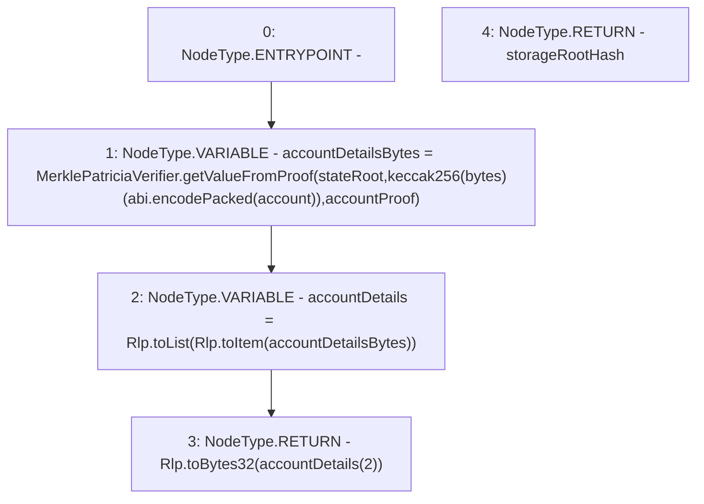

# Context: AccountVerifier.getAccountStorageRoot

**Contract:** `AccountVerifier` (Inherits: None)
**Signature:** `getAccountStorageRoot(address,bytes32,bytes) returns (bytes32)`
**Method Selector ID:** `Internal (No Method ID)`
**Visibility:** `internal`
**Environment-Free:** `Yes`
**Modifiers:** None

### State Variables Interaction
- **Reads:** None
- **Writes:** None

### Environment & Verification Flags
- **Uses Foundry Cheatcodes:** No
- **Has Echidna Properties:** No

### Internal Calls Tree
- None

### External Calls / Value Transfers
- `Rlp.TMP_5(bytes32) = LIBRARY_CALL, dest:Rlp, function:Rlp.toBytes32(Rlp.Item), arguments:['REF_5'] `
- `Rlp.TMP_4(Rlp.Item[]) = LIBRARY_CALL, dest:Rlp, function:Rlp.toList(Rlp.Item), arguments:['TMP_3'] `
- `MerklePatriciaVerifier.TMP_2(bytes) = LIBRARY_CALL, dest:MerklePatriciaVerifier, function:MerklePatriciaVerifier.getValueFromProof(bytes32,bytes32,bytes), arguments:['stateRoot', 'TMP_1', 'accountProof'] `
- `Rlp.TMP_3(Rlp.Item) = LIBRARY_CALL, dest:Rlp, function:Rlp.toItem(bytes), arguments:['accountDetailsBytes'] `

### Control Flow Graph (CFG)


### Source Mapping
Declared in: `certora-ac-datasets/detasets/web3bugs/dataset/web3bugs/42/projects/mochi-library/contracts/AccountVerifier.sol` on lines **12** to **22**

```solidity
    function getAccountStorageRoot(
        address account,
        bytes32 stateRoot,
        bytes memory accountProof
    ) internal pure returns(
        bytes32 storageRootHash
    ) {
        bytes memory accountDetailsBytes = MerklePatriciaVerifier.getValueFromProof(stateRoot, keccak256(abi.encodePacked(account)), accountProof);
        Rlp.Item[] memory accountDetails = Rlp.toList(Rlp.toItem(accountDetailsBytes));
        return Rlp.toBytes32(accountDetails[2]);
    }

```
