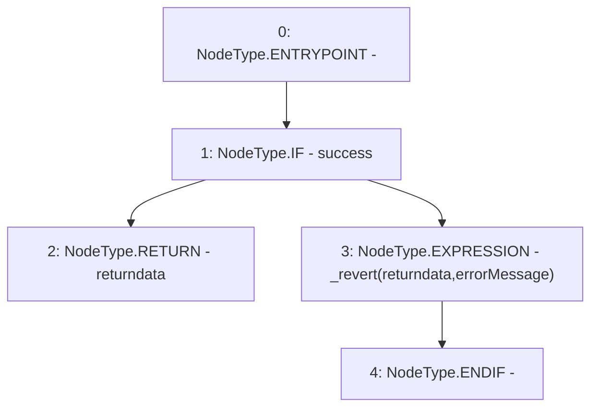

# Context: AddressUpgradeable.verifyCallResult

**Contract:** `AddressUpgradeable` (Inherits: None)
**Signature:** `verifyCallResult(bool,bytes,string) returns (bytes)`
**Method Selector ID:** `Internal (No Method ID)`
**Visibility:** `internal`
**Environment-Free:** `Yes`
**Modifiers:** None

### State Variables Interaction
- **Reads:** None
- **Writes:** None

### Assertion Checks & Business Requirements
- revert: `_revert(returndata,errorMessage)`

### Environment & Verification Flags
- **Uses Foundry Cheatcodes:** No
- **Has Echidna Properties:** No

### Internal Calls Tree
- None

### External Calls / Value Transfers
- None

### Control Flow Graph (CFG)


### Source Mapping
Declared in: `certora-ac-datasets/detasets/web3bugs/dataset/web3bugs/42/projects/mochi-core/node_modules/@openzeppelin/contracts-upgradeable/utils/AddressUpgradeable.sol` on lines **219** to **229**

```solidity
    function verifyCallResult(
        bool success,
        bytes memory returndata,
        string memory errorMessage
    ) internal pure returns (bytes memory) {
        if (success) {
            return returndata;
        } else {
            _revert(returndata, errorMessage);
        }
    }

```
