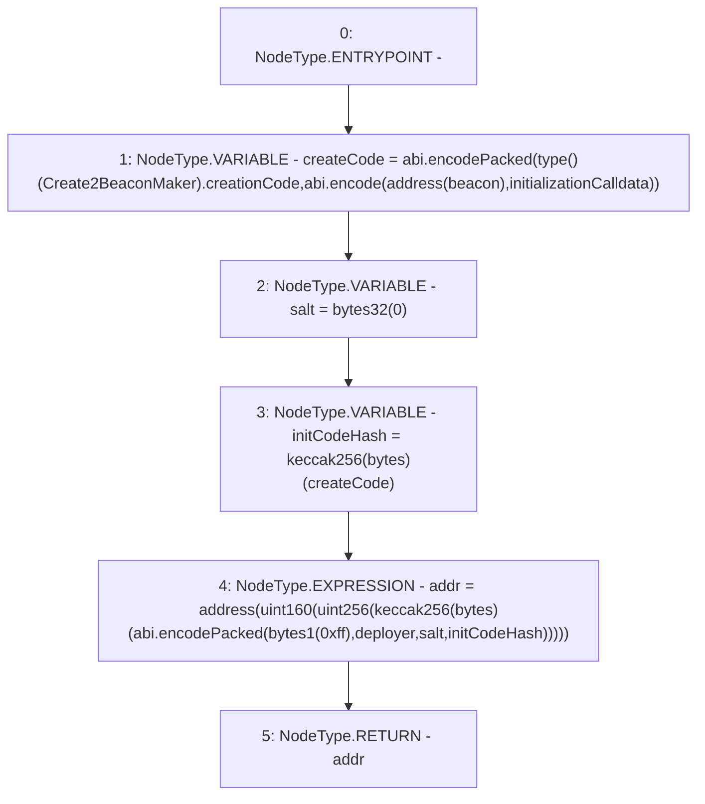

# Context: BeaconProxyDeployer.calculateAddress

**Contract:** `BeaconProxyDeployer` (Inherits: None)
**Signature:** `calculateAddress(address,address,bytes) returns (address)`
**Method Selector ID:** `Internal (No Method ID)`
**Visibility:** `internal`
**Environment-Free:** `Yes`
**Modifiers:** None

### State Variables Interaction
- **Reads:** None
- **Writes:** None

### Environment & Verification Flags
- **Uses Foundry Cheatcodes:** No
- **Has Echidna Properties:** No

### Internal Calls Tree
- None

### External Calls / Value Transfers
- None

### Control Flow Graph (CFG)


### Source Mapping
Declared in: `certora-ac-datasets/detasets/web3bugs/dataset/web3bugs/42/projects/mochi-library/contracts/BeaconProxyDeployer.sol` on lines **38** to **66**

```solidity
    function calculateAddress(
        address deployer,
        address beacon,
        bytes memory initializationCalldata
    ) internal view returns (address addr) {
        bytes memory createCode =
            abi.encodePacked(
                type(Create2BeaconMaker).creationCode,
                abi.encode(address(beacon), initializationCalldata)
            );

        bytes32 salt = bytes32(0);
        // get the keccak256 hash of the init code for address derivation.
        bytes32 initCodeHash = keccak256(createCode);
        addr = address( // derive the target deployment address.
            uint160( // downcast to match the address type.
                uint256( // cast to uint to truncate upper digits.
                    keccak256( // compute CREATE2 hash using 4 inputs.
                        abi.encodePacked( // pack all inputs to the hash together.
                            bytes1(0xff), // pass in the control character.
                            deployer, // pass in the address of this contract.
                            salt, // pass in the salt from above.
                            initCodeHash // pass in hash of contract creation code.
                        )
                    )
                )
            )
        );
    }

```
