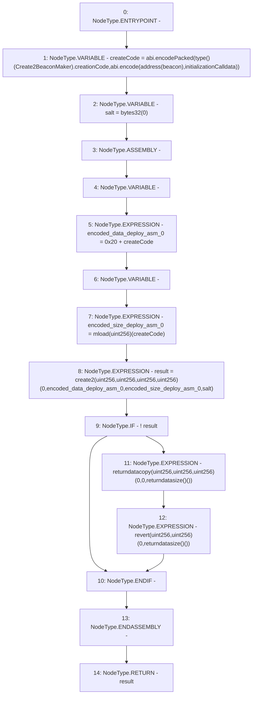

# Context: BeaconProxyDeployer.deploy

**Contract:** `BeaconProxyDeployer` (Inherits: None)
**Signature:** `deploy(address,bytes) returns (address)`
**Method Selector ID:** `Internal (No Method ID)`
**Visibility:** `internal`
**Environment-Free:** `Yes`
**Modifiers:** None

### State Variables Interaction
- **Reads:** None
- **Writes:** None

### Assertion Checks & Business Requirements
- revert: `revert(uint256,uint256)(0,returndatasize()())`

### Environment & Verification Flags
- **Uses Foundry Cheatcodes:** No
- **Has Echidna Properties:** No

### Internal Calls Tree
- None

### External Calls / Value Transfers
- None

### Control Flow Graph (CFG)


### Source Mapping
Declared in: `certora-ac-datasets/detasets/web3bugs/dataset/web3bugs/42/projects/mochi-library/contracts/BeaconProxyDeployer.sol` on lines **7** to **36**

```solidity
    function deploy(address beacon, bytes memory initializationCalldata)
        internal
        returns (address result)
    {
        bytes memory createCode =
            abi.encodePacked(
                type(Create2BeaconMaker).creationCode,
                abi.encode(address(beacon), initializationCalldata)
            );
        bytes32 salt = bytes32(0);

        // solhint-disable-next-line no-inline-assembly
        assembly {
            let encoded_data := add(0x20, createCode) // load initialization code.
            let encoded_size := mload(createCode) // load the init code's length.
            result := create2(
                // call `CREATE2` w/ 4 arguments.
                0, // forward any supplied endowment.
                encoded_data, // pass in initialization code.
                encoded_size, // pass in init code's length.
                salt // pass in the salt value.
            )

            // pass along failure message from failed contract deployment and revert.
            if iszero(result) {
                returndatacopy(0, 0, returndatasize())
                revert(0, returndatasize())
            }
        }
    }

```
