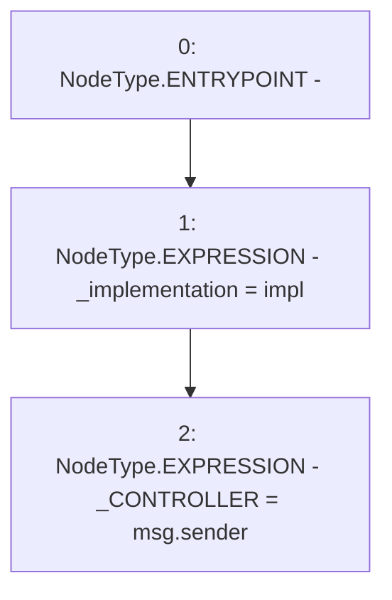

# Context: Beacon.constructor

**Contract:** `Beacon` (Inherits: None)
**Signature:** `constructor(address)`
**Method Selector ID:** `0xf8a6c595`
**Visibility:** `public`
**Environment-Free:** `No (reads EVM state context)`
**Modifiers:** None

### State Variables Interaction
- **Reads:** None
- **Writes:** _CONTROLLER, _implementation

### Environment & Verification Flags
- **Uses Foundry Cheatcodes:** No
- **Has Echidna Properties:** No

### Internal Calls Tree
- None

### External Calls / Value Transfers
- None

### Control Flow Graph (CFG)


### Source Mapping
Declared in: `certora-ac-datasets/detasets/web3bugs/dataset/web3bugs/42/projects/mochi-library/contracts/Beacon.sol` on lines **9** to **12**

```solidity
    constructor(address impl) {
        _implementation = impl;
        _CONTROLLER = msg.sender;
    }

```
