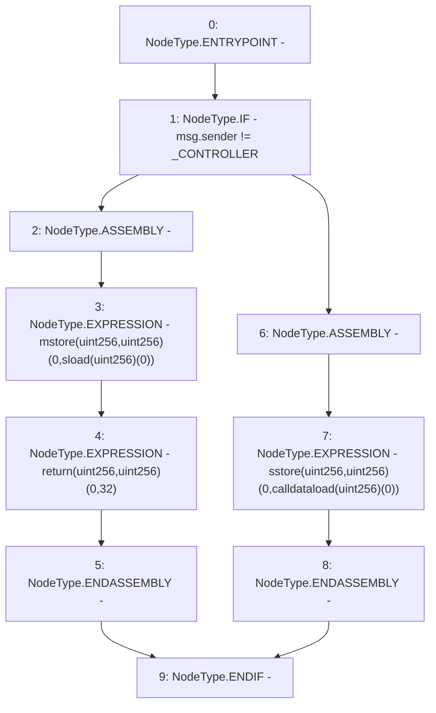

# Context: Beacon.fallback

**Contract:** `Beacon` (Inherits: None)
**Signature:** `fallback()`
**Method Selector ID:** `0x552079dc`
**Visibility:** `external`
**Environment-Free:** `No (reads EVM state context)`
**Modifiers:** None

### State Variables Interaction
- **Reads:** _CONTROLLER
- **Writes:** None

### Environment & Verification Flags
- **Uses Foundry Cheatcodes:** No
- **Has Echidna Properties:** No

### Internal Calls Tree
- None

### External Calls / Value Transfers
- None

### Control Flow Graph (CFG)


### Source Mapping
Declared in: `certora-ac-datasets/detasets/web3bugs/dataset/web3bugs/42/projects/mochi-library/contracts/Beacon.sol` on lines **14** to **25**

```solidity
    fallback() external {
        if (msg.sender != _CONTROLLER) {
            // solhint-disable-next-line no-inline-assembly
          assembly {
            mstore(0, sload(0))
            return(0, 32)
          }
        } else {
            // solhint-disable-next-line no-inline-assembly
          assembly { sstore(0, calldataload(0)) }
        }
    }

```
