# Context: BlockVerifier.extractStateRootAndTimestamp

**Contract:** `BlockVerifier` (Inherits: None)
**Signature:** `extractStateRootAndTimestamp(bytes) returns (bytes32, uint256, uint256)`
**Method Selector ID:** `Internal (No Method ID)`
**Visibility:** `internal`
**Environment-Free:** `Yes`
**Modifiers:** None

### State Variables Interaction
- **Reads:** None
- **Writes:** None

### Assertion Checks & Business Requirements
- revert: `revertWithReason(blockHash != rlpHash,20)`

### Environment & Verification Flags
- **Uses Foundry Cheatcodes:** No
- **Has Echidna Properties:** No

### Internal Calls Tree
- None

### External Calls / Value Transfers
- None

### Control Flow Graph (CFG)

```mermaid
flowchart TD
    Node_0["0: NodeType.ENTRYPOINT - "]
    Node_0 --> Node_1
    Node_1["1: NodeType.ASSEMBLY - "]
    Node_1 --> Node_2
    Node_2["2: NodeType.VARIABLE - "]
    Node_2 --> Node_3
    Node_3["3: NodeType.EXPRESSION - rlpLength_extractStateRootAndTimestamp_asm_0 = mload(uint256)(rlpBytes)"]
    Node_3 --> Node_4
    Node_4["4: NodeType.EXPRESSION - rlpBytes = rlpBytes + 0x20"]
    Node_4 --> Node_5
    Node_5["5: NodeType.VARIABLE - "]
    Node_5 --> Node_6
    Node_6["6: NodeType.EXPRESSION - parentHashPrefixPointer_extractStateRootAndTimestamp_asm_0 = rlpBytes + 3"]
    Node_6 --> Node_7
    Node_7["7: NodeType.VARIABLE - "]
    Node_7 --> Node_8
    Node_8["8: NodeType.EXPRESSION - parentHashPointer_extractStateRootAndTimestamp_asm_0 = parentHashPrefixPointer_extractStateRootAndTimestamp_asm_0 + 1"]
    Node_8 --> Node_9
    Node_9["9: NodeType.VARIABLE - "]
    Node_9 --> Node_10
    Node_10["10: NodeType.EXPRESSION - uncleHashPrefixPointer_extractStateRootAndTimestamp_asm_0 = parentHashPointer_extractStateRootAndTimestamp_asm_0 + 32"]
    Node_10 --> Node_11
    Node_11["11: NodeType.VARIABLE - "]
    Node_11 --> Node_12
    Node_12["12: NodeType.EXPRESSION - uncleHashPointer_extractStateRootAndTimestamp_asm_0 = uncleHashPrefixPointer_extractStateRootAndTimestamp_asm_0 + 1"]
    Node_12 --> Node_13
    Node_13["13: NodeType.VARIABLE - "]
    Node_13 --> Node_14
    Node_14["14: NodeType.EXPRESSION - minerAddressPrefixPointer_extractStateRootAndTimestamp_asm_0 = uncleHashPointer_extractStateRootAndTimestamp_asm_0 + 32"]
    Node_14 --> Node_15
    Node_15["15: NodeType.VARIABLE - "]
    Node_15 --> Node_16
    Node_16["16: NodeType.EXPRESSION - minerAddressPointer_extractStateRootAndTimestamp_asm_0 = minerAddressPrefixPointer_extractStateRootAndTimestamp_asm_0 + 1"]
    Node_16 --> Node_17
    Node_17["17: NodeType.VARIABLE - "]
    Node_17 --> Node_18
    Node_18["18: NodeType.EXPRESSION - stateRootPrefixPointer_extractStateRootAndTimestamp_asm_0 = minerAddressPointer_extractStateRootAndTimestamp_asm_0 + 20"]
    Node_18 --> Node_19
    Node_19["19: NodeType.VARIABLE - "]
    Node_19 --> Node_20
    Node_20["20: NodeType.EXPRESSION - stateRootPointer_extractStateRootAndTimestamp_asm_0 = stateRootPrefixPointer_extractStateRootAndTimestamp_asm_0 + 1"]
    Node_20 --> Node_21
    Node_21["21: NodeType.VARIABLE - "]
    Node_21 --> Node_22
    Node_22["22: NodeType.EXPRESSION - transactionRootPrefixPointer_extractStateRootAndTimestamp_asm_0 = stateRootPointer_extractStateRootAndTimestamp_asm_0 + 32"]
    Node_22 --> Node_23
    Node_23["23: NodeType.VARIABLE - "]
    Node_23 --> Node_24
    Node_24["24: NodeType.EXPRESSION - transactionRootPointer_extractStateRootAndTimestamp_asm_0 = transactionRootPrefixPointer_extractStateRootAndTimestamp_asm_0 + 1"]
    Node_24 --> Node_25
    Node_25["25: NodeType.VARIABLE - "]
    Node_25 --> Node_26
    Node_26["26: NodeType.EXPRESSION - receiptsRootPrefixPointer_extractStateRootAndTimestamp_asm_0 = transactionRootPointer_extractStateRootAndTimestamp_asm_0 + 32"]
    Node_26 --> Node_27
    Node_27["27: NodeType.VARIABLE - "]
    Node_27 --> Node_28
    Node_28["28: NodeType.EXPRESSION - receiptsRootPointer_extractStateRootAndTimestamp_asm_0 = receiptsRootPrefixPointer_extractStateRootAndTimestamp_asm_0 + 1"]
    Node_28 --> Node_29
    Node_29["29: NodeType.VARIABLE - "]
    Node_29 --> Node_30
    Node_30["30: NodeType.EXPRESSION - logsBloomPrefixPointer_extractStateRootAndTimestamp_asm_0 = receiptsRootPointer_extractStateRootAndTimestamp_asm_0 + 32"]
    Node_30 --> Node_31
    Node_31["31: NodeType.VARIABLE - "]
    Node_31 --> Node_32
    Node_32["32: NodeType.EXPRESSION - logsBloomPointer_extractStateRootAndTimestamp_asm_0 = logsBloomPrefixPointer_extractStateRootAndTimestamp_asm_0 + 3"]
    Node_32 --> Node_33
    Node_33["33: NodeType.VARIABLE - "]
    Node_33 --> Node_34
    Node_34["34: NodeType.EXPRESSION - difficultyPrefixPointer_extractStateRootAndTimestamp_asm_0 = logsBloomPointer_extractStateRootAndTimestamp_asm_0 + 256"]
    Node_34 --> Node_35
    Node_35["35: NodeType.VARIABLE - "]
    Node_35 --> Node_36
    Node_36["36: NodeType.VARIABLE - "]
    Node_36 --> Node_37
    Node_37["37: NodeType.EXPRESSION - (difficultyPointer_extractStateRootAndTimestamp_asm_0,difficultyLength_extractStateRootAndTimestamp_asm_0) = readDynamic(difficultyPrefixPointer_extractStateRootAndTimestamp_asm_0)"]
    Node_37 --> Node_38
    Node_38["38: NodeType.VARIABLE - "]
    Node_38 --> Node_39
    Node_39["39: NodeType.EXPRESSION - blockNumberPrefixPointer_extractStateRootAndTimestamp_asm_0 = difficultyPointer_extractStateRootAndTimestamp_asm_0 + difficultyLength_extractStateRootAndTimestamp_asm_0"]
    Node_39 --> Node_40
    Node_40["40: NodeType.VARIABLE - "]
    Node_40 --> Node_41
    Node_41["41: NodeType.VARIABLE - "]
    Node_41 --> Node_42
    Node_42["42: NodeType.EXPRESSION - (blockNumberPointer_extractStateRootAndTimestamp_asm_0,blockNumberLength_extractStateRootAndTimestamp_asm_0) = readDynamic(blockNumberPrefixPointer_extractStateRootAndTimestamp_asm_0)"]
    Node_42 --> Node_43
    Node_43["43: NodeType.VARIABLE - "]
    Node_43 --> Node_44
    Node_44["44: NodeType.EXPRESSION - gasLimitPrefixPointer_extractStateRootAndTimestamp_asm_0 = blockNumberPointer_extractStateRootAndTimestamp_asm_0 + blockNumberLength_extractStateRootAndTimestamp_asm_0"]
    Node_44 --> Node_45
    Node_45["45: NodeType.VARIABLE - "]
    Node_45 --> Node_46
    Node_46["46: NodeType.VARIABLE - "]
    Node_46 --> Node_47
    Node_47["47: NodeType.EXPRESSION - (gasLimitPointer_extractStateRootAndTimestamp_asm_0,gasLimitLength_extractStateRootAndTimestamp_asm_0) = readDynamic(gasLimitPrefixPointer_extractStateRootAndTimestamp_asm_0)"]
    Node_47 --> Node_48
    Node_48["48: NodeType.VARIABLE - "]
    Node_48 --> Node_49
    Node_49["49: NodeType.EXPRESSION - gasUsedPrefixPointer_extractStateRootAndTimestamp_asm_0 = gasLimitPointer_extractStateRootAndTimestamp_asm_0 + gasLimitLength_extractStateRootAndTimestamp_asm_0"]
    Node_49 --> Node_50
    Node_50["50: NodeType.VARIABLE - "]
    Node_50 --> Node_51
    Node_51["51: NodeType.VARIABLE - "]
    Node_51 --> Node_52
    Node_52["52: NodeType.EXPRESSION - (gasUsedPointer_extractStateRootAndTimestamp_asm_0,gasUsedLength_extractStateRootAndTimestamp_asm_0) = readDynamic(gasUsedPrefixPointer_extractStateRootAndTimestamp_asm_0)"]
    Node_52 --> Node_53
    Node_53["53: NodeType.VARIABLE - "]
    Node_53 --> Node_54
    Node_54["54: NodeType.EXPRESSION - timestampPrefixPointer_extractStateRootAndTimestamp_asm_0 = gasUsedPointer_extractStateRootAndTimestamp_asm_0 + gasUsedLength_extractStateRootAndTimestamp_asm_0"]
    Node_54 --> Node_55
    Node_55["55: NodeType.VARIABLE - "]
    Node_55 --> Node_56
    Node_56["56: NodeType.VARIABLE - "]
    Node_56 --> Node_57
    Node_57["57: NodeType.EXPRESSION - (timestampPointer_extractStateRootAndTimestamp_asm_0,timestampLength_extractStateRootAndTimestamp_asm_0) = readDynamic(timestampPrefixPointer_extractStateRootAndTimestamp_asm_0)"]
    Node_57 --> Node_58
    Node_58["58: NodeType.EXPRESSION - blockNumber = mload(uint256)(blockNumberPointer_extractStateRootAndTimestamp_asm_0) >> 256 - blockNumberLength_extractStateRootAndTimestamp_asm_0 * 8"]
    Node_58 --> Node_59
    Node_59["59: NodeType.VARIABLE - "]
    Node_59 --> Node_60
    Node_60["60: NodeType.EXPRESSION - blockHash_extractStateRootAndTimestamp_asm_0 = blockhash(uint256)(blockNumber)"]
    Node_60 --> Node_61
    Node_61["61: NodeType.VARIABLE - "]
    Node_61 --> Node_62
    Node_62["62: NodeType.EXPRESSION - rlpHash_extractStateRootAndTimestamp_asm_0 = keccak256(uint256,uint256)(rlpBytes,rlpLength_extractStateRootAndTimestamp_asm_0)"]
    Node_62 --> Node_63
    Node_63["63: NodeType.IF - ! blockHash_extractStateRootAndTimestamp_asm_0 == rlpHash_extractStateRootAndTimestamp_asm_0"]
    Node_63 --> Node_65
    Node_63 --> Node_64
    Node_64["64: NodeType.ENDIF - "]
    Node_64 --> Node_66
    Node_65["65: NodeType.EXPRESSION - revertWithReason(blockHash != rlpHash,20)"]
    Node_65 --> Node_64
    Node_66["66: NodeType.EXPRESSION - stateRoot = mload(uint256)(stateRootPointer_extractStateRootAndTimestamp_asm_0)"]
    Node_66 --> Node_67
    Node_67["67: NodeType.EXPRESSION - blockTimestamp = mload(uint256)(timestampPointer_extractStateRootAndTimestamp_asm_0) >> 256 - timestampLength_extractStateRootAndTimestamp_asm_0 * 8"]
    Node_67 --> Node_68
    Node_68["68: NodeType.ENDASSEMBLY - "]
    Node_68 --> Node_69
    Node_69["69: NodeType.RETURN - (stateRoot,blockTimestamp,blockNumber)"]
```


### Source Mapping
Declared in: `certora-ac-datasets/detasets/web3bugs/dataset/web3bugs/42/projects/mochi-library/contracts/BlockVerifier.sol` on lines **6** to **69**

```solidity
    function extractStateRootAndTimestamp(bytes memory rlpBytes) internal view returns (bytes32 stateRoot, uint256 blockTimestamp, uint256 blockNumber) {
        assembly {
            function revertWithReason(message, length) {
                mstore(0, 0x08c379a000000000000000000000000000000000000000000000000000000000)
                mstore(4, 0x20)
                mstore(0x24, length)
                mstore(0x44, message)
                revert(0, add(0x44, length))
            }

            function readDynamic(prefixPointer) -> dataPointer, dataLength {
                let value := byte(0, mload(prefixPointer))
                switch lt(value, 0x80)
                case 1 {
                    dataPointer := prefixPointer
                    dataLength := 1
                }
                case 0 {
                    dataPointer := add(prefixPointer, 1)
                    dataLength := sub(value, 0x80)
                }
            }

            // get the length of the data
            let rlpLength := mload(rlpBytes)
            // move pointer forward, ahead of length
            rlpBytes := add(rlpBytes, 0x20)

            // we know the length of the block will be between 483 bytes and 709 bytes, which means it will have 2 length bytes after the prefix byte, so we can skip 3 bytes in
            // CONSIDER: we could save a trivial amount of gas by compressing most of this into a single add instruction
            let parentHashPrefixPointer := add(rlpBytes, 3)
            let parentHashPointer := add(parentHashPrefixPointer, 1)
            let uncleHashPrefixPointer := add(parentHashPointer, 32)
            let uncleHashPointer := add(uncleHashPrefixPointer, 1)
            let minerAddressPrefixPointer := add(uncleHashPointer, 32)
            let minerAddressPointer := add(minerAddressPrefixPointer, 1)
            let stateRootPrefixPointer := add(minerAddressPointer, 20)
            let stateRootPointer := add(stateRootPrefixPointer, 1)
            let transactionRootPrefixPointer := add(stateRootPointer, 32)
            let transactionRootPointer := add(transactionRootPrefixPointer, 1)
            let receiptsRootPrefixPointer := add(transactionRootPointer, 32)
            let receiptsRootPointer := add(receiptsRootPrefixPointer, 1)
            let logsBloomPrefixPointer := add(receiptsRootPointer, 32)
            let logsBloomPointer := add(logsBloomPrefixPointer, 3)
            let difficultyPrefixPointer := add(logsBloomPointer, 256)
            let difficultyPointer, difficultyLength := readDynamic(difficultyPrefixPointer)
            let blockNumberPrefixPointer := add(difficultyPointer, difficultyLength)
            let blockNumberPointer, blockNumberLength := readDynamic(blockNumberPrefixPointer)
            let gasLimitPrefixPointer := add(blockNumberPointer, blockNumberLength)
            let gasLimitPointer, gasLimitLength := readDynamic(gasLimitPrefixPointer)
            let gasUsedPrefixPointer := add(gasLimitPointer, gasLimitLength)
            let gasUsedPointer, gasUsedLength := readDynamic(gasUsedPrefixPointer)
            let timestampPrefixPointer := add(gasUsedPointer, gasUsedLength)
            let timestampPointer, timestampLength := readDynamic(timestampPrefixPointer)

            blockNumber := shr(sub(256, mul(blockNumberLength, 8)), mload(blockNumberPointer))
            let blockHash := blockhash(blockNumber)
            let rlpHash := keccak256(rlpBytes, rlpLength)
            if iszero(eq(blockHash, rlpHash)) { revertWithReason("blockHash != rlpHash", 20) }

            stateRoot := mload(stateRootPointer)
            blockTimestamp := shr(sub(256, mul(timestampLength, 8)), mload(timestampPointer))
        }
    }

```
