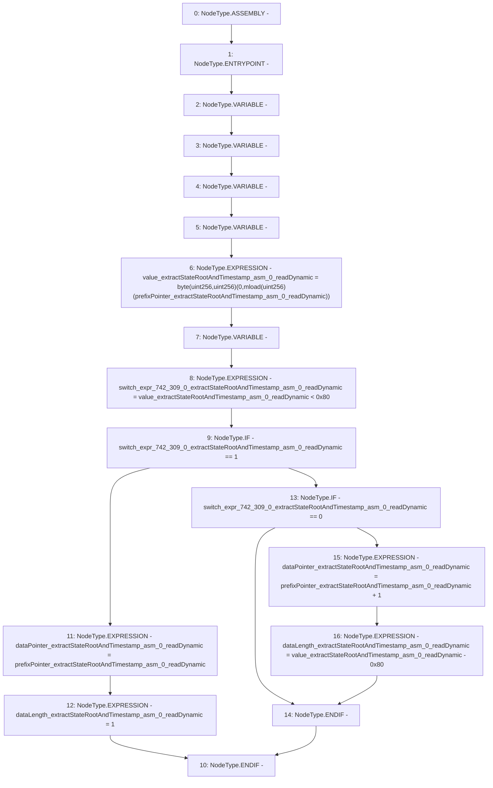

# Context: BlockVerifier.readDynamic

**Contract:** `BlockVerifier` (Inherits: None)
**Signature:** `readDynamic(uint256) returns (uint256, uint256)`
**Method Selector ID:** `Internal (No Method ID)`
**Visibility:** `private`
**Environment-Free:** `Yes`
**Modifiers:** None

### State Variables Interaction
- **Reads:** None
- **Writes:** None

### Environment & Verification Flags
- **Uses Foundry Cheatcodes:** No
- **Has Echidna Properties:** No

### Internal Calls Tree
- None

### External Calls / Value Transfers
- None

### Control Flow Graph (CFG)


### Source Mapping
Declared in: `certora-ac-datasets/detasets/web3bugs/dataset/web3bugs/42/projects/mochi-library/contracts/BlockVerifier.sol` on lines **16** to **27**

```solidity
            function readDynamic(prefixPointer) -> dataPointer, dataLength {
                let value := byte(0, mload(prefixPointer))
                switch lt(value, 0x80)
                case 1 {
                    dataPointer := prefixPointer
                    dataLength := 1
                }
                case 0 {
                    dataPointer := add(prefixPointer, 1)
                    dataLength := sub(value, 0x80)
                }
            }

```
