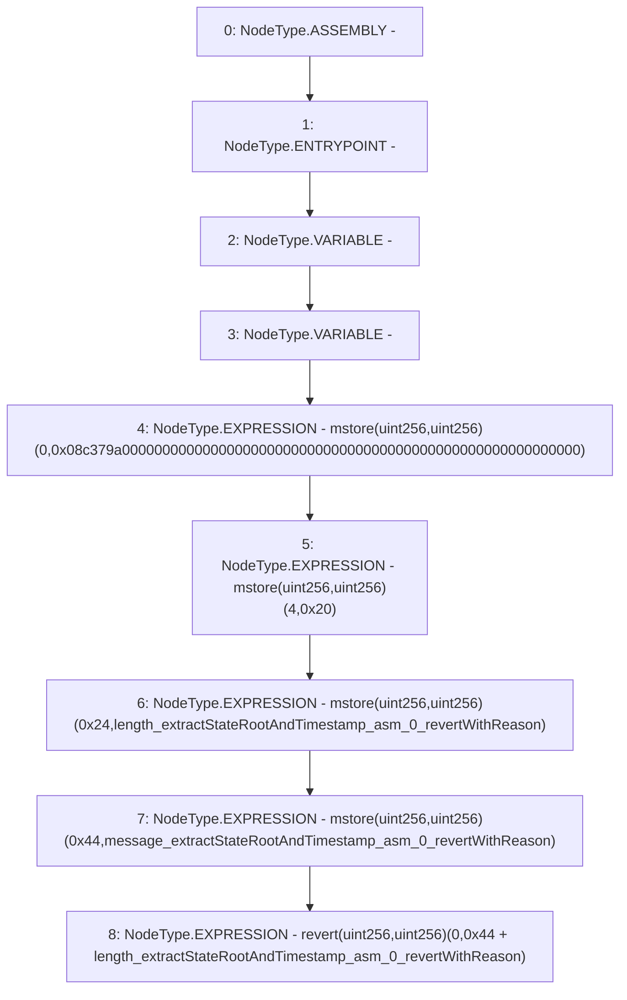

# Context: BlockVerifier.revertWithReason

**Contract:** `BlockVerifier` (Inherits: None)
**Signature:** `revertWithReason(uint256,uint256)`
**Method Selector ID:** `Internal (No Method ID)`
**Visibility:** `private`
**Environment-Free:** `Yes`
**Modifiers:** None

### State Variables Interaction
- **Reads:** None
- **Writes:** None

### Assertion Checks & Business Requirements
- revert: `mstore(uint256,uint256)(0x24,length_extractStateRootAndTimestamp_asm_0_revertWithReason)`
- revert: `mstore(uint256,uint256)(0x44,message_extractStateRootAndTimestamp_asm_0_revertWithReason)`
- revert: `revert(uint256,uint256)(0,0x44 + length_extractStateRootAndTimestamp_asm_0_revertWithReason)`

### Environment & Verification Flags
- **Uses Foundry Cheatcodes:** No
- **Has Echidna Properties:** No

### Internal Calls Tree
- None

### External Calls / Value Transfers
- None

### Control Flow Graph (CFG)


### Source Mapping
Declared in: `certora-ac-datasets/detasets/web3bugs/dataset/web3bugs/42/projects/mochi-library/contracts/BlockVerifier.sol` on lines **8** to **14**

```solidity
            function revertWithReason(message, length) {
                mstore(0, 0x08c379a000000000000000000000000000000000000000000000000000000000)
                mstore(4, 0x20)
                mstore(0x24, length)
                mstore(0x44, message)
                revert(0, add(0x44, length))
            }

```
