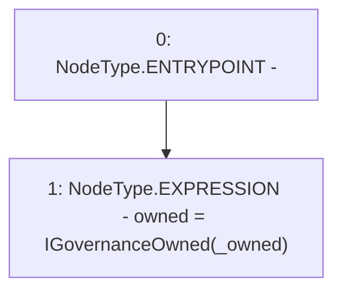

# Context: ChainlinkAdapterEth.constructor

**Contract:** `ChainlinkAdapterEth` (Inherits: ICSSRAdapter)
**Signature:** `constructor(address)`
**Method Selector ID:** `0xf8a6c595`
**Visibility:** `public`
**Environment-Free:** `Yes`
**Modifiers:** None

### State Variables Interaction
- **Reads:** None
- **Writes:** owned

### Environment & Verification Flags
- **Uses Foundry Cheatcodes:** No
- **Has Echidna Properties:** No

### Internal Calls Tree
- None

### External Calls / Value Transfers
- None

### Control Flow Graph (CFG)


### Source Mapping
Declared in: `certora-ac-datasets/detasets/web3bugs/dataset/web3bugs/42/projects/mochi-cssr/contracts/adapter/ChainlinkAdapter.sol` on lines **21** to **23**

```solidity
    constructor(address _owned) {
        owned = IGovernanceOwned(_owned);
    }

```
