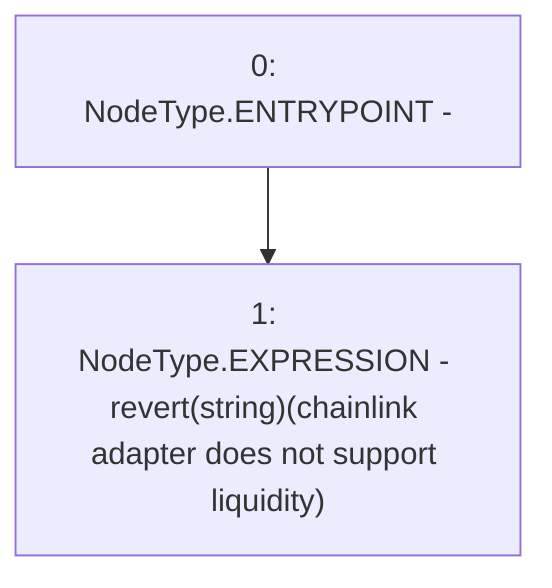

# Context: ChainlinkAdapterEth.getLiquidity

**Contract:** `ChainlinkAdapterEth` (Inherits: ICSSRAdapter)
**Signature:** `getLiquidity(address) returns (uint256)`
**Method Selector ID:** `0xa747b93b`
**Visibility:** `external`
**Environment-Free:** `Yes`
**Modifiers:** None

### State Variables Interaction
- **Reads:** None
- **Writes:** None

### Assertion Checks & Business Requirements
- revert: `revert(string)(chainlink adapter does not support liquidity)`

### Environment & Verification Flags
- **Uses Foundry Cheatcodes:** No
- **Has Echidna Properties:** No

### Internal Calls Tree
- None

### External Calls / Value Transfers
- None

### Control Flow Graph (CFG)


### Source Mapping
Declared in: `certora-ac-datasets/detasets/web3bugs/dataset/web3bugs/42/projects/mochi-cssr/contracts/adapter/ChainlinkAdapter.sol` on lines **67** to **74**

```solidity
    function getLiquidity(address _asset)
        external
        view
        override
        returns (uint256)
    {
        revert("chainlink adapter does not support liquidity");
    }

```
