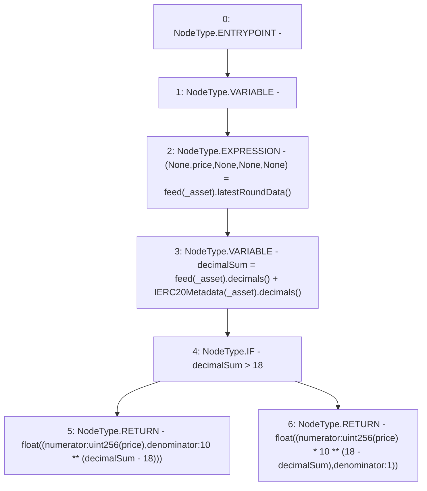

# Context: ChainlinkAdapterEth.getPrice

**Contract:** `ChainlinkAdapterEth` (Inherits: ICSSRAdapter)
**Signature:** `getPrice(address) returns (float)`
**Method Selector ID:** `0x41976e09`
**Visibility:** `public`
**Environment-Free:** `Yes`
**Modifiers:** None

### State Variables Interaction
- **Reads:** feed
- **Writes:** None

### Environment & Verification Flags
- **Uses Foundry Cheatcodes:** No
- **Has Echidna Properties:** No

### Internal Calls Tree
- None

### External Calls / Value Transfers
- `IERC20Metadata.TMP_11(uint8) = HIGH_LEVEL_CALL, dest:TMP_10(IERC20Metadata), function:decimals, arguments:[]  `
- `AggregatorV3Interface.TMP_9(uint8) = HIGH_LEVEL_CALL, dest:REF_7(AggregatorV3Interface), function:decimals, arguments:[]  `
- `AggregatorV3Interface.TUPLE_0(uint80,int256,uint256,uint256,uint80) = HIGH_LEVEL_CALL, dest:REF_5(AggregatorV3Interface), function:latestRoundData, arguments:[]  `

### Control Flow Graph (CFG)


### Source Mapping
Declared in: `certora-ac-datasets/detasets/web3bugs/dataset/web3bugs/42/projects/mochi-cssr/contracts/adapter/ChainlinkAdapter.sol` on lines **43** to **65**

```solidity
    function getPrice(address _asset)
        public
        view
        override
        returns (float memory)
    {
        (, int256 price, , , ) = feed[_asset].latestRoundData();
        uint256 decimalSum = feed[_asset].decimals() +
            IERC20Metadata(_asset).decimals();
        if (decimalSum > 18) {
            return
                float({
                    numerator: uint256(price),
                    denominator: 10**(decimalSum - 18)
                });
        } else {
            return
                float({
                    numerator: uint256(price) * 10**(18 - decimalSum),
                    denominator: 1
                });
        }
    }

```
