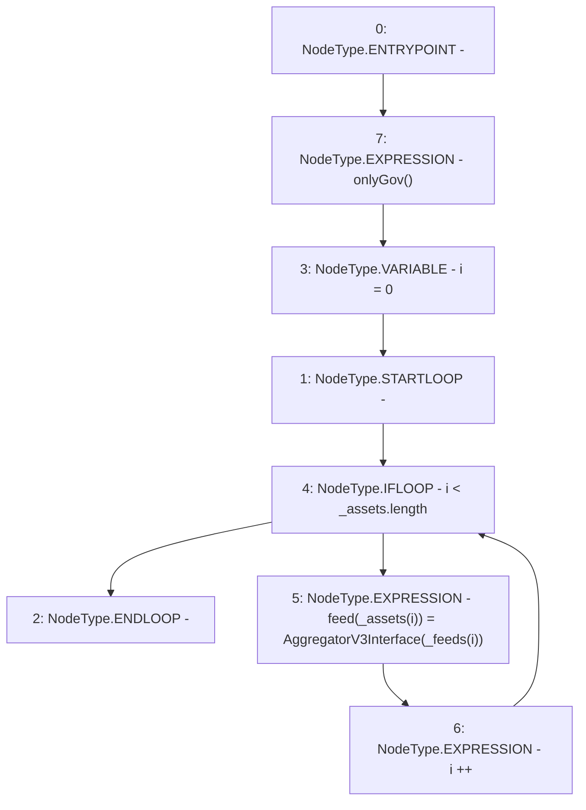

# Context: ChainlinkAdapterEth.setFeed

**Contract:** `ChainlinkAdapterEth` (Inherits: ICSSRAdapter)
**Signature:** `setFeed(address[],address[])`
**Method Selector ID:** `0x1931afc7`
**Visibility:** `external`
**Environment-Free:** `No (reads EVM state context)`
**Modifiers:**
- `onlyGov`
  ```solidity
  modifier onlyGov() {
          require(msg.sender == owned.governance(), "!gov");
          _;
      }
  ```

### State Variables Interaction
- **Reads:** None
- **Writes:** feed

### Environment & Verification Flags
- **Uses Foundry Cheatcodes:** No
- **Has Echidna Properties:** No

### Internal Calls Tree
- None

### External Calls / Value Transfers
- None

### Control Flow Graph (CFG)


### Source Mapping
Declared in: `certora-ac-datasets/detasets/web3bugs/dataset/web3bugs/42/projects/mochi-cssr/contracts/adapter/ChainlinkAdapter.sol` on lines **33** to **37**

```solidity
    function setFeed(address[] calldata _assets, address[] calldata _feeds) external onlyGov {
        for(uint256 i = 0; i<_assets.length; i++) {
            feed[_assets[i]] = AggregatorV3Interface(_feeds[i]);
        }
    }

```
