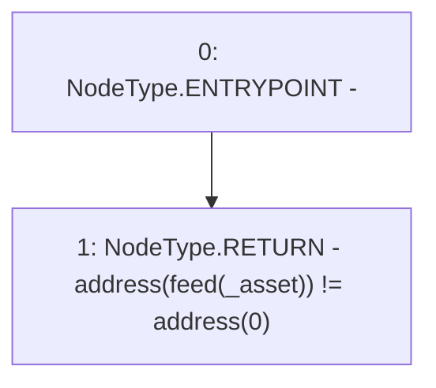

# Context: ChainlinkAdapterEth.support

**Contract:** `ChainlinkAdapterEth` (Inherits: ICSSRAdapter)
**Signature:** `support(address) returns (bool)`
**Method Selector ID:** `0xe660cc08`
**Visibility:** `external`
**Environment-Free:** `Yes`
**Modifiers:** None

### State Variables Interaction
- **Reads:** feed
- **Writes:** None

### Environment & Verification Flags
- **Uses Foundry Cheatcodes:** No
- **Has Echidna Properties:** No

### Internal Calls Tree
- None

### External Calls / Value Transfers
- None

### Control Flow Graph (CFG)


### Source Mapping
Declared in: `certora-ac-datasets/detasets/web3bugs/dataset/web3bugs/42/projects/mochi-cssr/contracts/adapter/ChainlinkAdapter.sol` on lines **39** to **41**

```solidity
    function support(address _asset) external view override returns (bool) {
        return address(feed[_asset]) != address(0);
    }

```
