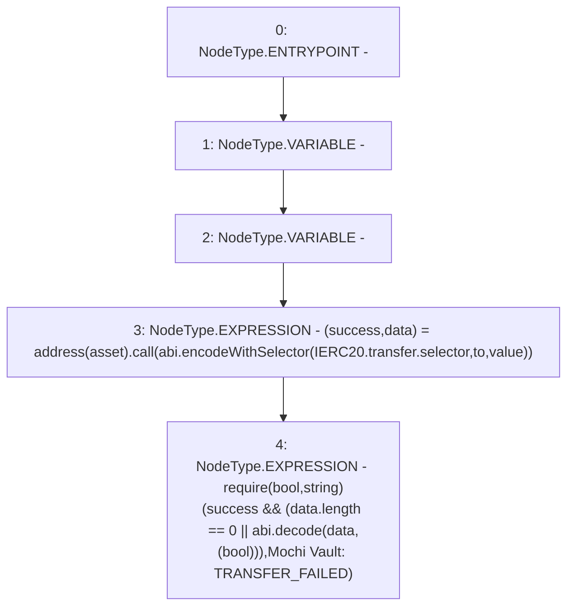

# Context: CheapERC20.cheapTransfer

**Contract:** `CheapERC20` (Inherits: None)
**Signature:** `cheapTransfer(IERC20,address,uint256)`
**Method Selector ID:** `Internal (No Method ID)`
**Visibility:** `internal`
**Environment-Free:** `Yes`
**Modifiers:** None

### State Variables Interaction
- **Reads:** None
- **Writes:** None

### Assertion Checks & Business Requirements
- require/assert: `require(bool,string)(success && (data.length == 0 || abi.decode(data,(bool))),Mochi Vault: TRANSFER_FAILED)`

### Environment & Verification Flags
- **Uses Foundry Cheatcodes:** No
- **Has Echidna Properties:** No

### Internal Calls Tree
- None

### External Calls / Value Transfers
- `low-level-call`

### Control Flow Graph (CFG)


### Source Mapping
Declared in: `certora-ac-datasets/detasets/web3bugs/dataset/web3bugs/42/projects/mochi-library/contracts/CheapERC20.sol` on lines **8** to **11**

```solidity
    function cheapTransfer(IERC20 asset, address to, uint value) internal {
        (bool success, bytes memory data) = address(asset).call(abi.encodeWithSelector(IERC20.transfer.selector, to, value));
        require(success && (data.length == 0 || abi.decode(data, (bool))), 'Mochi Vault: TRANSFER_FAILED');
    }

```
