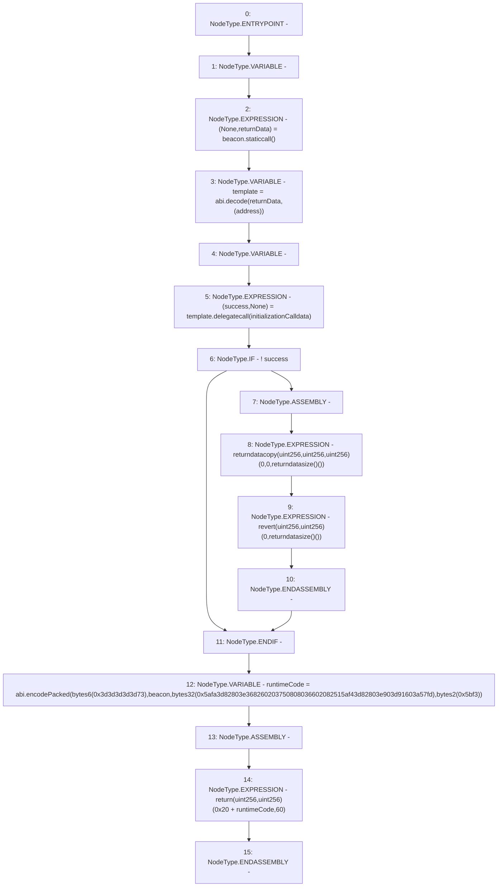

# Context: Create2BeaconMaker.constructor

**Contract:** `Create2BeaconMaker` (Inherits: None)
**Signature:** `constructor(address,bytes)`
**Method Selector ID:** `0x4531ea10`
**Visibility:** `public`
**Environment-Free:** `Yes`
**Modifiers:** None

### State Variables Interaction
- **Reads:** None
- **Writes:** None

### Assertion Checks & Business Requirements
- revert: `revert(uint256,uint256)(0,returndatasize()())`

### Environment & Verification Flags
- **Uses Foundry Cheatcodes:** No
- **Has Echidna Properties:** No

### Internal Calls Tree
- None

### External Calls / Value Transfers
- `low-level-call`

### Control Flow Graph (CFG)


### Source Mapping
Declared in: `certora-ac-datasets/detasets/web3bugs/dataset/web3bugs/42/projects/mochi-library/contracts/Create2BeaconMaker.sol` on lines **6** to **36**

```solidity
    constructor(address beacon, bytes memory initializationCalldata)
        payable
    {
        (, bytes memory returnData) = beacon.staticcall("");
        address template = abi.decode(returnData, (address));
        // solhint-disable-next-line avoid-low-level-calls
        (bool success, ) = template.delegatecall(initializationCalldata);
        if (!success) {
            // pass along failure message from delegatecall and revert.
            // solhint-disable-next-line no-inline-assembly
            assembly {
                returndatacopy(0, 0, returndatasize())
                revert(0, returndatasize())
            }
        }

        // place eip-1167 runtime code in memory.
        bytes memory runtimeCode =
            abi.encodePacked(
                bytes6(0x3d3d3d3d3d73),
                beacon,
                bytes32(0x5afa3d82803e368260203750808036602082515af43d82803e903d91603a57fd),
                bytes2(0x5bf3)
            );

        // return Beacon Minimal Proxy code to write it to spawned contract runtime.
        // solhint-disable-next-line no-inline-assembly
        assembly {
            return(add(0x20, runtimeCode), 60) // Beacon Minimal Proxy runtime code, length
        }
    }

```
