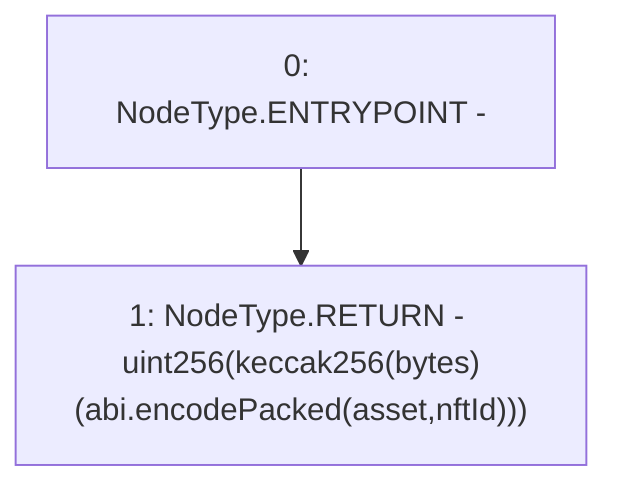

# Context: DutchAuctionLiquidator.auctionId

**Contract:** `DutchAuctionLiquidator` (Inherits: ILiquidator)
**Signature:** `auctionId(address,uint256) returns (uint256)`
**Method Selector ID:** `0x8e78a28c`
**Visibility:** `public`
**Environment-Free:** `Yes`
**Modifiers:** None

### State Variables Interaction
- **Reads:** None
- **Writes:** None

### Environment & Verification Flags
- **Uses Foundry Cheatcodes:** No
- **Has Echidna Properties:** No

### Internal Calls Tree
- None

### External Calls / Value Transfers
- None

### Control Flow Graph (CFG)


### Source Mapping
Declared in: `certora-ac-datasets/detasets/web3bugs/dataset/web3bugs/42/projects/mochi-core/contracts/liquidator/DutchAuctionLiquidator.sol` on lines **33** to **39**

```solidity
    function auctionId(address asset, uint256 nftId)
        public
        pure
        returns (uint256)
    {
        return uint256(keccak256(abi.encodePacked(asset, nftId)));
    }

```
