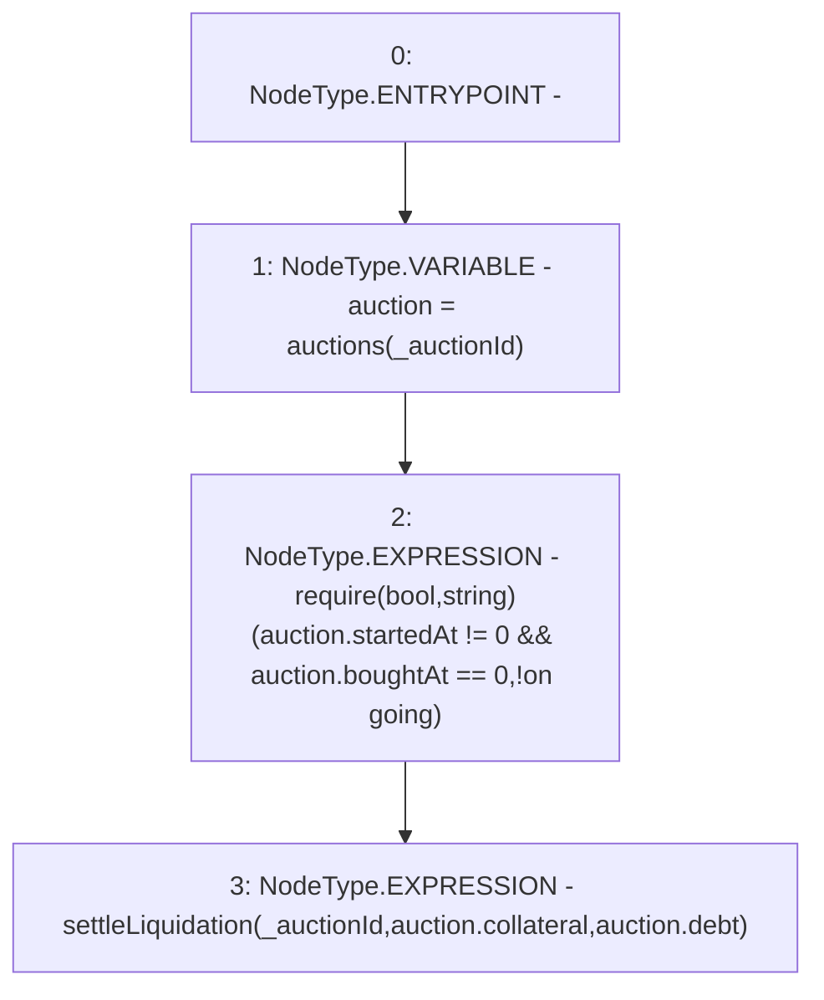

# Context: DutchAuctionLiquidator.buy

**Contract:** `DutchAuctionLiquidator` (Inherits: ILiquidator)
**Signature:** `buy(uint256)`
**Method Selector ID:** `0xd96a094a`
**Visibility:** `external`
**Environment-Free:** `No (reads EVM state context)`
**Modifiers:** None

### State Variables Interaction
- **Reads:** auctions
- **Writes:** None

### Assertion Checks & Business Requirements
- require/assert: `require(bool,string)(auction.startedAt != 0 && auction.boughtAt == 0,!on going)`

### Environment & Verification Flags
- **Uses Foundry Cheatcodes:** No
- **Has Echidna Properties:** No

### Internal Calls Tree
- None

### External Calls / Value Transfers
- None

### Control Flow Graph (CFG)


### Source Mapping
Declared in: `certora-ac-datasets/detasets/web3bugs/dataset/web3bugs/42/projects/mochi-core/contracts/liquidator/DutchAuctionLiquidator.sol` on lines **119** to **123**

```solidity
    function buy(uint256 _auctionId) external {
        Auction memory auction = auctions[_auctionId];
        require(auction.startedAt != 0 && auction.boughtAt == 0, "!on going");
        settleLiquidation(_auctionId, auction.collateral, auction.debt);
    }

```
