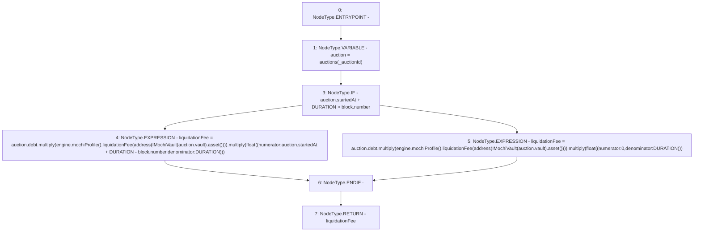

# Context: DutchAuctionLiquidator.currentLiquidationFee

**Contract:** `DutchAuctionLiquidator` (Inherits: ILiquidator)
**Signature:** `currentLiquidationFee(uint256) returns (uint256)`
**Method Selector ID:** `0x6050f02f`
**Visibility:** `public`
**Environment-Free:** `No (reads EVM state context)`
**Modifiers:** None

### State Variables Interaction
- **Reads:** DURATION, auctions, engine
- **Writes:** None

### Environment & Verification Flags
- **Uses Foundry Cheatcodes:** No
- **Has Echidna Properties:** No

### Internal Calls Tree
- None

### External Calls / Value Transfers
- `IMochiVault.TMP_10(IERC20) = HIGH_LEVEL_CALL, dest:TMP_9(IMochiVault), function:asset, arguments:[]  `
- `IMochiEngine.TMP_8(IMochiProfile) = HIGH_LEVEL_CALL, dest:engine(IMochiEngine), function:mochiProfile, arguments:[]  `
- `IMochiProfile.TMP_12(float) = HIGH_LEVEL_CALL, dest:TMP_8(IMochiProfile), function:liquidationFee, arguments:['TMP_11']  `
- `Float.TMP_17(uint256) = LIBRARY_CALL, dest:Float, function:Float.multiply(uint256,float), arguments:['TMP_13', 'TMP_16'] `
- `Float.TMP_23(uint256) = LIBRARY_CALL, dest:Float, function:Float.multiply(uint256,float), arguments:['REF_13', 'TMP_22'] `
- `IMochiEngine.TMP_18(IMochiProfile) = HIGH_LEVEL_CALL, dest:engine(IMochiEngine), function:mochiProfile, arguments:[]  `
- `Float.TMP_13(uint256) = LIBRARY_CALL, dest:Float, function:Float.multiply(uint256,float), arguments:['REF_5', 'TMP_12'] `
- `Float.TMP_25(uint256) = LIBRARY_CALL, dest:Float, function:Float.multiply(uint256,float), arguments:['TMP_23', 'TMP_24'] `
- `IMochiProfile.TMP_22(float) = HIGH_LEVEL_CALL, dest:TMP_18(IMochiProfile), function:liquidationFee, arguments:['TMP_21']  `
- `IMochiVault.TMP_20(IERC20) = HIGH_LEVEL_CALL, dest:TMP_19(IMochiVault), function:asset, arguments:[]  `

### Control Flow Graph (CFG)


### Source Mapping
Declared in: `certora-ac-datasets/detasets/web3bugs/dataset/web3bugs/42/projects/mochi-core/contracts/liquidator/DutchAuctionLiquidator.sol` on lines **46** to **67**

```solidity
    function currentLiquidationFee(uint256 _auctionId)
        public
        view
        returns (uint256 liquidationFee)
    {
        Auction memory auction = auctions[_auctionId];
        liquidationFee = auction
            .debt
            .multiply(
                engine.mochiProfile().liquidationFee(
                    address(IMochiVault(auction.vault).asset())
                )
            )
            .multiply(
                float({
                    numerator: auction.startedAt + DURATION > block.number
                        ? auction.startedAt + DURATION - block.number
                        : 0,
                    denominator: DURATION
                })
            );
    }

```
