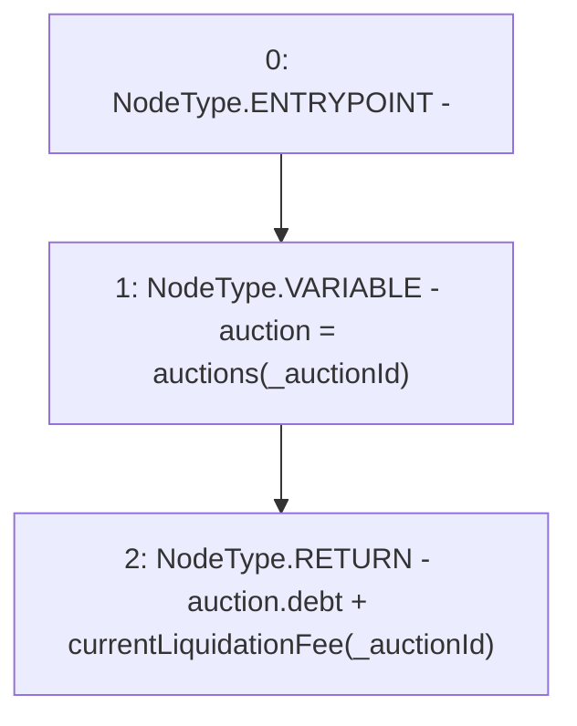

# Context: DutchAuctionLiquidator.price

**Contract:** `DutchAuctionLiquidator` (Inherits: ILiquidator)
**Signature:** `price(uint256) returns (uint256)`
**Method Selector ID:** `0x26a49e37`
**Visibility:** `external`
**Environment-Free:** `No (reads EVM state context)`
**Modifiers:** None

### State Variables Interaction
- **Reads:** auctions
- **Writes:** None

### Environment & Verification Flags
- **Uses Foundry Cheatcodes:** No
- **Has Echidna Properties:** No

### Internal Calls Tree
- None

### External Calls / Value Transfers
- None

### Control Flow Graph (CFG)


### Source Mapping
Declared in: `certora-ac-datasets/detasets/web3bugs/dataset/web3bugs/42/projects/mochi-core/contracts/liquidator/DutchAuctionLiquidator.sol` on lines **41** to **44**

```solidity
    function price(uint256 _auctionId) external view returns (uint256) {
        Auction memory auction = auctions[_auctionId];
        return auction.debt + currentLiquidationFee(_auctionId);
    }

```
