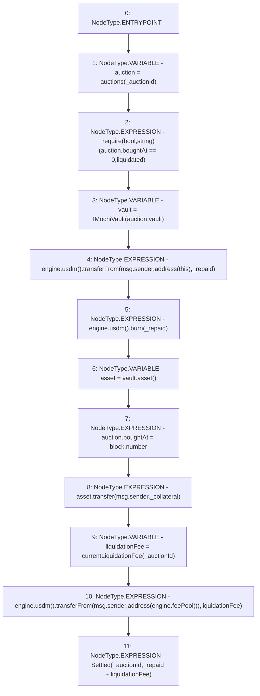

# Context: DutchAuctionLiquidator.settleLiquidation

**Contract:** `DutchAuctionLiquidator` (Inherits: ILiquidator)
**Signature:** `settleLiquidation(uint256,uint256,uint256)`
**Method Selector ID:** `Internal (No Method ID)`
**Visibility:** `internal`
**Environment-Free:** `No (reads EVM state context)`
**Modifiers:** None

### State Variables Interaction
- **Reads:** auctions, engine
- **Writes:** auctions

### Assertion Checks & Business Requirements
- require/assert: `require(bool,string)(auction.boughtAt == 0,liquidated)`

### Environment & Verification Flags
- **Uses Foundry Cheatcodes:** No
- **Has Echidna Properties:** No

### Internal Calls Tree
- None

### External Calls / Value Transfers
- `IMochiVault.TMP_51(IERC20) = HIGH_LEVEL_CALL, dest:vault(IMochiVault), function:asset, arguments:[]  `
- `IMochiEngine.TMP_46(IUSDM) = HIGH_LEVEL_CALL, dest:engine(IMochiEngine), function:usdm, arguments:[]  `
- `IMochiEngine.TMP_49(IUSDM) = HIGH_LEVEL_CALL, dest:engine(IMochiEngine), function:usdm, arguments:[]  `
- `IMochiEngine.TMP_55(IFeePool) = HIGH_LEVEL_CALL, dest:engine(IMochiEngine), function:feePool, arguments:[]  `
- `IUSDM.TMP_57(bool) = HIGH_LEVEL_CALL, dest:TMP_54(IUSDM), function:transferFrom, arguments:['msg.sender', 'TMP_56', 'liquidationFee']  `
- `IMochiEngine.TMP_54(IUSDM) = HIGH_LEVEL_CALL, dest:engine(IMochiEngine), function:usdm, arguments:[]  `
- `IERC20.TMP_52(bool) = HIGH_LEVEL_CALL, dest:asset(IERC20), function:transfer, arguments:['msg.sender', '_collateral']  `
- `IUSDM.TMP_48(bool) = HIGH_LEVEL_CALL, dest:TMP_46(IUSDM), function:transferFrom, arguments:['msg.sender', 'TMP_47', '_repaid']  `
- `IUSDM.HIGH_LEVEL_CALL, dest:TMP_49(IUSDM), function:burn, arguments:['_repaid']  `

### Control Flow Graph (CFG)


### Source Mapping
Declared in: `certora-ac-datasets/detasets/web3bugs/dataset/web3bugs/42/projects/mochi-core/contracts/liquidator/DutchAuctionLiquidator.sol` on lines **94** to **117**

```solidity
    function settleLiquidation(
        uint256 _auctionId,
        uint256 _collateral,
        uint256 _repaid
    ) internal {
        Auction storage auction = auctions[_auctionId];
        require(auction.boughtAt == 0, "liquidated");
        IMochiVault vault = IMochiVault(auction.vault);
        //repay the debt first
        engine.usdm().transferFrom(msg.sender, address(this), _repaid);
        engine.usdm().burn(_repaid);
        IERC20 asset = vault.asset();
        auction.boughtAt = block.number;
        asset.transfer(msg.sender, _collateral);
        //transfer liquidation fee to feePool
        uint256 liquidationFee = currentLiquidationFee(_auctionId);
        engine.usdm().transferFrom(
            msg.sender,
            address(engine.feePool()),
            liquidationFee
        );

        emit Settled(_auctionId, _repaid + liquidationFee);
    }

```
