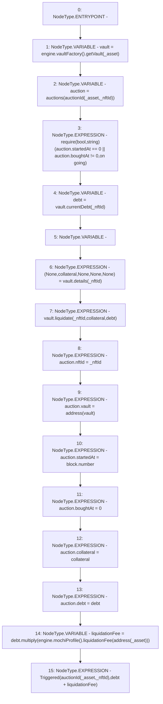

# Context: DutchAuctionLiquidator.triggerLiquidation

**Contract:** `DutchAuctionLiquidator` (Inherits: ILiquidator)
**Signature:** `triggerLiquidation(address,uint256)`
**Method Selector ID:** `0xb2c8d354`
**Visibility:** `external`
**Environment-Free:** `No (reads EVM state context)`
**Modifiers:** None

### State Variables Interaction
- **Reads:** auctions, engine
- **Writes:** auctions

### Assertion Checks & Business Requirements
- require/assert: `require(bool,string)(auction.startedAt == 0 || auction.boughtAt != 0,on going)`

### Environment & Verification Flags
- **Uses Foundry Cheatcodes:** No
- **Has Echidna Properties:** No

### Internal Calls Tree
- None

### External Calls / Value Transfers
- `IMochiEngine.TMP_36(IMochiProfile) = HIGH_LEVEL_CALL, dest:engine(IMochiEngine), function:mochiProfile, arguments:[]  `
- `IMochiProfile.TMP_38(float) = HIGH_LEVEL_CALL, dest:TMP_36(IMochiProfile), function:liquidationFee, arguments:['TMP_37']  `
- `IMochiVault.TUPLE_0(Status,uint256,uint256,uint256,address) = HIGH_LEVEL_CALL, dest:vault(IMochiVault), function:details, arguments:['_nftId']  `
- `IMochiEngine.TMP_26(IMochiVaultFactory) = HIGH_LEVEL_CALL, dest:engine(IMochiEngine), function:vaultFactory, arguments:[]  `
- `IMochiVaultFactory.TMP_27(IMochiVault) = HIGH_LEVEL_CALL, dest:TMP_26(IMochiVaultFactory), function:getVault, arguments:['_asset']  `
- `Float.TMP_39(uint256) = LIBRARY_CALL, dest:Float, function:Float.multiply(uint256,float), arguments:['debt', 'TMP_38'] `
- `IMochiVault.TMP_33(uint256) = HIGH_LEVEL_CALL, dest:vault(IMochiVault), function:currentDebt, arguments:['_nftId']  `
- `IMochiVault.HIGH_LEVEL_CALL, dest:vault(IMochiVault), function:liquidate, arguments:['_nftId', 'collateral', 'debt']  `

### Control Flow Graph (CFG)


### Source Mapping
Declared in: `certora-ac-datasets/detasets/web3bugs/dataset/web3bugs/42/projects/mochi-core/contracts/liquidator/DutchAuctionLiquidator.sol` on lines **69** to **92**

```solidity
    function triggerLiquidation(address _asset, uint256 _nftId)
        external
        override
    {
        IMochiVault vault = engine.vaultFactory().getVault(_asset);
        Auction storage auction = auctions[auctionId(_asset, _nftId)];
        require(auction.startedAt == 0 || auction.boughtAt != 0, "on going");
        uint256 debt = vault.currentDebt(_nftId);
        (, uint256 collateral, , , ) = vault.details(_nftId);

        vault.liquidate(_nftId, collateral, debt);

        auction.nftId = _nftId;
        auction.vault = address(vault);
        auction.startedAt = block.number;
        auction.boughtAt = 0;
        auction.collateral = collateral;
        auction.debt = debt;

        uint256 liquidationFee = debt.multiply(
            engine.mochiProfile().liquidationFee(address(_asset))
        );
        emit Triggered(auctionId(_asset, _nftId), debt + liquidationFee);
    }

```
