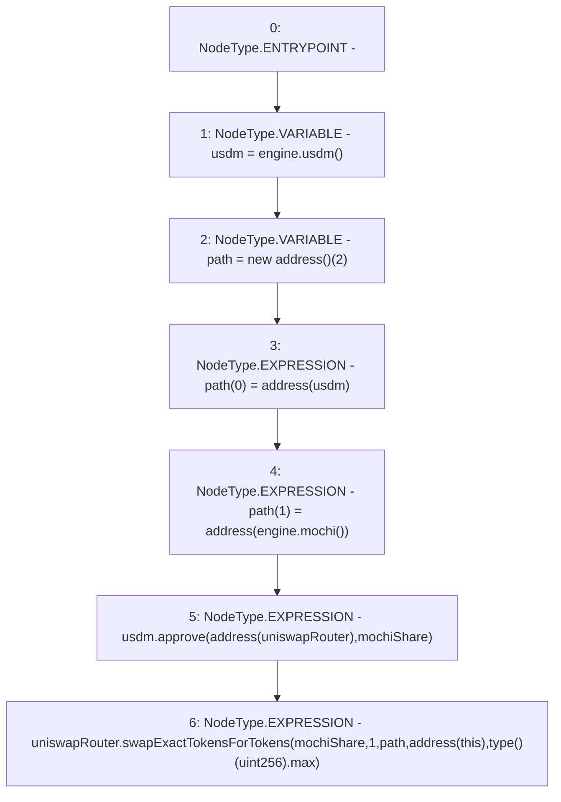

# Context: FeePoolV0._buyMochi

**Contract:** `FeePoolV0` (Inherits: IFeePool)
**Signature:** `_buyMochi()`
**Method Selector ID:** `Internal (No Method ID)`
**Visibility:** `internal`
**Environment-Free:** `Yes`
**Modifiers:** None

### State Variables Interaction
- **Reads:** engine, mochiShare, uniswapRouter
- **Writes:** None

### Environment & Verification Flags
- **Uses Foundry Cheatcodes:** No
- **Has Echidna Properties:** No

### Internal Calls Tree
- None

### External Calls / Value Transfers
- `IUSDM.TMP_31(bool) = HIGH_LEVEL_CALL, dest:usdm(IUSDM), function:approve, arguments:['TMP_30', 'mochiShare']  `
- `IMochiEngine.TMP_28(IMochi) = HIGH_LEVEL_CALL, dest:engine(IMochiEngine), function:mochi, arguments:[]  `
- `IMochiEngine.TMP_24(IUSDM) = HIGH_LEVEL_CALL, dest:engine(IMochiEngine), function:usdm, arguments:[]  `
- `IUniswapV2Router02.TMP_35(uint256[]) = HIGH_LEVEL_CALL, dest:uniswapRouter(IUniswapV2Router02), function:swapExactTokensForTokens, arguments:['mochiShare', '1', 'path', 'TMP_32', 'TMP_34']  `

### Control Flow Graph (CFG)


### Source Mapping
Declared in: `certora-ac-datasets/detasets/web3bugs/dataset/web3bugs/42/projects/mochi-core/contracts/feePool/FeePoolV0.sol` on lines **64** to **77**

```solidity
    function _buyMochi() internal {
        IUSDM usdm = engine.usdm();
        address[] memory path = new address[](2);
        path[0] = address(usdm);
        path[1] = address(engine.mochi());
        usdm.approve(address(uniswapRouter), mochiShare);
        uniswapRouter.swapExactTokensForTokens(
            mochiShare,
            1,
            path,
            address(this),
            type(uint256).max
        );
    }

```
