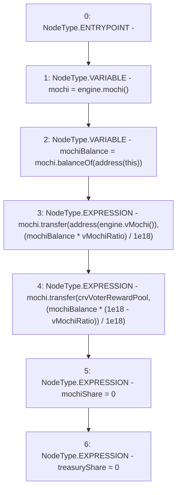

# Context: FeePoolV0._shareMochi

**Contract:** `FeePoolV0` (Inherits: IFeePool)
**Signature:** `_shareMochi()`
**Method Selector ID:** `Internal (No Method ID)`
**Visibility:** `internal`
**Environment-Free:** `Yes`
**Modifiers:** None

### State Variables Interaction
- **Reads:** crvVoterRewardPool, engine, vMochiRatio
- **Writes:** mochiShare, treasuryShare

### Environment & Verification Flags
- **Uses Foundry Cheatcodes:** No
- **Has Echidna Properties:** No

### Internal Calls Tree
- None

### External Calls / Value Transfers
- `IMochiEngine.TMP_36(IMochi) = HIGH_LEVEL_CALL, dest:engine(IMochiEngine), function:mochi, arguments:[]  `
- `IMochi.TMP_47(bool) = HIGH_LEVEL_CALL, dest:mochi(IMochi), function:transfer, arguments:['crvVoterRewardPool', 'TMP_46']  `
- `IMochi.TMP_38(uint256) = HIGH_LEVEL_CALL, dest:mochi(IMochi), function:balanceOf, arguments:['TMP_37']  `
- `IMochiEngine.TMP_39(IVMochi) = HIGH_LEVEL_CALL, dest:engine(IMochiEngine), function:vMochi, arguments:[]  `
- `IMochi.TMP_43(bool) = HIGH_LEVEL_CALL, dest:mochi(IMochi), function:transfer, arguments:['TMP_40', 'TMP_42']  `

### Control Flow Graph (CFG)


### Source Mapping
Declared in: `certora-ac-datasets/detasets/web3bugs/dataset/web3bugs/42/projects/mochi-core/contracts/feePool/FeePoolV0.sol` on lines **79** to **95**

```solidity
    function _shareMochi() internal {
        IMochi mochi = engine.mochi();
        uint256 mochiBalance = mochi.balanceOf(address(this));
        // send Mochi to vMochi Vault
        mochi.transfer(
            address(engine.vMochi()),
            (mochiBalance * vMochiRatio) / 1e18
        );
        // send Mochi to veCRV Holders
        mochi.transfer(
            crvVoterRewardPool,
            (mochiBalance * (1e18 - vMochiRatio)) / 1e18
        );
        // flush mochiShare
        mochiShare = 0;
        treasuryShare = 0;
    }

```
