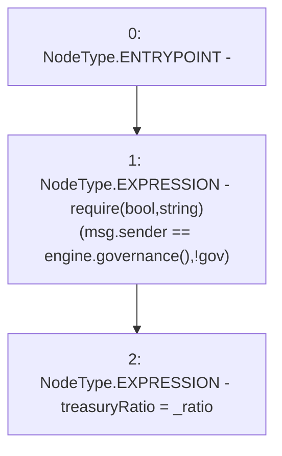

# Context: FeePoolV0.changeTreasuryRatio

**Contract:** `FeePoolV0` (Inherits: IFeePool)
**Signature:** `changeTreasuryRatio(uint256)`
**Method Selector ID:** `0x33656632`
**Visibility:** `external`
**Environment-Free:** `No (reads EVM state context)`
**Modifiers:** None

### State Variables Interaction
- **Reads:** engine
- **Writes:** treasuryRatio

### Assertion Checks & Business Requirements
- require/assert: `require(bool,string)(msg.sender == engine.governance(),!gov)`

### Environment & Verification Flags
- **Uses Foundry Cheatcodes:** No
- **Has Echidna Properties:** No

### Internal Calls Tree
- None

### External Calls / Value Transfers
- `IMochiEngine.TMP_16(address) = HIGH_LEVEL_CALL, dest:engine(IMochiEngine), function:governance, arguments:[]  `

### Control Flow Graph (CFG)


### Source Mapping
Declared in: `certora-ac-datasets/detasets/web3bugs/dataset/web3bugs/42/projects/mochi-core/contracts/feePool/FeePoolV0.sol` on lines **45** to **48**

```solidity
    function changeTreasuryRatio(uint256 _ratio) external {
        require(msg.sender == engine.governance(), "!gov");
        treasuryRatio = _ratio;
    }

```
