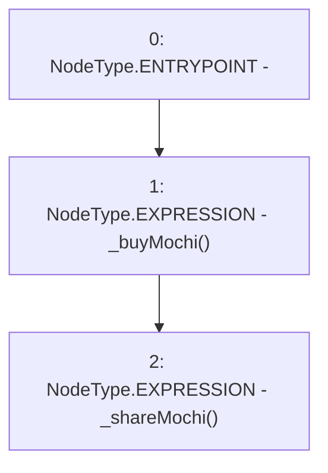

# Context: FeePoolV0.distributeMochi

**Contract:** `FeePoolV0` (Inherits: IFeePool)
**Signature:** `distributeMochi()`
**Method Selector ID:** `0x3a17e43a`
**Visibility:** `external`
**Environment-Free:** `Yes`
**Modifiers:** None

### State Variables Interaction
- **Reads:** None
- **Writes:** None

### Environment & Verification Flags
- **Uses Foundry Cheatcodes:** No
- **Has Echidna Properties:** No

### Internal Calls Tree
- None

### External Calls / Value Transfers
- None

### Control Flow Graph (CFG)


### Source Mapping
Declared in: `certora-ac-datasets/detasets/web3bugs/dataset/web3bugs/42/projects/mochi-core/contracts/feePool/FeePoolV0.sol` on lines **58** to **62**

```solidity
    function distributeMochi() external {
        // buy Mochi with mochiShare
        _buyMochi();
        _shareMochi();
    }

```
