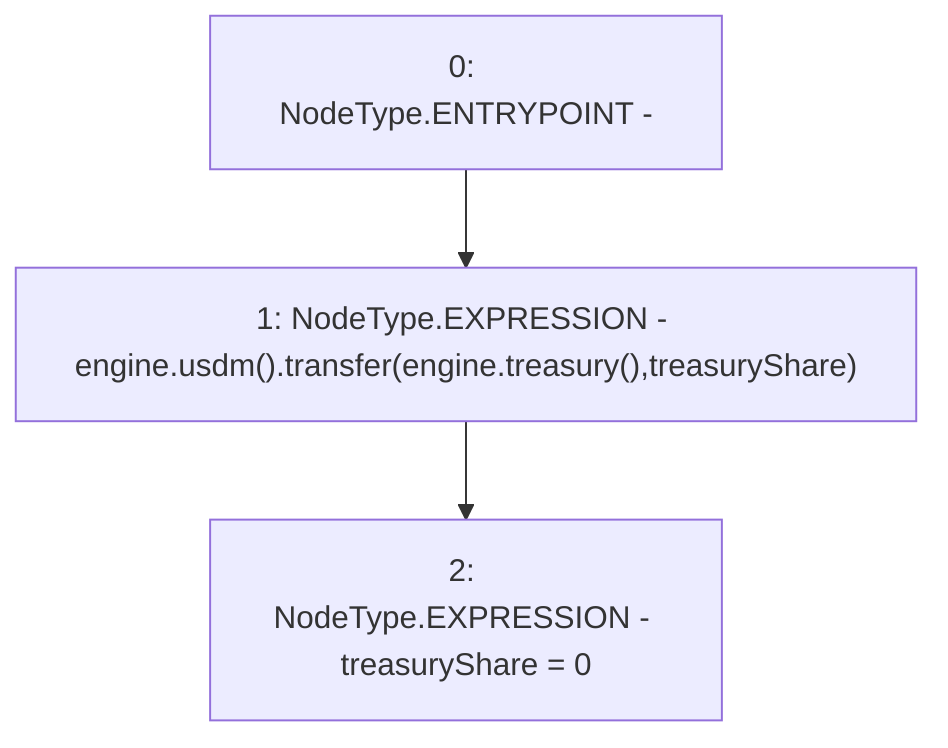

# Context: FeePoolV0.sendToTreasury

**Contract:** `FeePoolV0` (Inherits: IFeePool)
**Signature:** `sendToTreasury()`
**Method Selector ID:** `0x500bef84`
**Visibility:** `external`
**Environment-Free:** `Yes`
**Modifiers:** None

### State Variables Interaction
- **Reads:** engine, treasuryShare
- **Writes:** treasuryShare

### Environment & Verification Flags
- **Uses Foundry Cheatcodes:** No
- **Has Echidna Properties:** No

### Internal Calls Tree
- None

### External Calls / Value Transfers
- `IMochiEngine.TMP_48(IUSDM) = HIGH_LEVEL_CALL, dest:engine(IMochiEngine), function:usdm, arguments:[]  `
- `IUSDM.TMP_50(bool) = HIGH_LEVEL_CALL, dest:TMP_48(IUSDM), function:transfer, arguments:['TMP_49', 'treasuryShare']  `
- `IMochiEngine.TMP_49(address) = HIGH_LEVEL_CALL, dest:engine(IMochiEngine), function:treasury, arguments:[]  `

### Control Flow Graph (CFG)


### Source Mapping
Declared in: `certora-ac-datasets/detasets/web3bugs/dataset/web3bugs/42/projects/mochi-core/contracts/feePool/FeePoolV0.sol` on lines **97** to **100**

```solidity
    function sendToTreasury() external {
        engine.usdm().transfer(engine.treasury(), treasuryShare);
        treasuryShare = 0;
    }

```
