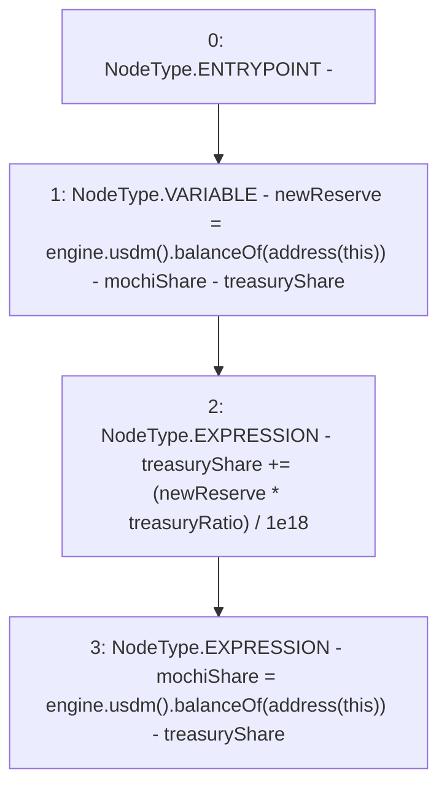

# Context: FeePoolV0.updateReserve

**Contract:** `FeePoolV0` (Inherits: IFeePool)
**Signature:** `updateReserve()`
**Method Selector ID:** `0xbac051ad`
**Visibility:** `external`
**Environment-Free:** `Yes`
**Modifiers:** None

### State Variables Interaction
- **Reads:** engine, mochiShare, treasuryRatio, treasuryShare
- **Writes:** mochiShare, treasuryShare

### Environment & Verification Flags
- **Uses Foundry Cheatcodes:** No
- **Has Echidna Properties:** No

### Internal Calls Tree
- None

### External Calls / Value Transfers
- `IMochiEngine.TMP_9(IUSDM) = HIGH_LEVEL_CALL, dest:engine(IMochiEngine), function:usdm, arguments:[]  `
- `IMochiEngine.TMP_2(IUSDM) = HIGH_LEVEL_CALL, dest:engine(IMochiEngine), function:usdm, arguments:[]  `
- `IUSDM.TMP_11(uint256) = HIGH_LEVEL_CALL, dest:TMP_9(IUSDM), function:balanceOf, arguments:['TMP_10']  `
- `IUSDM.TMP_4(uint256) = HIGH_LEVEL_CALL, dest:TMP_2(IUSDM), function:balanceOf, arguments:['TMP_3']  `

### Control Flow Graph (CFG)


### Source Mapping
Declared in: `certora-ac-datasets/detasets/web3bugs/dataset/web3bugs/42/projects/mochi-core/contracts/feePool/FeePoolV0.sol` on lines **32** to **38**

```solidity
    function updateReserve() external override {
        uint256 newReserve = engine.usdm().balanceOf(address(this)) -
            mochiShare -
            treasuryShare;
        treasuryShare += (newReserve * treasuryRatio) / 1e18;
        mochiShare = engine.usdm().balanceOf(address(this)) - treasuryShare;
    }

```
