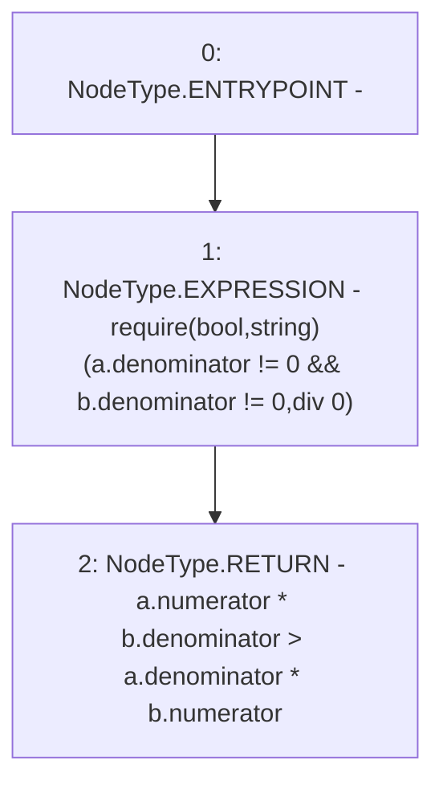

# Context: Float.gt

**Contract:** `Float` (Inherits: None)
**Signature:** `gt(float,float) returns (bool)`
**Method Selector ID:** `Internal (No Method ID)`
**Visibility:** `internal`
**Environment-Free:** `Yes`
**Modifiers:** None

### State Variables Interaction
- **Reads:** None
- **Writes:** None

### Assertion Checks & Business Requirements
- require/assert: `require(bool,string)(a.denominator != 0 && b.denominator != 0,div 0)`

### Environment & Verification Flags
- **Uses Foundry Cheatcodes:** No
- **Has Echidna Properties:** No

### Internal Calls Tree
- None

### External Calls / Value Transfers
- None

### Control Flow Graph (CFG)


### Source Mapping
Declared in: `certora-ac-datasets/detasets/web3bugs/dataset/web3bugs/42/projects/mochi-library/contracts/Float.sol` on lines **65** to **68**

```solidity
    function gt(float memory a, float memory b) internal pure returns(bool) {
        require(a.denominator != 0 && b.denominator != 0, "div 0");
        return a.numerator * b.denominator > a.denominator * b.numerator;
    }

```
