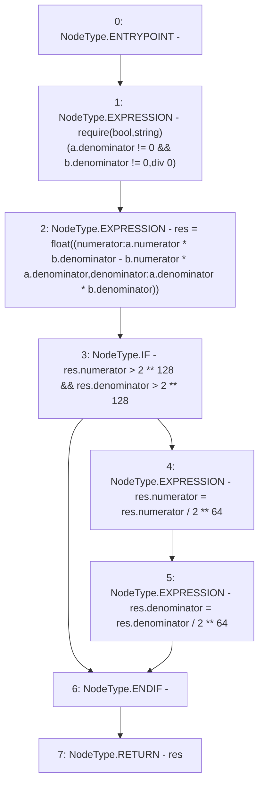

# Context: Float.sub

**Contract:** `Float` (Inherits: None)
**Signature:** `sub(float,float) returns (float)`
**Method Selector ID:** `Internal (No Method ID)`
**Visibility:** `internal`
**Environment-Free:** `Yes`
**Modifiers:** None

### State Variables Interaction
- **Reads:** None
- **Writes:** None

### Assertion Checks & Business Requirements
- require/assert: `require(bool,string)(a.denominator != 0 && b.denominator != 0,div 0)`

### Environment & Verification Flags
- **Uses Foundry Cheatcodes:** No
- **Has Echidna Properties:** No

### Internal Calls Tree
- None

### External Calls / Value Transfers
- None

### Control Flow Graph (CFG)


### Source Mapping
Declared in: `certora-ac-datasets/detasets/web3bugs/dataset/web3bugs/42/projects/mochi-library/contracts/Float.sol` on lines **41** to **51**

```solidity
    function sub(float memory a, float memory b) internal pure returns(float memory res) {
        require(a.denominator != 0 && b.denominator != 0, "div 0");
        res = float({
            numerator : a.numerator*b.denominator - b.numerator*a.denominator,
            denominator : a.denominator*b.denominator
        });
        if(res.numerator > 2**128 && res.denominator > 2**128){
            res.numerator = res.numerator / 2**64;
            res.denominator = res.denominator / 2**64;
        }
    }

```
