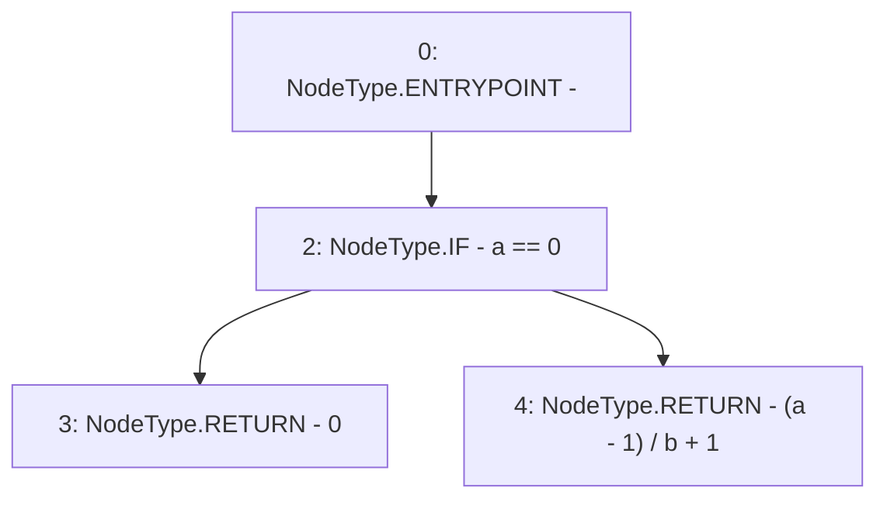

# Context: Math.ceilDiv

**Contract:** `Math` (Inherits: None)
**Signature:** `ceilDiv(uint256,uint256) returns (uint256)`
**Method Selector ID:** `Internal (No Method ID)`
**Visibility:** `internal`
**Environment-Free:** `Yes`
**Modifiers:** None

### State Variables Interaction
- **Reads:** None
- **Writes:** None

### Environment & Verification Flags
- **Uses Foundry Cheatcodes:** No
- **Has Echidna Properties:** No

### Internal Calls Tree
- None

### External Calls / Value Transfers
- None

### Control Flow Graph (CFG)


### Source Mapping
Declared in: `certora-ac-datasets/detasets/web3bugs/dataset/web3bugs/42/projects/mochi-core/node_modules/@openzeppelin/contracts/utils/math/Math.sol` on lines **45** to **48**

```solidity
    function ceilDiv(uint256 a, uint256 b) internal pure returns (uint256) {
        // (a + b - 1) / b can overflow on addition, so we distribute.
        return a == 0 ? 0 : (a - 1) / b + 1;
    }

```
