# Context: Math.mulDiv

**Contract:** `Math` (Inherits: None)
**Signature:** `mulDiv(uint256,uint256,uint256) returns (uint256)`
**Method Selector ID:** `Internal (No Method ID)`
**Visibility:** `internal`
**Environment-Free:** `Yes`
**Modifiers:** None

### State Variables Interaction
- **Reads:** None
- **Writes:** None

### Assertion Checks & Business Requirements
- require/assert: `require(bool,string)(denominator > prod1,Math: mulDiv overflow)`

### Environment & Verification Flags
- **Uses Foundry Cheatcodes:** No
- **Has Echidna Properties:** No

### Internal Calls Tree
- None

### External Calls / Value Transfers
- None

### Control Flow Graph (CFG)

```mermaid
flowchart TD
    Node_0["0: NodeType.ENTRYPOINT - "]
    Node_0 --> Node_1
    Node_1["1: NodeType.VARIABLE - "]
    Node_1 --> Node_2
    Node_2["2: NodeType.VARIABLE - "]
    Node_2 --> Node_3
    Node_3["3: NodeType.ASSEMBLY - "]
    Node_3 --> Node_4
    Node_4["4: NodeType.VARIABLE - "]
    Node_4 --> Node_5
    Node_5["5: NodeType.EXPRESSION - mm_mulDiv_asm_0 = mulmod(uint256,uint256,uint256)(x,y,~ 0)"]
    Node_5 --> Node_6
    Node_6["6: NodeType.EXPRESSION - prod0 = x * y"]
    Node_6 --> Node_7
    Node_7["7: NodeType.EXPRESSION - prod1 = mm_mulDiv_asm_0 - prod0 - mm_mulDiv_asm_0 < prod0"]
    Node_7 --> Node_8
    Node_8["8: NodeType.ENDASSEMBLY - "]
    Node_8 --> Node_9
    Node_9["9: NodeType.IF - prod1 == 0"]
    Node_9 --> Node_10
    Node_9 --> Node_11
    Node_10["10: NodeType.RETURN - prod0 / denominator"]
    Node_11["11: NodeType.ENDIF - "]
    Node_11 --> Node_12
    Node_12["12: NodeType.EXPRESSION - require(bool,string)(denominator > prod1,Math: mulDiv overflow)"]
    Node_12 --> Node_13
    Node_13["13: NodeType.VARIABLE - "]
    Node_13 --> Node_14
    Node_14["14: NodeType.ASSEMBLY - "]
    Node_14 --> Node_15
    Node_15["15: NodeType.EXPRESSION - remainder = mulmod(uint256,uint256,uint256)(x,y,denominator)"]
    Node_15 --> Node_16
    Node_16["16: NodeType.EXPRESSION - prod1 = prod1 - remainder > prod0"]
    Node_16 --> Node_17
    Node_17["17: NodeType.EXPRESSION - prod0 = prod0 - remainder"]
    Node_17 --> Node_18
    Node_18["18: NodeType.ENDASSEMBLY - "]
    Node_18 --> Node_19
    Node_19["19: NodeType.VARIABLE - twos = denominator & (~ denominator + 1)"]
    Node_19 --> Node_20
    Node_20["20: NodeType.ASSEMBLY - "]
    Node_20 --> Node_21
    Node_21["21: NodeType.EXPRESSION - denominator = denominator / twos"]
    Node_21 --> Node_22
    Node_22["22: NodeType.EXPRESSION - prod0 = prod0 / twos"]
    Node_22 --> Node_23
    Node_23["23: NodeType.EXPRESSION - twos = 0 - twos / twos + 1"]
    Node_23 --> Node_24
    Node_24["24: NodeType.ENDASSEMBLY - "]
    Node_24 --> Node_25
    Node_25["25: NodeType.EXPRESSION - prod0 |= prod1 * twos"]
    Node_25 --> Node_26
    Node_26["26: NodeType.VARIABLE - inverse = (3 * denominator) ^ 2"]
    Node_26 --> Node_27
    Node_27["27: NodeType.EXPRESSION - inverse *= 2 - denominator * inverse"]
    Node_27 --> Node_28
    Node_28["28: NodeType.EXPRESSION - inverse *= 2 - denominator * inverse"]
    Node_28 --> Node_29
    Node_29["29: NodeType.EXPRESSION - inverse *= 2 - denominator * inverse"]
    Node_29 --> Node_30
    Node_30["30: NodeType.EXPRESSION - inverse *= 2 - denominator * inverse"]
    Node_30 --> Node_31
    Node_31["31: NodeType.EXPRESSION - inverse *= 2 - denominator * inverse"]
    Node_31 --> Node_32
    Node_32["32: NodeType.EXPRESSION - inverse *= 2 - denominator * inverse"]
    Node_32 --> Node_33
    Node_33["33: NodeType.EXPRESSION - result = prod0 * inverse"]
    Node_33 --> Node_34
    Node_34["34: NodeType.RETURN - result"]
    Node_35["35: NodeType.RETURN - result"]
```


### Source Mapping
Declared in: `certora-ac-datasets/detasets/web3bugs/dataset/web3bugs/42/projects/mochi-core/node_modules/@openzeppelin/contracts/utils/math/Math.sol` on lines **55** to **134**

```solidity
    function mulDiv(uint256 x, uint256 y, uint256 denominator) internal pure returns (uint256 result) {
        unchecked {
            // 512-bit multiply [prod1 prod0] = x * y. Compute the product mod 2^256 and mod 2^256 - 1, then use
            // use the Chinese Remainder Theorem to reconstruct the 512 bit result. The result is stored in two 256
            // variables such that product = prod1 * 2^256 + prod0.
            uint256 prod0; // Least significant 256 bits of the product
            uint256 prod1; // Most significant 256 bits of the product
            assembly {
                let mm := mulmod(x, y, not(0))
                prod0 := mul(x, y)
                prod1 := sub(sub(mm, prod0), lt(mm, prod0))
            }

            // Handle non-overflow cases, 256 by 256 division.
            if (prod1 == 0) {
                // Solidity will revert if denominator == 0, unlike the div opcode on its own.
                // The surrounding unchecked block does not change this fact.
                // See https://docs.soliditylang.org/en/latest/control-structures.html#checked-or-unchecked-arithmetic.
                return prod0 / denominator;
            }

            // Make sure the result is less than 2^256. Also prevents denominator == 0.
            require(denominator > prod1, "Math: mulDiv overflow");

            ///////////////////////////////////////////////
            // 512 by 256 division.
            ///////////////////////////////////////////////

            // Make division exact by subtracting the remainder from [prod1 prod0].
            uint256 remainder;
            assembly {
                // Compute remainder using mulmod.
                remainder := mulmod(x, y, denominator)

                // Subtract 256 bit number from 512 bit number.
                prod1 := sub(prod1, gt(remainder, prod0))
                prod0 := sub(prod0, remainder)
            }

            // Factor powers of two out of denominator and compute largest power of two divisor of denominator. Always >= 1.
            // See https://cs.stackexchange.com/q/138556/92363.

            // Does not overflow because the denominator cannot be zero at this stage in the function.
            uint256 twos = denominator & (~denominator + 1);
            assembly {
                // Divide denominator by twos.
                denominator := div(denominator, twos)

                // Divide [prod1 prod0] by twos.
                prod0 := div(prod0, twos)

                // Flip twos such that it is 2^256 / twos. If twos is zero, then it becomes one.
                twos := add(div(sub(0, twos), twos), 1)
            }

            // Shift in bits from prod1 into prod0.
            prod0 |= prod1 * twos;

            // Invert denominator mod 2^256. Now that denominator is an odd number, it has an inverse modulo 2^256 such
            // that denominator * inv = 1 mod 2^256. Compute the inverse by starting with a seed that is correct for
            // four bits. That is, denominator * inv = 1 mod 2^4.
            uint256 inverse = (3 * denominator) ^ 2;

            // Use the Newton-Raphson iteration to improve the precision. Thanks to Hensel's lifting lemma, this also works
            // in modular arithmetic, doubling the correct bits in each step.
            inverse *= 2 - denominator * inverse; // inverse mod 2^8
            inverse *= 2 - denominator * inverse; // inverse mod 2^16
            inverse *= 2 - denominator * inverse; // inverse mod 2^32
            inverse *= 2 - denominator * inverse; // inverse mod 2^64
            inverse *= 2 - denominator * inverse; // inverse mod 2^128
            inverse *= 2 - denominator * inverse; // inverse mod 2^256

            // Because the division is now exact we can divide by multiplying with the modular inverse of denominator.
            // This will give us the correct result modulo 2^256. Since the preconditions guarantee that the outcome is
            // less than 2^256, this is the final result. We don't need to compute the high bits of the result and prod1
            // is no longer required.
            result = prod0 * inverse;
            return result;
        }
    }

```
