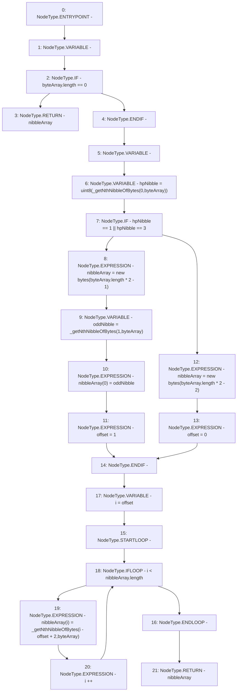

# Context: MerklePatriciaVerifier._getNibbleArray

**Contract:** `MerklePatriciaVerifier` (Inherits: None)
**Signature:** `_getNibbleArray(bytes) returns (bytes)`
**Method Selector ID:** `Internal (No Method ID)`
**Visibility:** `private`
**Environment-Free:** `Yes`
**Modifiers:** None

### State Variables Interaction
- **Reads:** None
- **Writes:** None

### Environment & Verification Flags
- **Uses Foundry Cheatcodes:** No
- **Has Echidna Properties:** No

### Internal Calls Tree
- None

### External Calls / Value Transfers
- None

### Control Flow Graph (CFG)


### Source Mapping
Declared in: `certora-ac-datasets/detasets/web3bugs/dataset/web3bugs/42/projects/mochi-library/contracts/MerklePatriciaVerifier.sol` on lines **92** to **112**

```solidity
	function _getNibbleArray(bytes memory byteArray) private pure returns (bytes memory) {
		bytes memory nibbleArray;
		if (byteArray.length == 0) return nibbleArray;

		uint8 offset;
		uint8 hpNibble = uint8(_getNthNibbleOfBytes(0,byteArray));
		if(hpNibble == 1 || hpNibble == 3) {
			nibbleArray = new bytes(byteArray.length*2-1);
			bytes1 oddNibble = _getNthNibbleOfBytes(1,byteArray);
			nibbleArray[0] = oddNibble;
			offset = 1;
		} else {
			nibbleArray = new bytes(byteArray.length*2-2);
			offset = 0;
		}

		for(uint i=offset; i<nibbleArray.length; i++) {
			nibbleArray[i] = _getNthNibbleOfBytes(i-offset+2,byteArray);
		}
		return nibbleArray;
	}

```
