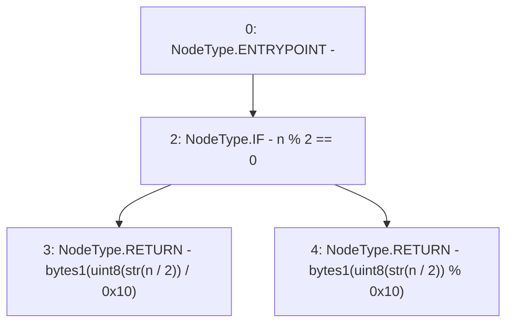

# Context: MerklePatriciaVerifier._getNthNibbleOfBytes

**Contract:** `MerklePatriciaVerifier` (Inherits: None)
**Signature:** `_getNthNibbleOfBytes(uint256,bytes) returns (bytes1)`
**Method Selector ID:** `Internal (No Method ID)`
**Visibility:** `private`
**Environment-Free:** `Yes`
**Modifiers:** None

### State Variables Interaction
- **Reads:** None
- **Writes:** None

### Environment & Verification Flags
- **Uses Foundry Cheatcodes:** No
- **Has Echidna Properties:** No

### Internal Calls Tree
- None

### External Calls / Value Transfers
- None

### Control Flow Graph (CFG)


### Source Mapping
Declared in: `certora-ac-datasets/detasets/web3bugs/dataset/web3bugs/42/projects/mochi-library/contracts/MerklePatriciaVerifier.sol` on lines **114** to **116**

```solidity
	function _getNthNibbleOfBytes(uint n, bytes memory str) private pure returns (bytes1) {
		return bytes1(n%2==0 ? uint8(str[n/2])/0x10 : uint8(str[n/2])%0x10);
	}

```
