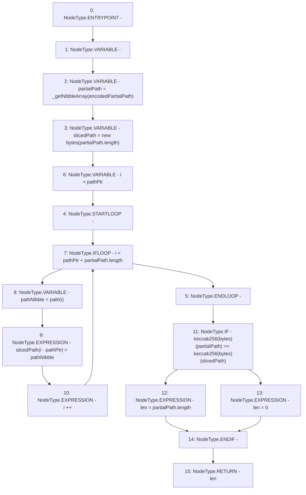

# Context: MerklePatriciaVerifier._nibblesToTraverse

**Contract:** `MerklePatriciaVerifier` (Inherits: None)
**Signature:** `_nibblesToTraverse(bytes,bytes,uint256) returns (uint256)`
**Method Selector ID:** `Internal (No Method ID)`
**Visibility:** `private`
**Environment-Free:** `Yes`
**Modifiers:** None

### State Variables Interaction
- **Reads:** None
- **Writes:** None

### Environment & Verification Flags
- **Uses Foundry Cheatcodes:** No
- **Has Echidna Properties:** No

### Internal Calls Tree
- None

### External Calls / Value Transfers
- None

### Control Flow Graph (CFG)


### Source Mapping
Declared in: `certora-ac-datasets/detasets/web3bugs/dataset/web3bugs/42/projects/mochi-library/contracts/MerklePatriciaVerifier.sol` on lines **69** to **89**

```solidity
	function _nibblesToTraverse(bytes memory encodedPartialPath, bytes memory path, uint pathPtr) private pure returns (uint) {
		uint len;
		// encodedPartialPath has elements that are each two hex characters (1 byte), but partialPath
		// and slicedPath have elements that are each one hex character (1 nibble)
		bytes memory partialPath = _getNibbleArray(encodedPartialPath);
		bytes memory slicedPath = new bytes(partialPath.length);

		// pathPtr counts nibbles in path
		// partialPath.length is a number of nibbles
		for(uint i=pathPtr; i<pathPtr+partialPath.length; i++) {
			bytes1 pathNibble = path[i];
			slicedPath[i-pathPtr] = pathNibble;
		}

		if(keccak256(partialPath) == keccak256(slicedPath)) {
			len = partialPath.length;
		} else {
			len = 0;
		}
		return len;
	}

```
