# Context: MerklePatriciaVerifier.getValueFromProof

**Contract:** `MerklePatriciaVerifier` (Inherits: None)
**Signature:** `getValueFromProof(bytes32,bytes32,bytes) returns (bytes)`
**Method Selector ID:** `Internal (No Method ID)`
**Visibility:** `internal`
**Environment-Free:** `Yes`
**Modifiers:** None

### State Variables Interaction
- **Reads:** None
- **Writes:** None

### Assertion Checks & Business Requirements
- require/assert: `require(bool,string)(path.length != 0,empty path provided)`
- require/assert: `require(bool,string)(pathPtr <= nibblePath.length,Path overflow)`
- require/assert: `require(bool,string)(nodeKey == keccak256(bytes)(currentNode),node doesn't match key)`
- require/assert: `require(bool,string)(nextPathNibble <= 16,nibble too long)`
- require/assert: `require(bool,string)(_nibblesToTraverse(Rlp.toData(currentNodeList[0]),nibblePath,pathPtr) != 0,invalid extension node)`
- require/assert: `require(bool,string)(false,unexpected length array)`
- require/assert: `require(bool,string)(false,not enough proof nodes)`

### Environment & Verification Flags
- **Uses Foundry Cheatcodes:** No
- **Has Echidna Properties:** No

### Internal Calls Tree
- None

### External Calls / Value Transfers
- `Rlp.TMP_63(bytes) = LIBRARY_CALL, dest:Rlp, function:Rlp.toBytes(Rlp.Item), arguments:['REF_10'] `
- `Rlp.TMP_71(Rlp.Item[]) = LIBRARY_CALL, dest:Rlp, function:Rlp.toList(Rlp.Item), arguments:['REF_16'] `
- `Rlp.TMP_80(bytes) = LIBRARY_CALL, dest:Rlp, function:Rlp.toData(Rlp.Item), arguments:['REF_26'] `
- `Rlp.TMP_55(Rlp.Item[]) = LIBRARY_CALL, dest:Rlp, function:Rlp.toList(Rlp.Item), arguments:['rlpParentNodes'] `
- `Rlp.TMP_54(Rlp.Item) = LIBRARY_CALL, dest:Rlp, function:Rlp.toItem(bytes), arguments:['proofNodesRlp'] `
- `Rlp.TMP_74(bytes) = LIBRARY_CALL, dest:Rlp, function:Rlp.toData(Rlp.Item), arguments:['REF_20'] `
- `Rlp.TMP_88(bytes32) = LIBRARY_CALL, dest:Rlp, function:Rlp.toBytes32(Rlp.Item), arguments:['REF_33'] `
- `Rlp.TMP_84(bytes) = LIBRARY_CALL, dest:Rlp, function:Rlp.toData(Rlp.Item), arguments:['REF_31'] `
- `Rlp.TMP_83(bytes) = LIBRARY_CALL, dest:Rlp, function:Rlp.toData(Rlp.Item), arguments:['REF_29'] `
- `Rlp.TMP_78(bytes32) = LIBRARY_CALL, dest:Rlp, function:Rlp.toBytes32(Rlp.Item), arguments:['REF_23'] `
- `Rlp.TMP_67(bytes) = LIBRARY_CALL, dest:Rlp, function:Rlp.toBytes(Rlp.Item), arguments:['REF_14'] `

### Control Flow Graph (CFG)

```mermaid
flowchart TD
    Node_0["0: NodeType.ENTRYPOINT - "]
    Node_0 --> Node_1
    Node_1["1: NodeType.VARIABLE - rlpParentNodes = Rlp.toItem(proofNodesRlp)"]
    Node_1 --> Node_2
    Node_2["2: NodeType.VARIABLE - parentNodes = Rlp.toList(rlpParentNodes)"]
    Node_2 --> Node_3
    Node_3["3: NodeType.VARIABLE - "]
    Node_3 --> Node_4
    Node_4["4: NodeType.VARIABLE - "]
    Node_4 --> Node_5
    Node_5["5: NodeType.VARIABLE - nodeKey = expectedRoot"]
    Node_5 --> Node_6
    Node_6["6: NodeType.VARIABLE - pathPtr = 0"]
    Node_6 --> Node_7
    Node_7["7: NodeType.VARIABLE - nibblePath = new bytes(33)"]
    Node_7 --> Node_8
    Node_8["8: NodeType.ASSEMBLY - "]
    Node_8 --> Node_9
    Node_9["9: NodeType.EXPRESSION - mstore(uint256,uint256)(nibblePath + 33,path)"]
    Node_9 --> Node_10
    Node_10["10: NodeType.ENDASSEMBLY - "]
    Node_10 --> Node_11
    Node_11["11: NodeType.EXPRESSION - nibblePath = _getNibbleArray(nibblePath)"]
    Node_11 --> Node_12
    Node_12["12: NodeType.EXPRESSION - require(bool,string)(path.length != 0,empty path provided)"]
    Node_12 --> Node_13
    Node_13["13: NodeType.EXPRESSION - currentNode = Rlp.toBytes(parentNodes(0))"]
    Node_13 --> Node_16
    Node_14["14: NodeType.STARTLOOP - "]
    Node_14 --> Node_17
    Node_15["15: NodeType.ENDLOOP - "]
    Node_15 --> Node_41
    Node_16["16: NodeType.VARIABLE - i = 0"]
    Node_16 --> Node_14
    Node_17["17: NodeType.IFLOOP - i < parentNodes.length"]
    Node_17 --> Node_18
    Node_17 --> Node_15
    Node_18["18: NodeType.EXPRESSION - require(bool,string)(pathPtr <= nibblePath.length,Path overflow)"]
    Node_18 --> Node_19
    Node_19["19: NodeType.EXPRESSION - currentNode = Rlp.toBytes(parentNodes(i))"]
    Node_19 --> Node_20
    Node_20["20: NodeType.EXPRESSION - require(bool,string)(nodeKey == keccak256(bytes)(currentNode),node doesn't match key)"]
    Node_20 --> Node_21
    Node_21["21: NodeType.EXPRESSION - currentNodeList = Rlp.toList(parentNodes(i))"]
    Node_21 --> Node_22
    Node_22["22: NodeType.IF - currentNodeList.length == 17"]
    Node_22 --> Node_23
    Node_22 --> Node_30
    Node_23["23: NodeType.IF - pathPtr == nibblePath.length"]
    Node_23 --> Node_24
    Node_23 --> Node_25
    Node_24["24: NodeType.RETURN - Rlp.toData(currentNodeList(16))"]
    Node_25["25: NodeType.ENDIF - "]
    Node_25 --> Node_26
    Node_26["26: NodeType.VARIABLE - nextPathNibble = uint8(nibblePath(pathPtr))"]
    Node_26 --> Node_27
    Node_27["27: NodeType.EXPRESSION - require(bool,string)(nextPathNibble <= 16,nibble too long)"]
    Node_27 --> Node_28
    Node_28["28: NodeType.EXPRESSION - nodeKey = Rlp.toBytes32(currentNodeList(nextPathNibble))"]
    Node_28 --> Node_29
    Node_29["29: NodeType.EXPRESSION - pathPtr += 1"]
    Node_29 --> Node_39
    Node_30["30: NodeType.IF - currentNodeList.length == 2"]
    Node_30 --> Node_31
    Node_30 --> Node_37
    Node_31["31: NodeType.EXPRESSION - pathPtr += _nibblesToTraverse(Rlp.toData(currentNodeList(0)),nibblePath,pathPtr)"]
    Node_31 --> Node_32
    Node_32["32: NodeType.IF - pathPtr == nibblePath.length"]
    Node_32 --> Node_33
    Node_32 --> Node_34
    Node_33["33: NodeType.RETURN - Rlp.toData(currentNodeList(1))"]
    Node_34["34: NodeType.ENDIF - "]
    Node_34 --> Node_35
    Node_35["35: NodeType.EXPRESSION - require(bool,string)(_nibblesToTraverse(Rlp.toData(currentNodeList(0)),nibblePath,pathPtr) != 0,invalid extension node)"]
    Node_35 --> Node_36
    Node_36["36: NodeType.EXPRESSION - nodeKey = Rlp.toBytes32(currentNodeList(1))"]
    Node_36 --> Node_38
    Node_37["37: NodeType.EXPRESSION - require(bool,string)(false,unexpected length array)"]
    Node_37 --> Node_38
    Node_38["38: NodeType.ENDIF - "]
    Node_38 --> Node_39
    Node_39["39: NodeType.ENDIF - "]
    Node_39 --> Node_40
    Node_40["40: NodeType.EXPRESSION - i ++"]
    Node_40 --> Node_17
    Node_41["41: NodeType.EXPRESSION - require(bool,string)(false,not enough proof nodes)"]
    Node_41 --> Node_42
    Node_42["42: NodeType.RETURN - value"]
```


### Source Mapping
Declared in: `certora-ac-datasets/detasets/web3bugs/dataset/web3bugs/42/projects/mochi-library/contracts/MerklePatriciaVerifier.sol` on lines **17** to **67**

```solidity
	function getValueFromProof(bytes32 expectedRoot, bytes32 path, bytes memory proofNodesRlp) internal pure returns (bytes memory value) {
		Rlp.Item memory rlpParentNodes = Rlp.toItem(proofNodesRlp);
		Rlp.Item[] memory parentNodes = Rlp.toList(rlpParentNodes);

		bytes memory currentNode;
		Rlp.Item[] memory currentNodeList;

		bytes32 nodeKey = expectedRoot;
		uint pathPtr = 0;

		// our input is a 32-byte path, but we have to prepend a single 0 byte to that and pass it along as a 33 byte memory array since that is what getNibbleArray wants
		bytes memory nibblePath = new bytes(33);
		assembly { mstore(add(nibblePath, 33), path) }
		nibblePath = _getNibbleArray(nibblePath);

		require(path.length != 0, "empty path provided");

		currentNode = Rlp.toBytes(parentNodes[0]);

		for (uint i=0; i<parentNodes.length; i++) {
			require(pathPtr <= nibblePath.length, "Path overflow");

			currentNode = Rlp.toBytes(parentNodes[i]);
			require(nodeKey == keccak256(currentNode), "node doesn't match key");
			currentNodeList = Rlp.toList(parentNodes[i]);

			if(currentNodeList.length == 17) {
				if(pathPtr == nibblePath.length) {
					return Rlp.toData(currentNodeList[16]);
				}

				uint8 nextPathNibble = uint8(nibblePath[pathPtr]);
				require(nextPathNibble <= 16, "nibble too long");
				nodeKey = Rlp.toBytes32(currentNodeList[nextPathNibble]);
				pathPtr += 1;
			} else if(currentNodeList.length == 2) {
				pathPtr += _nibblesToTraverse(Rlp.toData(currentNodeList[0]), nibblePath, pathPtr);
				// leaf node
				if(pathPtr == nibblePath.length) {
					return Rlp.toData(currentNodeList[1]);
				}
				//extension node
				require(_nibblesToTraverse(Rlp.toData(currentNodeList[0]), nibblePath, pathPtr) != 0, "invalid extension node");

				nodeKey = Rlp.toBytes32(currentNodeList[1]);
			} else {
				require(false, "unexpected length array");
			}
		}
		require(false, "not enough proof nodes");
	}

```
