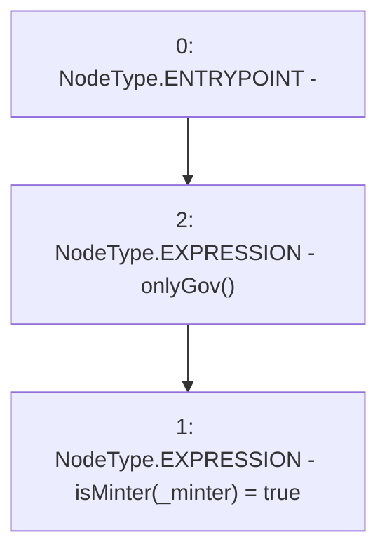

# Context: MinterV0.addMinter

**Contract:** `MinterV0` (Inherits: IMinter)
**Signature:** `addMinter(address)`
**Method Selector ID:** `0x983b2d56`
**Visibility:** `external`
**Environment-Free:** `No (reads EVM state context)`
**Modifiers:**
- `onlyGov`
  ```solidity
  modifier onlyGov() {
          require(msg.sender == engine.governance(), "!gov");
          _;
      }
  ```

### State Variables Interaction
- **Reads:** None
- **Writes:** isMinter

### Environment & Verification Flags
- **Uses Foundry Cheatcodes:** No
- **Has Echidna Properties:** No

### Internal Calls Tree
- None

### External Calls / Value Transfers
- None

### Control Flow Graph (CFG)


### Source Mapping
Declared in: `certora-ac-datasets/detasets/web3bugs/dataset/web3bugs/42/projects/mochi-core/contracts/minter/UsdmMinter.sol` on lines **28** to **30**

```solidity
    function addMinter(address _minter) external onlyGov {
        isMinter[_minter] = true;
    }

```
