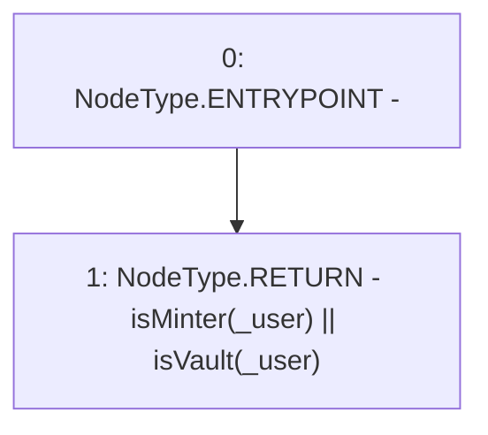

# Context: MinterV0.hasPermission

**Contract:** `MinterV0` (Inherits: IMinter)
**Signature:** `hasPermission(address) returns (bool)`
**Method Selector ID:** `0x97128e00`
**Visibility:** `public`
**Environment-Free:** `Yes`
**Modifiers:** None

### State Variables Interaction
- **Reads:** isMinter
- **Writes:** None

### Environment & Verification Flags
- **Uses Foundry Cheatcodes:** No
- **Has Echidna Properties:** No

### Internal Calls Tree
- None

### External Calls / Value Transfers
- None

### Control Flow Graph (CFG)


### Source Mapping
Declared in: `certora-ac-datasets/detasets/web3bugs/dataset/web3bugs/42/projects/mochi-core/contracts/minter/UsdmMinter.sol` on lines **44** to **46**

```solidity
    function hasPermission(address _user) public view override returns (bool) {
        return isMinter[_user] || isVault(_user);
    }

```
