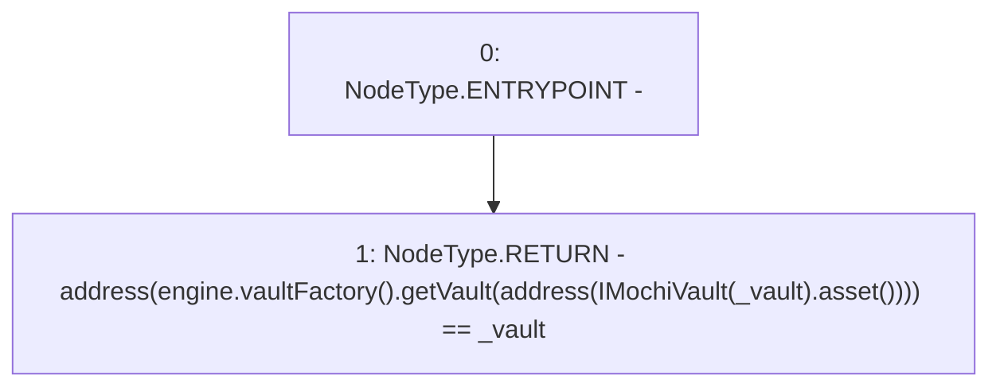

# Context: MinterV0.isVault

**Contract:** `MinterV0` (Inherits: IMinter)
**Signature:** `isVault(address) returns (bool)`
**Method Selector ID:** `0x652b9b41`
**Visibility:** `public`
**Environment-Free:** `Yes`
**Modifiers:** None

### State Variables Interaction
- **Reads:** engine
- **Writes:** None

### Environment & Verification Flags
- **Uses Foundry Cheatcodes:** No
- **Has Echidna Properties:** No

### Internal Calls Tree
- None

### External Calls / Value Transfers
- `IMochiVaultFactory.TMP_12(IMochiVault) = HIGH_LEVEL_CALL, dest:TMP_8(IMochiVaultFactory), function:getVault, arguments:['TMP_11']  `
- `IMochiVault.TMP_10(IERC20) = HIGH_LEVEL_CALL, dest:TMP_9(IMochiVault), function:asset, arguments:[]  `
- `IMochiEngine.TMP_8(IMochiVaultFactory) = HIGH_LEVEL_CALL, dest:engine(IMochiEngine), function:vaultFactory, arguments:[]  `

### Control Flow Graph (CFG)


### Source Mapping
Declared in: `certora-ac-datasets/detasets/web3bugs/dataset/web3bugs/42/projects/mochi-core/contracts/minter/UsdmMinter.sol` on lines **48** to **55**

```solidity
    function isVault(address _vault) public view override returns (bool) {
        return
            address(
                engine.vaultFactory().getVault(
                    address(IMochiVault(_vault).asset())
                )
            ) == _vault;
    }

```
