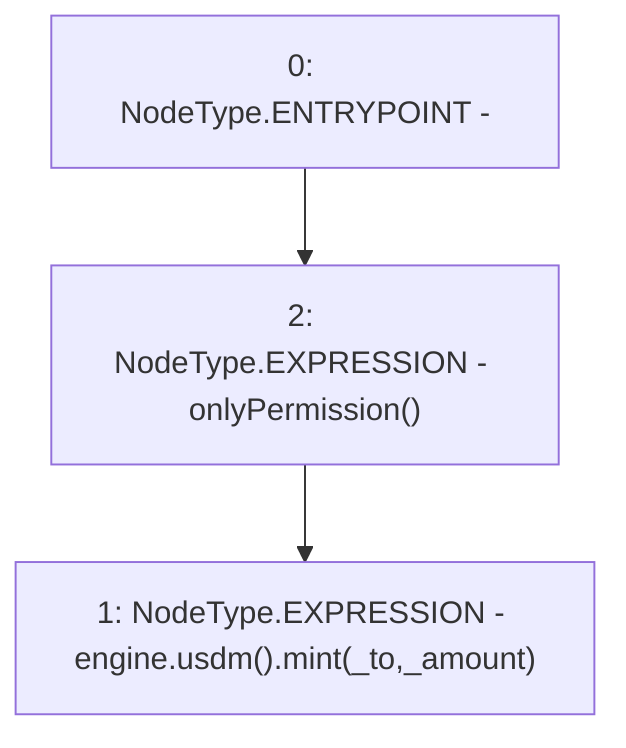

# Context: MinterV0.mint

**Contract:** `MinterV0` (Inherits: IMinter)
**Signature:** `mint(address,uint256)`
**Method Selector ID:** `0x40c10f19`
**Visibility:** `external`
**Environment-Free:** `No (reads EVM state context)`
**Modifiers:**
- `onlyPermission`
  ```solidity
  modifier onlyPermission() {
          require(hasPermission(msg.sender), "!permission");
          _;
      }
  ```

### State Variables Interaction
- **Reads:** engine
- **Writes:** None

### Environment & Verification Flags
- **Uses Foundry Cheatcodes:** No
- **Has Echidna Properties:** No

### Internal Calls Tree
- None

### External Calls / Value Transfers
- `IUSDM.HIGH_LEVEL_CALL, dest:TMP_3(IUSDM), function:mint, arguments:['_to', '_amount']  `
- `IMochiEngine.TMP_3(IUSDM) = HIGH_LEVEL_CALL, dest:engine(IMochiEngine), function:usdm, arguments:[]  `

### Control Flow Graph (CFG)


### Source Mapping
Declared in: `certora-ac-datasets/detasets/web3bugs/dataset/web3bugs/42/projects/mochi-core/contracts/minter/UsdmMinter.sol` on lines **36** to **42**

```solidity
    function mint(address _to, uint256 _amount)
        external
        override
        onlyPermission
    {
        engine.usdm().mint(_to, _amount);
    }

```
