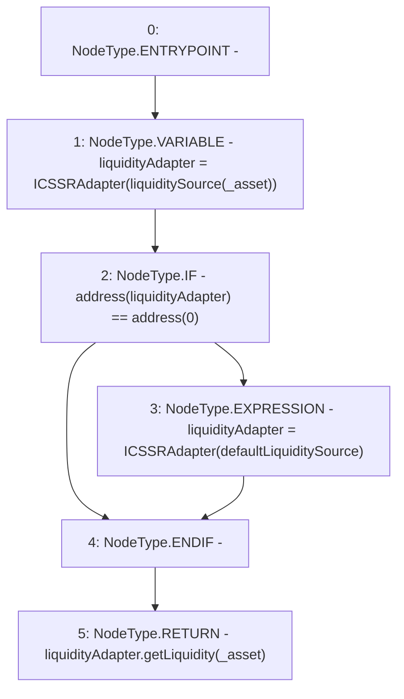

# Context: MochiCSSRv0.getLiquidity

**Contract:** `MochiCSSRv0` (Inherits: ICSSRRouter)
**Signature:** `getLiquidity(address) returns (uint256)`
**Method Selector ID:** `0xa747b93b`
**Visibility:** `public`
**Environment-Free:** `Yes`
**Modifiers:** None

### State Variables Interaction
- **Reads:** defaultLiquiditySource, liquiditySource
- **Writes:** None

### Environment & Verification Flags
- **Uses Foundry Cheatcodes:** No
- **Has Echidna Properties:** No

### Internal Calls Tree
- None

### External Calls / Value Transfers
- `ICSSRAdapter.TMP_48(uint256) = HIGH_LEVEL_CALL, dest:liquidityAdapter(ICSSRAdapter), function:getLiquidity, arguments:['_asset']  `

### Control Flow Graph (CFG)


### Source Mapping
Declared in: `certora-ac-datasets/detasets/web3bugs/dataset/web3bugs/42/projects/mochi-cssr/contracts/MochiCSSRv0.sol` on lines **126** to **137**

```solidity
    function getLiquidity(address _asset)
        public
        view
        override
        returns (uint256)
    {
        ICSSRAdapter liquidityAdapter = ICSSRAdapter(liquiditySource[_asset]);
        if (address(liquidityAdapter) == address(0)) {
            liquidityAdapter = ICSSRAdapter(defaultLiquiditySource);
        }
        return liquidityAdapter.getLiquidity(_asset);
    }

```
