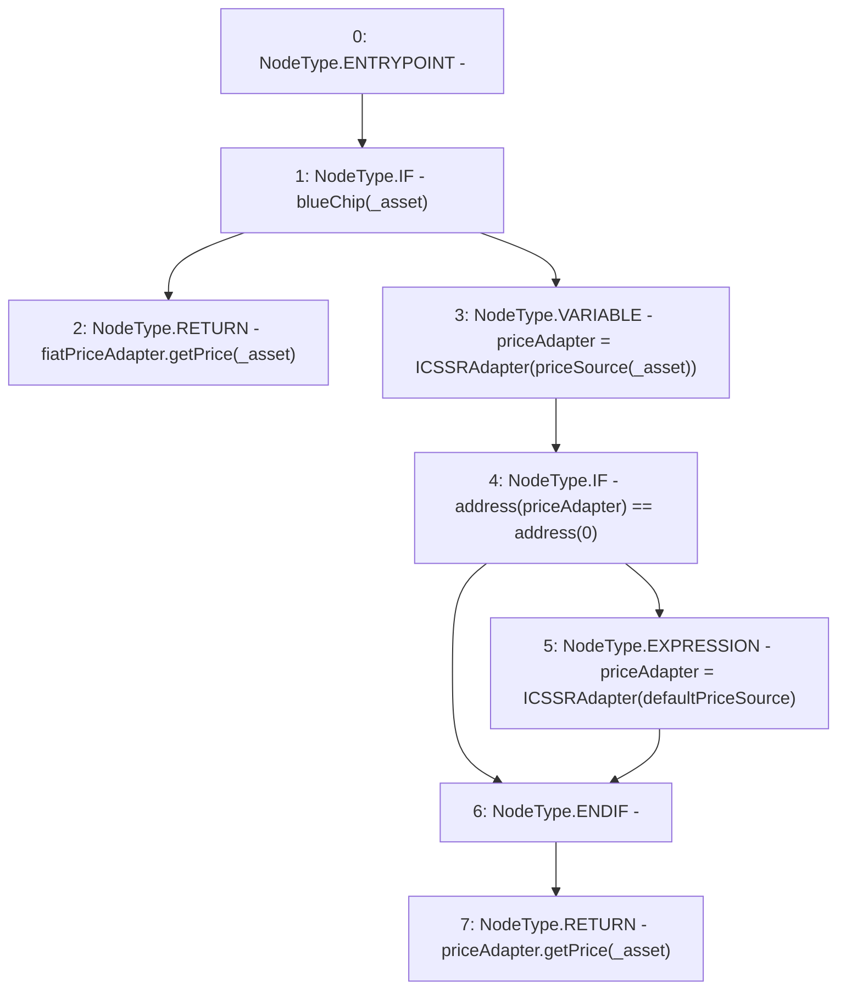

# Context: MochiCSSRv0.getPrice

**Contract:** `MochiCSSRv0` (Inherits: ICSSRRouter)
**Signature:** `getPrice(address) returns (float)`
**Method Selector ID:** `0x41976e09`
**Visibility:** `external`
**Environment-Free:** `Yes`
**Modifiers:** None

### State Variables Interaction
- **Reads:** blueChip, defaultPriceSource, fiatPriceAdapter, priceSource
- **Writes:** None

### Environment & Verification Flags
- **Uses Foundry Cheatcodes:** No
- **Has Echidna Properties:** No

### Internal Calls Tree
- None

### External Calls / Value Transfers
- `ICSSRAdapter.TMP_42(float) = HIGH_LEVEL_CALL, dest:priceAdapter(ICSSRAdapter), function:getPrice, arguments:['_asset']  `
- `ICSSRAdapter.TMP_36(float) = HIGH_LEVEL_CALL, dest:fiatPriceAdapter(ICSSRAdapter), function:getPrice, arguments:['_asset']  `

### Control Flow Graph (CFG)


### Source Mapping
Declared in: `certora-ac-datasets/detasets/web3bugs/dataset/web3bugs/42/projects/mochi-cssr/contracts/MochiCSSRv0.sol` on lines **109** to **124**

```solidity
    function getPrice(address _asset)
        external
        view
        override
        returns (float memory)
    {
        if (blueChip[_asset]) {
            return fiatPriceAdapter.getPrice(_asset);
        } else {
            ICSSRAdapter priceAdapter = ICSSRAdapter(priceSource[_asset]);
            if (address(priceAdapter) == address(0)) {
                priceAdapter = ICSSRAdapter(defaultPriceSource);
            }
            return priceAdapter.getPrice(_asset);
        }
    }

```
