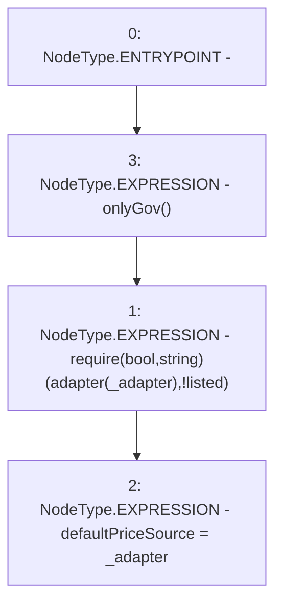

# Context: MochiCSSRv0.setDefaultPriceSource

**Contract:** `MochiCSSRv0` (Inherits: ICSSRRouter)
**Signature:** `setDefaultPriceSource(address)`
**Method Selector ID:** `0x67fefdc3`
**Visibility:** `external`
**Environment-Free:** `No (reads EVM state context)`
**Modifiers:**
- `onlyGov`
  ```solidity
  modifier onlyGov() {
          require(msg.sender == owned.governance(), "!gov");
          _;
      }
  ```

### State Variables Interaction
- **Reads:** adapter
- **Writes:** defaultPriceSource

### Assertion Checks & Business Requirements
- require/assert: `require(bool,string)(adapter[_adapter],!listed)`

### Environment & Verification Flags
- **Uses Foundry Cheatcodes:** No
- **Has Echidna Properties:** No

### Internal Calls Tree
- None

### External Calls / Value Transfers
- None

### Control Flow Graph (CFG)


### Source Mapping
Declared in: `certora-ac-datasets/detasets/web3bugs/dataset/web3bugs/42/projects/mochi-cssr/contracts/MochiCSSRv0.sol` on lines **83** to **86**

```solidity
    function setDefaultPriceSource(address _adapter) external onlyGov {
        require(adapter[_adapter], "!listed");
        defaultPriceSource = _adapter;
    }

```
