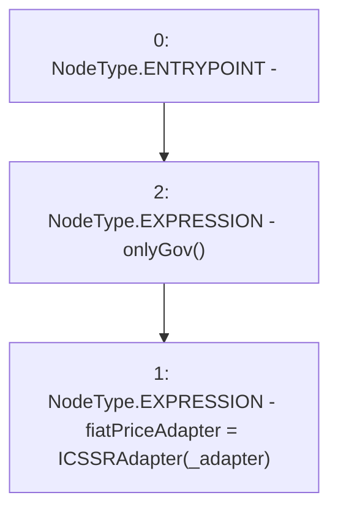

# Context: MochiCSSRv0.setFiatPriceAdapter

**Contract:** `MochiCSSRv0` (Inherits: ICSSRRouter)
**Signature:** `setFiatPriceAdapter(address)`
**Method Selector ID:** `0xb0eb2334`
**Visibility:** `external`
**Environment-Free:** `No (reads EVM state context)`
**Modifiers:**
- `onlyGov`
  ```solidity
  modifier onlyGov() {
          require(msg.sender == owned.governance(), "!gov");
          _;
      }
  ```

### State Variables Interaction
- **Reads:** None
- **Writes:** fiatPriceAdapter

### Environment & Verification Flags
- **Uses Foundry Cheatcodes:** No
- **Has Echidna Properties:** No

### Internal Calls Tree
- None

### External Calls / Value Transfers
- None

### Control Flow Graph (CFG)


### Source Mapping
Declared in: `certora-ac-datasets/detasets/web3bugs/dataset/web3bugs/42/projects/mochi-cssr/contracts/MochiCSSRv0.sol` on lines **60** to **62**

```solidity
    function setFiatPriceAdapter(address _adapter) external onlyGov {
        fiatPriceAdapter = ICSSRAdapter(_adapter);
    }

```
