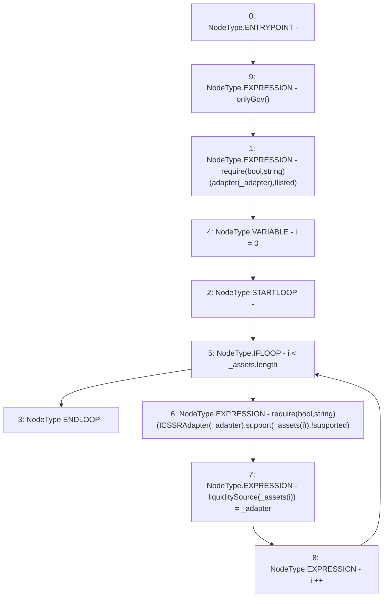

# Context: MochiCSSRv0.setLiquiditySource

**Contract:** `MochiCSSRv0` (Inherits: ICSSRRouter)
**Signature:** `setLiquiditySource(address,address[])`
**Method Selector ID:** `0xc4b73015`
**Visibility:** `external`
**Environment-Free:** `No (reads EVM state context)`
**Modifiers:**
- `onlyGov`
  ```solidity
  modifier onlyGov() {
          require(msg.sender == owned.governance(), "!gov");
          _;
      }
  ```

### State Variables Interaction
- **Reads:** adapter
- **Writes:** liquiditySource

### Assertion Checks & Business Requirements
- require/assert: `require(bool,string)(adapter[_adapter],!listed)`
- require/assert: `require(bool,string)(ICSSRAdapter(_adapter).support(_assets[i]),!supported)`

### Environment & Verification Flags
- **Uses Foundry Cheatcodes:** No
- **Has Echidna Properties:** No

### Internal Calls Tree
- None

### External Calls / Value Transfers
- `ICSSRAdapter.TMP_21(bool) = HIGH_LEVEL_CALL, dest:TMP_20(ICSSRAdapter), function:support, arguments:['REF_17']  `

### Control Flow Graph (CFG)


### Source Mapping
Declared in: `certora-ac-datasets/detasets/web3bugs/dataset/web3bugs/42/projects/mochi-cssr/contracts/MochiCSSRv0.sol` on lines **72** to **81**

```solidity
    function setLiquiditySource(address _adapter, address[] calldata _assets)
        external
        onlyGov
    {
        require(adapter[_adapter], "!listed");
        for(uint256 i = 0; i<_assets.length; i++){
            require(ICSSRAdapter(_adapter).support(_assets[i]), "!supported");
            liquiditySource[_assets[i]] = _adapter;
        }
    }

```
