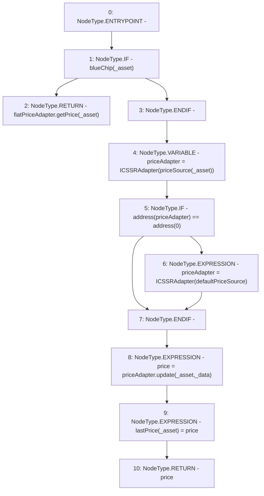

# Context: MochiCSSRv0.update

**Contract:** `MochiCSSRv0` (Inherits: ICSSRRouter)
**Signature:** `update(address,bytes) returns (float)`
**Method Selector ID:** `0x02a688ed`
**Visibility:** `external`
**Environment-Free:** `Yes`
**Modifiers:** None

### State Variables Interaction
- **Reads:** blueChip, defaultPriceSource, fiatPriceAdapter, priceSource
- **Writes:** lastPrice

### Environment & Verification Flags
- **Uses Foundry Cheatcodes:** No
- **Has Echidna Properties:** No

### Internal Calls Tree
- None

### External Calls / Value Transfers
- `ICSSRAdapter.TMP_35(float) = HIGH_LEVEL_CALL, dest:priceAdapter(ICSSRAdapter), function:update, arguments:['_asset', '_data']  `
- `ICSSRAdapter.TMP_29(float) = HIGH_LEVEL_CALL, dest:fiatPriceAdapter(ICSSRAdapter), function:getPrice, arguments:['_asset']  `

### Control Flow Graph (CFG)


### Source Mapping
Declared in: `certora-ac-datasets/detasets/web3bugs/dataset/web3bugs/42/projects/mochi-cssr/contracts/MochiCSSRv0.sol` on lines **93** to **107**

```solidity
    function update(address _asset, bytes memory _data)
        external
        override
        returns (float memory price)
    {
        if (blueChip[_asset]) {
            return fiatPriceAdapter.getPrice(_asset);
        }
        ICSSRAdapter priceAdapter = ICSSRAdapter(priceSource[_asset]);
        if (address(priceAdapter) == address(0)) {
            priceAdapter = ICSSRAdapter(defaultPriceSource);
        }
        price = priceAdapter.update(_asset, _data);
        lastPrice[_asset] = price;
    }

```
