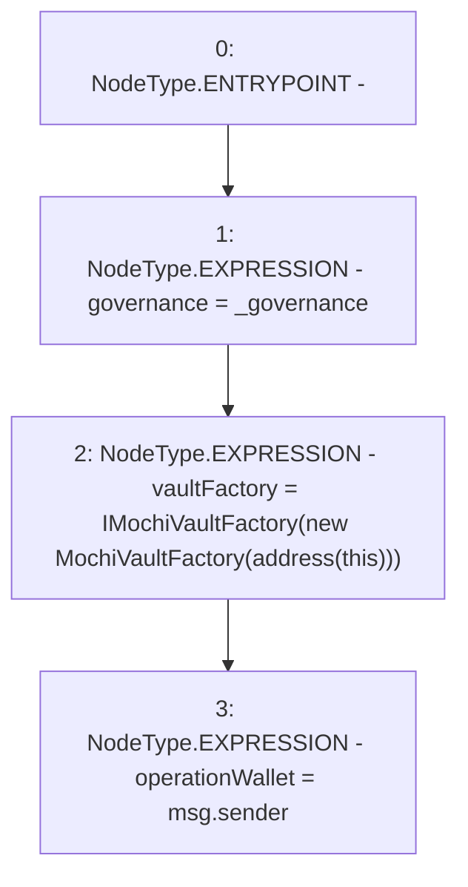

# Context: MochiEngine.constructor

**Contract:** `MochiEngine` (Inherits: IMochiEngine)
**Signature:** `constructor(address)`
**Method Selector ID:** `0xf8a6c595`
**Visibility:** `public`
**Environment-Free:** `No (reads EVM state context)`
**Modifiers:** None

### State Variables Interaction
- **Reads:** None
- **Writes:** governance, operationWallet, vaultFactory

### Environment & Verification Flags
- **Uses Foundry Cheatcodes:** No
- **Has Echidna Properties:** No

### Internal Calls Tree
- None

### External Calls / Value Transfers
- None

### Control Flow Graph (CFG)


### Source Mapping
Declared in: `certora-ac-datasets/detasets/web3bugs/dataset/web3bugs/42/projects/mochi-core/contracts/MochiEngine.sol` on lines **28** to **32**

```solidity
    constructor(address _governance) {
        governance = _governance;
        vaultFactory = IMochiVaultFactory(new MochiVaultFactory(address(this)));
        operationWallet = msg.sender;
    }

```
