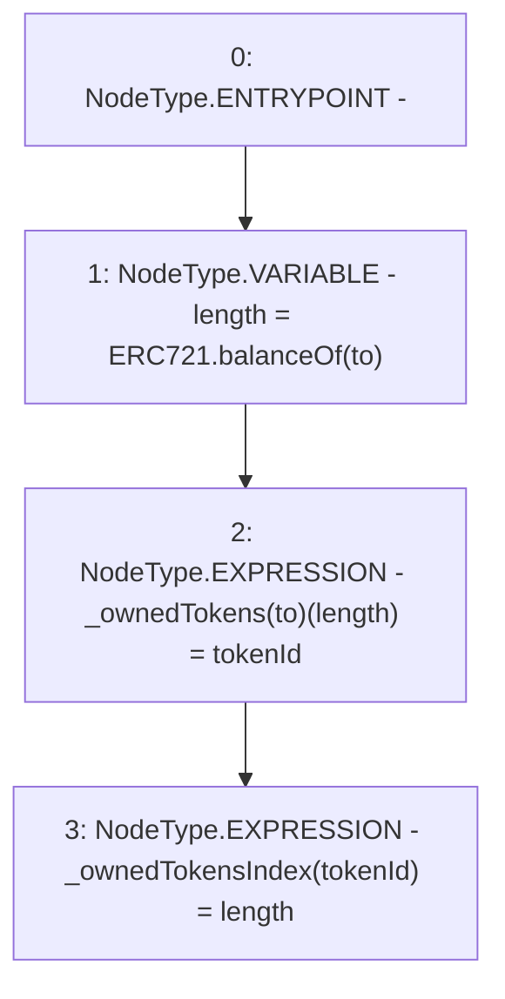

# Context: MochiNFT._addTokenToOwnerEnumeration

**Contract:** `MochiNFT` (Inherits: ERC721Enumerable, IMochiNFT, IERC721Enumerable, ERC721, IERC721Metadata, IERC721, ERC165, IERC165, Context)
**Signature:** `_addTokenToOwnerEnumeration(address,uint256)`
**Method Selector ID:** `Internal (No Method ID)`
**Visibility:** `private`
**Environment-Free:** `Yes`
**Modifiers:** None

### State Variables Interaction
- **Reads:** None
- **Writes:** _ownedTokens, _ownedTokensIndex

### Environment & Verification Flags
- **Uses Foundry Cheatcodes:** No
- **Has Echidna Properties:** No

### Internal Calls Tree
- None

### External Calls / Value Transfers
- None

### Control Flow Graph (CFG)


### Source Mapping
Declared in: `certora-ac-datasets/detasets/web3bugs/dataset/web3bugs/42/projects/mochi-core/node_modules/@openzeppelin/contracts/token/ERC721/extensions/ERC721Enumerable.sol` on lines **92** to **96**

```solidity
    function _addTokenToOwnerEnumeration(address to, uint256 tokenId) private {
        uint256 length = ERC721.balanceOf(to);
        _ownedTokens[to][length] = tokenId;
        _ownedTokensIndex[tokenId] = length;
    }

```
