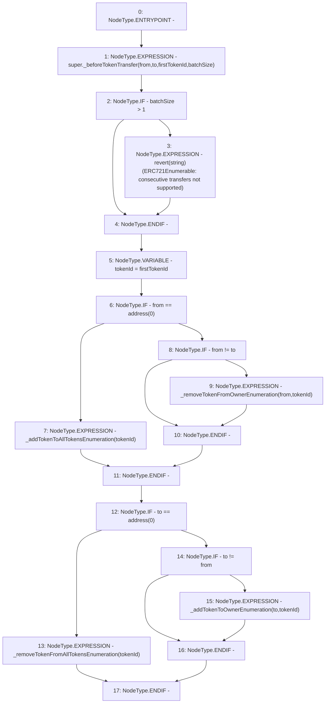

# Context: MochiNFT._beforeTokenTransfer

**Contract:** `MochiNFT` (Inherits: ERC721Enumerable, IMochiNFT, IERC721Enumerable, ERC721, IERC721Metadata, IERC721, ERC165, IERC165, Context)
**Signature:** `_beforeTokenTransfer(address,address,uint256,uint256)`
**Method Selector ID:** `Internal (No Method ID)`
**Visibility:** `internal`
**Environment-Free:** `Yes`
**Modifiers:** None

### State Variables Interaction
- **Reads:** None
- **Writes:** None

### Assertion Checks & Business Requirements
- revert: `revert(string)(ERC721Enumerable: consecutive transfers not supported)`

### Environment & Verification Flags
- **Uses Foundry Cheatcodes:** No
- **Has Echidna Properties:** No

### Internal Calls Tree
- None

### External Calls / Value Transfers
- `TMP_12(None) = SOLIDITY_CALL revert(string)(ERC721Enumerable: consecutive transfers not supported)`

### Control Flow Graph (CFG)


### Source Mapping
Declared in: `certora-ac-datasets/detasets/web3bugs/dataset/web3bugs/42/projects/mochi-core/node_modules/@openzeppelin/contracts/token/ERC721/extensions/ERC721Enumerable.sol` on lines **60** to **85**

```solidity
    function _beforeTokenTransfer(
        address from,
        address to,
        uint256 firstTokenId,
        uint256 batchSize
    ) internal virtual override {
        super._beforeTokenTransfer(from, to, firstTokenId, batchSize);

        if (batchSize > 1) {
            // Will only trigger during construction. Batch transferring (minting) is not available afterwards.
            revert("ERC721Enumerable: consecutive transfers not supported");
        }

        uint256 tokenId = firstTokenId;

        if (from == address(0)) {
            _addTokenToAllTokensEnumeration(tokenId);
        } else if (from != to) {
            _removeTokenFromOwnerEnumeration(from, tokenId);
        }
        if (to == address(0)) {
            _removeTokenFromAllTokensEnumeration(tokenId);
        } else if (to != from) {
            _addTokenToOwnerEnumeration(to, tokenId);
        }
    }

```
